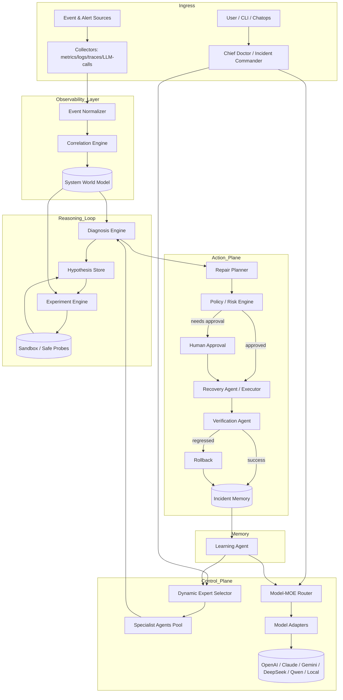
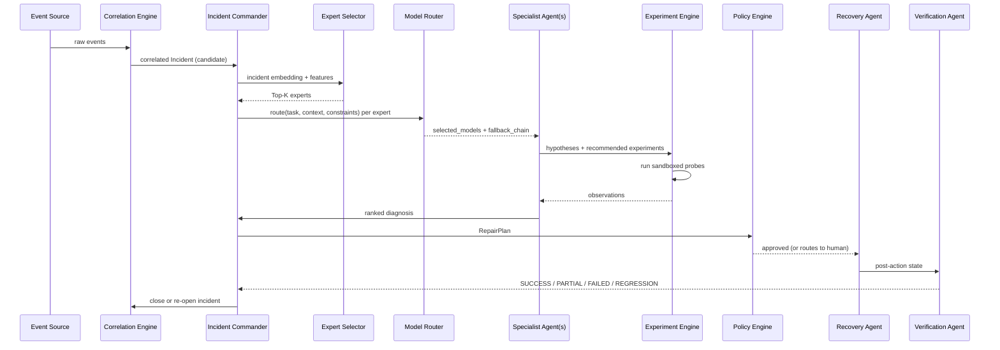
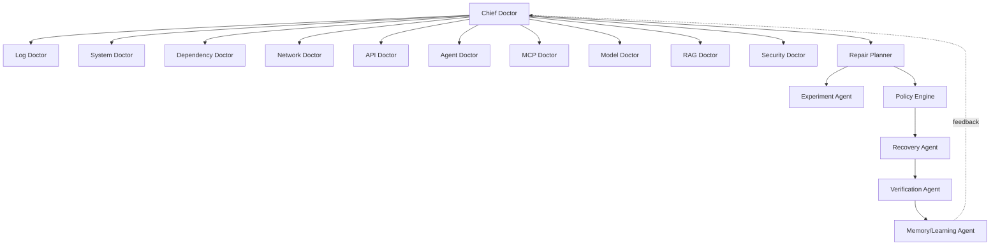
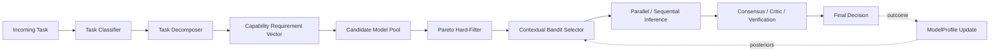
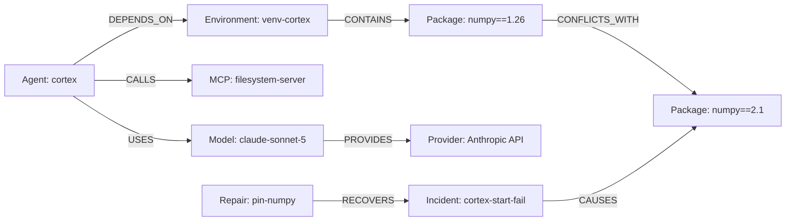
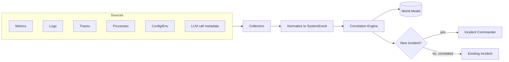
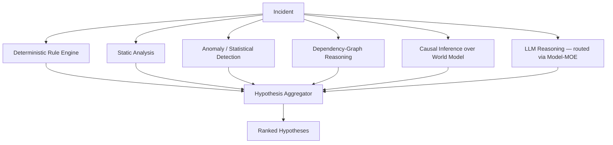
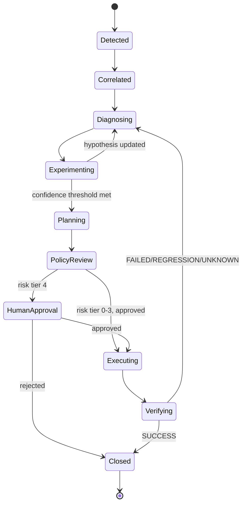
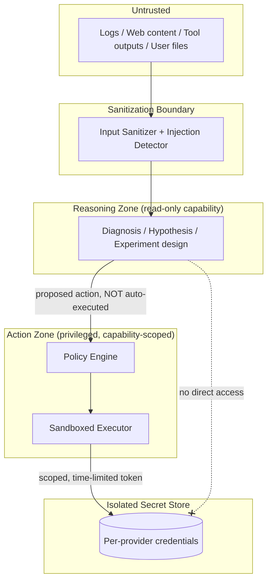
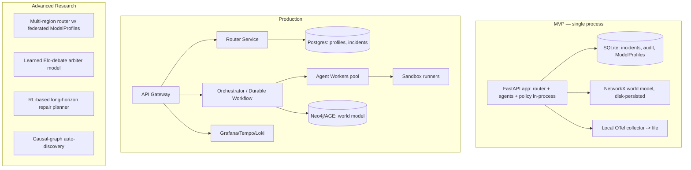

# Agent Doctor: Architecture of an Autonomous, Model-Agnostic AI Operations & Diagnosis Platform

**A software-level Mixture-of-Experts control plane for heterogeneous LLM agent ecosystems**

---

## Table of Contents

1. Executive Summary
2. Design Philosophy
3. Core Design Principles
4. Full System Architecture
5. Agent Hierarchy
6. Model-MOE Architecture
7. Dynamic Routing Algorithm
8. System World Model
9. Observability Layer
10. Diagnosis Engine
11. Hypothesis & Experiment Engine
12. Repair Engine
13. Verification Engine
14. Incident Memory
15. Adaptive Learning
16. Security Architecture
17. Failure Handling
18. Cost Optimization
19. Data Model
20. Internal Protocols & API Design
21. Technology Stack
22. Deployment Architecture (MVP / Production / Advanced)
23. Performance Optimization
24. Implementation Roadmap
25. Risks and Failure Modes
26. Final Recommended Architecture

---

## 1. Executive Summary

Agent Doctor is a control-plane system that observes, diagnoses, and repairs modern AI agent ecosystems — the agents themselves, their MCP servers/tools/skills, their runtime environments, and the LLM APIs they depend on. It is not a single agent and not a wrapper around one model provider. It is a **hierarchical multi-agent system sitting on top of a stateful, self-learning model router** that treats every LLM (OpenAI, Claude, Gemini, DeepSeek, Qwen, local models, specialized reasoning/coding/vision/embedding models) as a heterogeneous expert with its own evolving capability, cost, latency, and reliability profile.

The system runs a closed control loop — **Observe → Detect → Diagnose → Hypothesize → Experiment → Plan → Execute → Verify → Recover → Learn** — with strict safety gates between diagnosis and action. It never mutates production state on the basis of a single model's guess: every repair passes through a risk-tiered policy engine, is validated against sandboxed experiments, and is checked post-hoc by an independent verification agent before being marked resolved.

The architectural core is the **Model-MOE Router**: a stateful, continuously-learning routing layer that scores every (model, task, system-state) triple using a two-stage process — Pareto-based hard filtering followed by contextual-bandit soft selection — rather than a static weighted sum or hard-coded role assignment. This lets the system discover empirically, in the operator's actual environment, which model is good at which task, and to keep re-learning that as models, prices, and reliability characteristics shift.

## 2. Design Philosophy

Three convictions shape every decision below:

1. **Models are unreliable experts, not oracles.** LLMs hallucinate, disagree, degrade, and get rate-limited. Any system that lets a single model's output directly trigger a production action is not an "AI Ops" system, it is an incident generator. Agent Doctor treats every model output as *evidence*, not *ground truth*, until it survives verification.
2. **Diagnosis and action are different trust domains.** Read-only reasoning is cheap and safe to parallelize across many models. Mutating actions are expensive to get wrong. The architecture is deliberately asymmetric: liberal use of models for hypothesis generation and analysis, conservative, policy-gated use of models for action authorization.
3. **The router is a product, not a config file.** Hard-coding "Claude does architecture, DeepSeek does coding" bakes in today's benchmark leaderboard and rots the day pricing or model versions change. The router must be a learning system with memory, not a lookup table.

## 3. Core Design Principles

| # | Principle | Implication |
|---|---|---|
| P1 | Sparse activation | Only the minimum necessary agents and models are invoked per incident — mirrors MOE sparsity at the application layer. |
| P2 | Evidence over assertion | Every diagnosis and repair claim must cite `Evidence` records traceable to raw observations. |
| P3 | Reversibility first | Prefer experiments and repairs with cheap rollback; irreversible actions require the highest confidence tier. |
| P4 | Vendor neutrality | No component outside the Model Adapter layer may contain provider-specific logic or prompts. |
| P5 | Statefulness | Routing, health, and diagnosis all condition on accumulated system memory, not just the current request. |
| P6 | Fail static, not silent | On uncertainty or model/provider failure, the system degrades to deterministic rule-based behavior rather than guessing. |
| P7 | Human authority is a policy level, not an afterthought | High-risk actions are structurally routed to a human gate, not merely "recommended." |
| P8 | Cost and latency are first-class objectives | Every routing and escalation decision explicitly trades off quality against $ and ms, never optimizes quality alone. |

## 4. Full System Architecture

### 4.A Logical Architecture



### 4.B Runtime Execution Architecture



### 4.C — 4.F (Model-MOE routing, Incident lifecycle, Data flow, Security boundary) are provided in their respective sections (§6, §14, §9, §16) to keep each diagram next to its explanatory text rather than front-loaded here.

## 5. Agent Hierarchy

Agent Doctor uses a **hierarchical, sparsely-activated** agent topology: one commander, sixteen specialists, invoked selectively.

| Agent | Responsibility | Typical model-capability need |
|---|---|---|
| Chief Doctor / Incident Commander | Owns incident lifecycle, expert selection, final decision authority | Long-horizon reasoning, planning |
| Log Doctor | Parses/clusters logs, extracts anomalies | Fast extraction, cheap/local |
| System Doctor | OS/process/resource-level diagnosis | General reasoning |
| Dependency Doctor | Python/Node/package graph conflicts | Coding/debugging |
| Network Doctor | Connectivity, DNS, TLS, firewall | General reasoning |
| API Doctor | Auth, quota, schema, rate-limit failures on external APIs | Structured output |
| Agent Doctor (subordinate) | Agent-loop pathology: runaway loops, infinite retries | Long-context, reasoning |
| MCP Doctor | MCP protocol/tool/schema failures | Structured output, coding |
| Model Doctor | Model/provider availability, latency, capability mismatch | Long-context analysis |
| RAG Doctor | Retrieval quality, embedding drift, context-window overflow | Long-context, retrieval-aware |
| Security Doctor | Prompt injection, credential exposure, policy violations | Reasoning, adversarial analysis |
| Repair Planner | Converts diagnosis into structured `RepairPlan` | Planning, structured output |
| Experiment Agent | Designs/executes low-risk probes | Coding, structured output |
| Verification Agent | Confirms repair efficacy, detects regressions | Analytical reasoning |
| Recovery Agent | Executes approved actions under policy constraints | Tool orchestration |
| Memory / Learning Agent | Updates incident memory, routing statistics | Cheap/local, statistical |

Only the Chief Doctor is always active. Every other agent is instantiated on demand by the Dynamic Expert Selector (§6.2).



## 6. Model-MOE Architecture

### 6.1 Pipeline



The router is deliberately **not** a static role table. Capability roles ("Claude for architecture," "DeepSeek for coding") are the *prior*, not the policy — they seed the ModelProfile before any empirical data exists, and are overwritten by observed performance over time.

### 6.2 Dynamic Expert (Agent) Selection

For an incident, the selector computes:

```
relevance(agent_i, incident) =
    α · cosine_sim(embed(incident), embed(agent_i.domain))
  + β · historical_success(agent_i | similar_past_incidents)
  + γ · symbolic_match(incident.signals, agent_i.trigger_rules)
  − δ · current_load(agent_i)
```

Top-K is not fixed. K is chosen by **cumulative relevance mass** (analogous to nucleus/top-p sampling): include agents in descending relevance order until cumulative relevance ≥ threshold τ, subject to a hard budget ceiling (max agents, max $, max latency). Chief Doctor is always included. If the top-1 relevance score and the top-2 score are close (high ambiguity) or overall confidence is low, K is expanded by one tier — the same escalation ladder used for cross-model debate (§6.4). This keeps the common case cheap (1–2 experts) while automatically widening for ambiguous or high-severity incidents.

### 6.3 Model Capability Roles (seed priors, not hard-coded policy)

| Model family | Seed strength prior | Notes |
|---|---|---|
| Claude-class | Long-horizon reasoning, architecture analysis, complex diagnosis, planning | High weight on Chief Doctor / Repair Planner tasks |
| OpenAI-class | General reasoning, tool orchestration, structured output | High weight on Recovery Agent, API Doctor |
| Gemini-class | Multimodal analysis, very long context | High weight on RAG Doctor, log-corpus analysis |
| DeepSeek-class | Cost-efficient reasoning, coding/debugging | High weight on Dependency Doctor, Experiment Agent |
| Qwen-class | Multilingual, local deployment, structured workloads | High weight on locale-sensitive log parsing |
| Small/local models | Classification, filtering, extraction, triage | High weight on Log Doctor pre-filtering, Memory Agent |

These priors initialize a Bayesian belief, not a routing rule — see §7.

### 6.4 Cross-Model Debate — Adaptive Escalation

| Uncertainty / Risk tier | Model participation |
|---|---|
| Low posterior uncertainty, low action risk | 1 model |
| Medium uncertainty | 2 independent models, compared for agreement |
| High uncertainty | 3+ models: diagnosis, independent diagnosis, critique |
| Any Level-3+ action (§16) | Mandatory independent verification model, different provider than the proposer |

Debate is triggered by posterior variance from the ModelProfile (§7.2), not by a fixed incident-severity label — this keeps the expensive path reserved for genuine ambiguity rather than every "important-sounding" incident.

## 7. Dynamic Routing Algorithm

### 7.1 Why not a hard-coded weighted sum

A static `score = w1·capability + w2·reliability − w3·cost − w4·latency` is brittle: weights need constant hand-retuning as providers change pricing/quality, it cannot express uncertainty ("we've only tried this model 3 times on this task type"), and it cannot adapt per-environment (a self-hosted Qwen might be far more reliable in one operator's network than another's).

### 7.2 Chosen approach: two-stage Pareto-filter + contextual-bandit selection

**Stage 1 — Pareto hard filter.** Discard models that are *dominated* on every hard constraint (context window too small for the task, provider currently unavailable, rate-limited, over budget ceiling, missing a required capability like vision or tool-use). What remains is the Pareto-efficient candidate set on (cost, latency, capability-fit) — no candidate in the set is strictly worse than another on all axes simultaneously, so nothing informative is thrown away before Stage 2.

**Stage 2 — Contextual bandit (Thompson Sampling) over the ModelProfile posterior.**

```
ModelProfile(m, task_category):
    success_belief   ~ Beta(α_m,c, β_m,c)          # task-conditional success rate
    latency_belief   ~ Gamma(shape, rate)           # latency distribution
    cost_belief      ~ point-estimate + variance    # token cost, priced deterministically
    reliability_belief ~ Beta(α_rel, β_rel)         # provider/API health
```

At decision time, for each surviving candidate model, sample:

```
θ_success ~ Beta(α_m,c, β_m,c)
θ_latency ~ Gamma(...)
θ_reliability ~ Beta(...)

Score(m, task, state) =
      f_capability(θ_success, task.requirement_vector)
    · f_reliability(θ_reliability, provider_health(m))
    − λ_cost · E[cost(m, task)]
    − λ_latency · E[latency(m) | budget]
```

Select `argmax Score`. Because θ values are *sampled* from posteriors rather than point estimates, the router naturally explores under-tried models proportionally to their remaining uncertainty (classic Thompson Sampling exploration/exploitation balance) without a separate ε-greedy knob.

**Why this over the alternatives considered:**

| Approach | Verdict | Reason |
|---|---|---|
| Static weighted sum | Rejected | No uncertainty representation, brittle, manual retuning |
| Full RL (policy gradient) | Rejected for v1 | Needs far more interaction volume than an ops system generates per environment; credit assignment is trivial here (one action → one observed outcome), so RL's main advantage (long-horizon credit assignment) is wasted overhead |
| Multi-armed bandit (context-free) | Rejected | Ignores task features — a global "best model" ignores per-task-type specialization |
| **Contextual bandit (Thompson Sampling), chosen** | **Adopted** | Sample-efficient, naturally handles non-stationarity by decaying old observations, principled explore/exploit, cheap to update online after every task |
| Elo-like ranking | Adopted as a *complement*, not primary | Used specifically inside cross-model debate (§6.4) to rank critique/consensus quality pairwise — a good fit for head-to-head comparisons, weak fit for absolute task-fit scoring |
| Pareto/portfolio optimization | Adopted as *Stage 1* | Correct tool for hard multi-objective filtering, not for the stochastic selection step |

### 7.3 Router API contract

```
route(task, context, constraints) -> RoutingDecision {
    selected_models: [ModelRef],
    selected_agents: [AgentRef],
    routing_reason: string,
    confidence: float,
    expected_cost: float,
    expected_latency_ms: int,
    fallback_chain: [ModelRef]
}
```

`fallback_chain` is always populated (§17) — every routing decision is computed together with its degraded-mode successor so failover requires no additional inference call.

### 7.4 Statefulness

Routing is `P(model | task, system_state, historical_performance)`, never `P(model | task)`. The `ModelProfile` (full schema §19) is updated after every completed task — success/failure, actual latency, actual cost, actual token usage, and whether the output survived downstream verification. Updates use exponential decay on old observations so the profile tracks drift (e.g., a provider degrading over a week) rather than converging to a fixed historical average.

## 8. System World Model

A persistent graph is the substrate all diagnosis and experiment reasoning operates over.

**Entities:** `Agent, Skill, MCP, Tool, Process, Container, Package, Environment, API, Model, Provider, Database, File, NetworkService`

**Relationships:** `DEPENDS_ON, CALLS, IMPORTS, CONNECTS_TO, PROVIDES, CONTAINS, CONFLICTS_WITH, CAUSES, RECOVERS, USES`



**Real-time update model:** the graph is updated via two channels — (a) *synchronous* structural updates from the Observability Layer (new process spawned, new dependency installed, new MCP connection opened — treated as graph deltas applied transactionally with the correlation engine), and (b) *asynchronous* enrichment from diagnosis/repair outcomes (CAUSES/RECOVERS edges are only added once a hypothesis or repair has been verified, keeping causal edges evidence-backed rather than speculative). The graph is versioned (each node/edge carries `valid_from`/`valid_to`) so the world model doubles as a time-travel debugger: "what did the dependency graph look like 10 minutes before the incident."

## 9. Observability Layer

### 9.D Data Flow Diagram



**Unified event representation:**

```typescript
interface SystemEvent {
  timestamp: string;               // ISO-8601
  source: string;                  // collector id
  component: string;               // agent/mcp/process/model/etc.
  event_type: string;               // e.g. "process_exit", "llm_error", "tool_failure"
  severity: "debug"|"info"|"warn"|"error"|"critical";
  raw_data: unknown;
  normalized_data: Record<string, unknown>;
  correlation_id: string;
  parent_event?: string;
  confidence: number;              // 0-1, collector's confidence this event is real signal not noise
}
```

**Correlation engine:** groups events into candidate incidents using (a) shared `correlation_id`/trace propagation where available, (b) temporal proximity + component-graph adjacency from the World Model (an error on a `Package` correlates strongly with an error on the `Agent` that `DEPENDS_ON` it within the same time window), and (c) a lightweight anomaly-scoring pass (statistical z-score / seasonal baseline) to suppress noisy, low-confidence events from ever reaching the Incident Commander. Only events crossing a confidence + severity threshold spawn a new `Incident`; the rest attach as supporting `Evidence` to existing incidents or are archived for the Learning Agent's baseline model.

## 10. Diagnosis Engine

The engine is explicitly **hybrid** — LLM reasoning is one input, not the whole engine.



Deterministic components run first and cheaply prune the hypothesis space (e.g., a rule engine that directly matches known error signatures needs no model call at all). LLM reasoning is reserved for hypotheses that survive the deterministic pass, or for genuinely novel failure signatures the rule engine doesn't recognize.

```typescript
interface Hypothesis {
  id: string;
  incident_id: string;
  statement: string;                    // e.g. "H2: incorrect PYTHONPATH"
  confidence: number;                   // 0-1
  supporting_evidence: EvidenceRef[];
  contradicting_evidence: EvidenceRef[];
  expected_observations: string[];      // what we'd see if true
  recommended_experiment: ExperimentRef;
  generated_by: "rule"|"static"|"anomaly"|"causal"|"llm";
  model_ref?: ModelRef;                 // populated if generated_by == "llm"
}
```

## 11. Hypothesis & Experiment Engine

Production is never touched directly on the basis of a hypothesis. Every hypothesis with confidence below the repair-action threshold routes through the Experiment Engine first.

```
Hypothesis → Experiment Design → Sandbox / Safe Probe → Observation → Hypothesis Update (Bayes)
```

**Bayesian update:**

```
P(H | O) = P(O | H) · P(H) / P(O)
```

where `O` is the experiment's observation. Priors `P(H)` come from the initial confidence assigned by the diagnosis engine; likelihoods `P(O|H)` are estimated from the experiment's design (a probe engineered to discriminate strongly between hypotheses has sharply different `P(O|H)` across hypotheses).

**Experiment selection — Expected Information Gain (EIG):**

```
EIG(experiment_e) = H(Hypotheses) − E_O[ H(Hypotheses | O) ]     (entropy reduction)

Utility(e) = EIG(e) / (Cost(e) · RiskFactor(e))
```

The Experiment Agent enumerates candidate probes per open hypothesis set and selects the one maximizing `Utility(e)` — this formalizes "cheap, reversible, high-information experiments" instead of leaving it as a vague preference. `RiskFactor(e)` is drawn from the same risk tiers used by the Policy Engine (§16), so an experiment that reads a log file has RiskFactor≈1 while one that restarts a shared service has RiskFactor≫1 and is heavily penalized even if informative.

## 12. Repair Engine

```typescript
interface RepairPlan {
  id: string;
  target: EntityRef;                 // world-model entity being repaired
  preconditions: Condition[];
  actions: Action[];
  expected_effect: string;
  risk_level: 0|1|2|3|4;              // matches §16 tiers
  rollback_plan: Action[];
  verification_plan: VerificationSpec;
  dry_run_supported: boolean;
  idempotent: boolean;
  timeout_ms: number;
  audit_ref: string;
}
```

Every `RepairPlan` must declare a `rollback_plan` and a `verification_plan` before it can be submitted to the Policy Engine — plans missing either are rejected structurally, not by convention. Where the underlying action supports it, the Repair Planner prefers actions with `dry_run_supported: true` and executes the dry run as an additional Experiment before committing.

## 13. Verification Engine

A repair is not successful because a command exited 0. Verification checks pre/post conditions across multiple signal types:

```
Pre-condition(target) → Action → Post-condition(target)
```

Signals evaluated: service health, process state, functional behavior (does the agent actually complete a representative task now), dependency state, latency, error rate, regression signals elsewhere in the World Model (did fixing A break B, checked via `DEPENDS_ON`/`CONFLICTS_WITH` edges), and downstream effects (any new anomalies within the blast radius since the action).

```typescript
type VerificationResult = "SUCCESS" | "PARTIAL_SUCCESS" | "FAILED" | "REGRESSION" | "UNKNOWN";
```

`UNKNOWN` is a first-class outcome (not an error) — it triggers an additional experiment rather than a false SUCCESS/FAILED classification, which is critical for avoiding silently-wrong autonomous closures.

## 14. Incident Memory

### 14.C Incident Lifecycle Diagram



Incidents are stored as full **trajectories**, not summaries:

```
S0 → observation → hypothesis → experiment → observation → hypothesis_update → repair → verification → recovered_state
```

```typescript
interface Incident {
  id: string;
  symptoms: SystemEvent[];
  environment_snapshot: WorldModelSnapshotRef;
  evidence: EvidenceRef[];
  hypotheses: Hypothesis[];
  experiments: Experiment[];
  failed_experiments: Experiment[];
  root_cause?: HypothesisRef;
  repair?: RepairPlan;
  verification?: VerificationResult;
  rollback_invoked: boolean;
  final_outcome: VerificationResult | "UNRESOLVED";
  trajectory: TrajectoryStep[];
}
```

Trajectories, not just outcomes, are what feed the Learning Agent — this lets future diagnosis retrieve "what sequence of experiments resolved a structurally similar incident" rather than only "what was the answer last time."

## 15. Adaptive Learning

After every completed task and every closed incident, the Learning Agent updates:

- `ModelProfile` posteriors (success/latency/cost/reliability, per task category) — feeds the router (§7)
- `AgentProfile` success rates — feeds the Dynamic Expert Selector (§6.2)
- Provider health rolling statistics — feeds failover (§17)
- Disagreement patterns from cross-model debate — used to recalibrate when debate escalation actually paid off, tightening or loosening the uncertainty thresholds that trigger it
- Verification-failure rate per (agent, model, task-category) triple — the strongest signal, since it reflects real-world downstream correctness rather than the model's own confidence

Because this is empirical and per-environment, two operators running Agent Doctor against different infrastructure will legitimately converge to different routing behavior even with identical model access — which is the intended outcome.

## 16. Security Architecture

### 16.F Security Boundary Diagram



Agent Doctor is a **privileged control plane** and is designed accordingly:

- **Untrusted-data isolation:** anything originating from logs, fetched web pages, tool outputs, or user-supplied files is treated as data, never as instructions — the sanitizer strips/flags directive-like content before it reaches a reasoning model's context, and the diagnosis pipeline never grants such content the ability to alter policy, invoke tools, or escalate risk tier.
- **Capability-based permissions:** every agent and every model call carries an explicit, minimal capability token (e.g., "read process list," not "shell access"). Capabilities are scoped per-task, not per-session.
- **Sandboxing:** all experiments and dry-runs execute in an isolated environment (container/namespace) with no route to production credentials.
- **Secret isolation:** API keys/credentials live in a dedicated store behind the Action Zone boundary; the Reasoning Zone (where most LLM calls happen) has no path to secrets at all — a compromised or manipulated reasoning trace cannot exfiltrate credentials because it structurally cannot reach them.
- **Command/tool allowlists:** the Executor only ever invokes pre-registered, schema-validated tool calls; free-form shell execution is disabled outside sandbox mode.
- **Output validation:** structured outputs from models (RepairPlan, Action) are schema-validated before being handed to the Policy Engine; malformed or schema-violating output is treated as a model failure (§17), not silently coerced.
- **Audit logging:** every state transition in §14's lifecycle diagram is written to an append-only `AuditRecord`.
- **Human approval:** structurally required at risk tier 4 (§16.1) — not a UI suggestion the system can bypass.

### 16.1 Autonomous Control Policy — Risk Tiers

| Tier | Class | Example | Approval needed |
|---|---|---|---|
| 0 | Read-only diagnostics | List processes, read logs | None |
| 1 | Safe reversible actions | Read env var, run a dry-run | None |
| 2 | Controlled modifications | Restart a single agent process, pin a package version | Automatic if confidence ≥ threshold and verification plan present |
| 3 | High-risk destructive actions | Delete a corrupted DB record, force-kill a shared process | Automatic only with mandatory independent cross-model verification (§6.4) + rollback plan tested in sandbox |
| 4 | Human approval required | Modify credentials, irreversible data deletion, production infra changes | Always routed to a human; system prepares the plan, does not execute |

The Policy Engine's decision function: `can_act(plan) = (plan.risk_level ≤ operator_ceiling) AND (confidence(plan) ≥ tier_threshold[plan.risk_level]) AND (rollback_plan.validated) AND (required_evidence.present)`.

## 17. Failure Handling

The control plane must survive the failure of any single model or provider.

| Failure mode | Mechanism |
|---|---|
| Provider unavailable / timeout | Circuit breaker opens after N consecutive failures; router consults precomputed `fallback_chain` (§7.3), no extra inference call needed |
| Rate limit | Exponential backoff + immediate reroute to next-best model in fallback chain rather than blocking |
| Malformed structured output | Schema validation failure counts as a task failure for that ModelProfile; single retry with stricter output constraints, then fallback |
| Hallucination / low self-consistency | Detected via cross-model disagreement (§6.4) or self-consistency sampling; triggers escalation, not silent acceptance |
| Model degradation (quality drop over time) | Rolling verification-failure rate feeds ModelProfile; router's Thompson Sampling naturally down-weights the model as its posterior success rate declines |
| Tool/MCP failure | MCP Doctor invoked; falls back to deterministic diagnosis path if all models routed to it are unavailable |
| Network failure (Agent Doctor's own) | Degraded mode: rule-engine-only diagnosis, all LLM-dependent stages skipped, incident flagged `UNKNOWN` pending recovery |
| Cascading/systemic outage | Deterministic emergency procedures — pre-authored, model-free runbooks for the highest-frequency historical incident types — execute at Tier ≤1 without waiting on any model call |

Fallback is layered: **provider failover → model failover (same provider, cheaper/different model) → local model fallback → cached reasoning (nearest-neighbor incident trajectory reuse) → deterministic emergency procedure**. Each layer only activates if the one above it is confirmed unavailable, not merely slow.

## 18. Cost Optimization

Rather than a flat linear utility, the scheduler optimizes a constrained, tiered objective:

```
Utility = Quality(m,t) − λ1·Cost(m,t) − λ2·Latency(m,t) − λ3·Risk(a)
```

used only *after* Pareto filtering (§7.2) has already removed budget-violating candidates — this avoids the classic failure mode of linear scalarization, where a bad tradeoff on one axis can be "bought off" by an unrealistically good score on another axis that doesn't matter for a hard constraint (e.g., a model that's very cheap but exceeds the task's context window should never be reachable by tuning λ's).

Additional levers:

- **Model cascades / cheap-first escalation:** small/local models attempt classification, filtering, and extraction first; escalate to a large model only if the local model's confidence is below threshold.
- **Early exit:** diagnosis stops widening (more agents, more debate) as soon as confidence crosses the action threshold — it does not exhaustively poll all applicable experts.
- **Dynamic token budgets:** capped per task-category based on historical token usage for successfully-resolved incidents of that type, not a global flat cap.
- **Caching / semantic dedup:** repeated diagnostic queries against an unchanged World Model region are served from the Incident Memory's nearest-neighbor cache rather than re-invoking a model.
- **Batching:** low-priority triage tasks (Log Doctor pre-filtering) are batched rather than dispatched per-event.

## 19. Data Model

Implementation-ready interfaces for all core protocols:

```typescript
interface Task {
  id: string;
  type: string;                       // "diagnosis"|"experiment"|"repair"|"verification"|...
  input: unknown;
  requirement_vector: CapabilityVector;
  constraints: { max_cost?: number; max_latency_ms?: number; min_confidence?: number };
  parent_incident_id?: string;
}

interface CapabilityVector {
  reasoning: number; coding: number; math: number; long_context: number;
  multimodal: number; tool_use: number; structured_output_reliability: number;
}

interface Evidence {
  id: string;
  event_refs: string[];               // SystemEvent ids
  description: string;
  supports: string[];                 // Hypothesis ids
  contradicts: string[];
  confidence: number;
}

interface Experiment {
  id: string;
  hypothesis_id: string;
  design: string;
  eig_estimate: number;
  cost_estimate: number;
  risk_factor: number;
  sandbox_ref: string;
  observation?: unknown;
  outcome_probability_update?: Record<string, number>;
}

interface Diagnosis {
  incident_id: string;
  ranked_hypotheses: Hypothesis[];
  root_cause: HypothesisRef;
  confidence: number;
  generated_by_agents: AgentRef[];
  cross_model_debate?: DebateRecord;
}

interface Action {
  id: string;
  tool: string;
  parameters: Record<string, unknown>;
  capability_required: string;
  dry_run: boolean;
}

interface Verification {
  plan: VerificationSpec;
  pre_state: WorldModelSnapshotRef;
  post_state: WorldModelSnapshotRef;
  result: "SUCCESS"|"PARTIAL_SUCCESS"|"FAILED"|"REGRESSION"|"UNKNOWN";
  regression_signals?: SystemEvent[];
}

interface ModelProfile {
  model_id: string; provider: string; version: string;
  capability_vector: CapabilityVector;
  cost_stats: { mean: number; variance: number; per_1k_tokens: number };
  latency_dist: { p50: number; p95: number; p99: number };
  error_dist: Record<string, number>;
  success_rate_by_task_category: Record<string, { alpha: number; beta: number }>;
  historical_failures: number;
  current_health: "healthy"|"degraded"|"unavailable";
  rate_limit_state: { remaining: number; reset_at: string };
  context_window_utilization: number;
  tool_use_reliability: number;
  structured_output_reliability: number;
  provider_reliability: { alpha: number; beta: number };
  confidence_estimate: number;
}

interface AgentProfile {
  agent_type: string;
  success_rate: number;
  avg_resolution_time_ms: number;
  trigger_rules: string[];
  domain_embedding: number[];
}

interface SystemState {
  world_model_snapshot: WorldModelSnapshotRef;
  active_incidents: string[];
  provider_health: Record<string, "healthy"|"degraded"|"unavailable">;
  budget_remaining: { cost: number; window: string };
}

interface HealthState {
  component: EntityRef;
  score: number;                      // see §9 AI Health Score
  dimensions: Record<string, number>;
  last_updated: string;
}

interface RoutingDecision {
  selected_models: ModelRef[];
  selected_agents: AgentRef[];
  routing_reason: string;
  confidence: number;
  expected_cost: number;
  expected_latency_ms: number;
  fallback_chain: ModelRef[];
}

interface AuditRecord {
  id: string;
  timestamp: string;
  actor: "system"|"human";
  action_taken: string;
  policy_decision: string;
  risk_tier: number;
  incident_id?: string;
  outcome: string;
}
```

## 20. Internal Protocols & API Design

**Model Router API:**

```
route(task: Task, context: SystemState, constraints: Constraints) -> RoutingDecision
```

Algorithm (see full derivation in §7):
1. Build `CapabilityRequirementVector` from task via Task Classifier + Decomposer.
2. Pareto-filter `ModelProfile` pool on hard constraints (availability, context window, budget, required capability flags).
3. Thompson-sample each surviving candidate's posterior; compute `Score`.
4. Select top model(s); if uncertainty tier warrants debate (§6.4), select additional independent models.
5. Precompute `fallback_chain` from the next-highest-scoring surviving candidates.
6. Emit `RoutingDecision`, log `routing_reason` (human-readable justification for audit).

**Model Adapter interface** (isolates all vendor logic):

```typescript
interface ModelAdapter {
  chat(messages, opts): Promise<Response>;
  stream(messages, opts): AsyncIterator<Chunk>;
  vision(images, prompt, opts): Promise<Response>;
  toolCall(messages, tools, opts): Promise<ToolCallResponse>;
  structuredOutput(messages, schema, opts): Promise<ValidatedResponse>;
  embed(text): Promise<number[]>;
  capabilities(): CapabilityVector;
}
```

No component outside this adapter layer contains a provider-specific prompt, SDK call, or quirk workaround — the Chief Doctor, Diagnosis Engine, and every specialist agent call only the adapter interface, keyed by `ModelRef` chosen by the router.

## 21. Technology Stack

Optimized for self-hosted, incremental, Windows+WSL2/Linux-friendly deployment; no unnecessary enterprise complexity.

| Layer | MVP choice | Production choice | Notes |
|---|---|---|---|
| Language | Python (agents/router) + TypeScript (adapters/UI) | same | Both are first-class per the brief |
| API gateway | FastAPI | FastAPI + Envoy/Traefik | Adds TLS termination, rate limiting at scale |
| Model router | In-process Python module | Standalone service (FastAPI) with its own DB | Decoupled once multiple consumers need routing |
| Orchestration | Direct async Python (asyncio) task graph | Temporal or a lightweight durable-execution layer | Durable execution matters once experiments/repairs must survive process restarts |
| Task queue | Redis Streams | Redis Streams or NATS JetStream | Avoid Kafka unless already present — unnecessary complexity for this scale |
| Event bus | Same Redis Streams instance | NATS or Kafka | Split only if event volume genuinely demands it |
| Time-series DB | SQLite + simple rollups | Prometheus + Victoria/Timescale | Metrics/latency/cost history |
| Relational DB | SQLite | Postgres | Incidents, plans, audit records |
| Vector DB | Chroma / SQLite+pgvector-lite | Postgres+pgvector or Qdrant | RAG Doctor, incident-trajectory nearest-neighbor retrieval |
| Graph DB | NetworkX in-process (persisted to disk) | Neo4j or Postgres+Apache AGE | World Model — MVP can defer a real graph DB |
| Cache | In-process LRU | Redis | Semantic dedup, routing posterior cache |
| Observability | OpenTelemetry SDK + local collector | OTel + Grafana/Tempo/Loki | Standard OTel avoids vendor lock |
| Sandboxing | OS-level subprocess + resource limits, or lightweight container (Docker optional per brief) | gVisor/Firecracker microVMs or Docker with strict seccomp | Escalate isolation as autonomy increases |
| MCP integration | Native MCP client, stdio/SSE transports | same, connection-pooled | Already the primary tool-integration surface |

## 22. Deployment Architecture



**MVP:** single Python process, SQLite, in-process world model, rule engine + one routed model per task, Level 0-2 actions only, no cross-model debate. Delivers real value: automated diagnosis + safe, reversible repairs for the most common failure classes (dependency conflicts, config errors, agent-loop pathologies) with human approval on anything ambiguous.

**Production:** decoupled router service with real posterior storage, durable workflow engine so long-running experiment/repair sequences survive restarts, dedicated graph DB, full risk-tier 0-3 automation, mandatory cross-model debate at tier 3, OTel-based observability stack.

**Advanced Research:** federated routing across environments/regions, a learned arbiter for cross-model debate (replacing simple majority/critique with a trained preference model), and exploration of RL for long-horizon multi-step repair planning once enough trajectory data exists to make it sample-efficient — explicitly deferred from MVP/Production per the "no RL until it's earned" position in §7.2.

## 23. Performance Optimization

Critical-path bottlenecks, in order of impact: (1) sequential model calls in diagnosis fan-out — mitigated by parallel expert inference wherever hypotheses are independent; (2) redundant re-diagnosis of structurally similar incidents — mitigated by incident-trajectory caching (§14) and semantic dedup (§18); (3) synchronous blocking on slow providers — mitigated by streaming + speculative execution (start the second-most-likely-needed agent's inference in parallel with the first, cancel if not needed); (4) verification always running full-signal checks — mitigated by an event-driven verification agent that only escalates to expensive functional checks if cheap signals (process state, error rate) already look clean.

General levers: asynchronous execution throughout (no component blocks the event loop on an LLM call), model cascades and caching (§18), batching low-priority triage, and event-driven re-evaluation rather than polling for the correlation engine and world-model updates.

## 24. Implementation Roadmap

| Phase | Deliverable | Depends on |
|---|---|---|
| 1 | Minimal autonomous diagnostics: single-model, rule-engine-assisted, read-only | — |
| 2 | Multi-model routing: static ModelProfile priors, manual fallback chain | Phase 1 |
| 3 | System world model: graph of entities/relationships, real-time updates | Phase 1 |
| 4 | Experiment engine: sandboxed probes, Bayesian hypothesis updates | Phase 3 |
| 5 | Automated repair: RepairPlan schema, policy engine tiers 0-2, rollback | Phase 4 |
| 6 | Incident memory: trajectory storage, nearest-neighbor retrieval | Phase 5 |
| 7 | Adaptive model routing: Thompson Sampling over live ModelProfile posteriors | Phase 2, 6 |
| 8 | Self-improving operations: cross-model debate, tiers 3-4, learned escalation thresholds | Phase 7 |

**Minimum viable version with real value:** Phases 1-3 plus a slice of Phase 5 (Level 0-1 repairs only, human-approved). This already delivers automated triage + evidence-backed root-cause suggestions + safe reversible fixes for the highest-frequency incident classes — the highest ROI-per-engineering-hour slice of the whole system, and it works with a single well-chosen model before any routing sophistication is built.

## 25. Risks and Failure Modes

| Risk | Mitigation |
|---|---|
| Model hallucinates a plausible-looking but wrong root cause | Evidence-linked hypotheses only; repair gated behind experiment verification, never diagnosis alone |
| Autonomous repair causes regression elsewhere | Verification agent checks downstream World Model neighborhood, not just the target; REGRESSION is a distinct, auditable outcome |
| Prompt injection via logs/tool output | Untrusted-data sanitization boundary (§16); Reasoning Zone has no path to Action Zone credentials |
| Router over-exploits a lucky-early-success model | Thompson Sampling's inherent exploration, decayed posteriors prevent permanent lock-in |
| Cost runaway from over-eager cross-model debate | Escalation gated on measured posterior uncertainty, not incident "importance" labels; hard budget ceilings at every stage |
| Silent false-positive incident closure | `UNKNOWN` verification outcome is first-class and re-opens diagnosis rather than defaulting to SUCCESS |
| Provider outage cascades into system-wide diagnostic blindness | Deterministic emergency procedures require zero model calls for the highest-frequency incident types |
| Human approval fatigue at Tier 4 leading to rubber-stamping | Out of architectural scope to fully solve, but AuditRecord + confidence/evidence surfaced alongside every approval request is the structural mitigation available to this layer |

## 26. Final Recommended Architecture

**Answer to the centralization question (§23 of the brief):** Hierarchical + centralized control plane with decentralized specialist execution — the default assumption — holds up under scrutiny, with one refinement. A fully centralized orchestrator becomes a bottleneck and single point of failure once parallel expert fan-out and cross-model debate are common; a fully decentralized multi-agent mesh loses the auditability, policy enforcement, and consistent risk-tiering that a control plane like this fundamentally requires. The recommended shape is therefore **hybrid**: one authoritative Incident Commander owns lifecycle state, policy decisions, and the final SUCCESS/FAILED verdict (centralized control), while diagnosis and experimentation execute as independently-schedulable, parallelizable specialist agent invocations against the Model-MOE Router (decentralized execution) — with the World Model as shared, versioned state rather than message-passing, so specialists don't need direct knowledge of each other to stay consistent. Cross-model debate is the one place true peer-to-peer structure appears (models critiquing models without commander mediation), and it is deliberately kept rare and policy-gated rather than the default mode of operation.

This gives the system MOE-style sparsity and heterogeneous-expert routing at the *model* layer, hierarchical accountability at the *agent* layer, and a hard trust boundary between *reasoning* and *action* — which is the property that makes autonomous production operation defensible in the first place.
