# Coding Agent OS — Production Architecture

**A Model-Agnostic, MoE-Style Orchestration System for Autonomous Software Engineering**

---

# 1. Executive Summary

This document specifies a production architecture for a Coding Agent OS: a system that autonomously understands, plans, implements, verifies, and repairs software changes using a heterogeneous pool of API-based LLMs (Claude, GPT, Gemini, DeepSeek, Qwen, etc.), routed and orchestrated like a Mixture-of-Experts operating at the *service* level rather than inside a single network.

The central architectural bet is this: **the LLM is the most expensive, least reliable, least deterministic component in the system, so the system's job is to need it as little as possible while succeeding as often as possible.** Everything that can be computed, indexed, parsed, classified, or verified deterministically is moved out of the model and into software. The model is invoked only for the residual: reasoning under ambiguity, code synthesis, and judgment calls that genuinely require it — and even then, at the cheapest tier of model that can be expected to succeed, with an explicit escalation ladder for when it doesn't.

The system is built around five pillars:

1. **A durable, explicit state machine** (not a prompt loop) that owns task state, so the LLM never has to "remember" anything the software already knows.
2. **A context engineering pipeline** that computes minimum-sufficient context per call instead of maximizing tokens sent.
3. **A model router** that treats models as experts with measured, evolving success rates, cost, and latency profiles, selected via a rule-filtered contextual bandit, not a static preference list.
4. **A deterministic verification and repair loop** that establishes ground truth (tests, types, lints, diffs) without asking a model to grade its own work, and only escalates model strength when verification actually fails.
5. **A layered memory system** (task / repository / convention / failure / preference) that lets the system get cheaper and more accurate over time on a given codebase, instead of re-deriving everything from scratch every session.

The result is not a chatbot with tools. It is closer to a compiler/CI pipeline that happens to call an LLM at well-defined decision points.

---

# 2. Design Goals

**Primary objective function** (informal, expanded on in §16):

```
maximize:  autonomy × correctness × verification_confidence
subject to:  cost_per_task ≤ budget, latency_per_task ≤ SLA
minimize:  token_spend, model_calls, human_intervention_rate
```

Hard requirements:

- Must work across multiple LLM vendors interchangeably (no vendor lock-in in the orchestration logic).
- Must degrade gracefully: a single provider outage or rate-limit event must not fail the task, only slow or reroute it.
- Must be auditable: every model call, tool call, and state transition must be traceable end-to-end.
- Must be safe by default: destructive actions require policy-gated approval, not model judgment alone.
- Must work in a low-resource client mode (laptop-class orchestration + remote API inference) and in a large-scale multi-tenant server mode, from the same core design.
- Must get *better* on a given repository over time (memory reuse), not re-pay the same discovery cost every task.

Non-goals:

- This is not a general chat assistant. Conversational UX is a thin layer on top of the task engine, not the core.
- This is not a research platform for training new models. Routing "learning" is bandit-style online adaptation over existing APIs, not model training.

---

# 3. Design Principles

1. **LLM for reasoning, software for everything deterministic.** If a regex, a parser, or a graph query can answer it, it must never reach the model.
2. **Ground truth over self-report.** Success/failure is determined by compilers, type checkers, test runners, and linters — never by asking the model "did that work?"
3. **Minimum sufficient context, not maximum available context.** Every token sent to a model is a cost and a distraction risk; context is retrieved and budgeted, not accumulated.
4. **Escalate, don't default to strong.** Start at the cheapest tier expected to succeed for a task class; escalate only on verified failure, with a hard ceiling on retries.
5. **State lives outside the model.** The model is stateless per call by design; all continuity is external (state machine + blackboard + memory), which also makes the system debuggable and resumable.
6. **Tools are discovered, not dumped.** The model sees a small, task-relevant capability surface, never "all 300 tools."
7. **Everything is measured.** Every routing decision, verification result, and repair outcome feeds back into the router's and memory system's statistics. The system is a closed feedback loop, not a fixed pipeline.
8. **Fail closed on risk, fail open on cost.** Ambiguous risk classification blocks and asks for approval; ambiguous cost/model choice proceeds with the cheapest reasonable default and can be corrected later.

---

# 4. Global Architecture

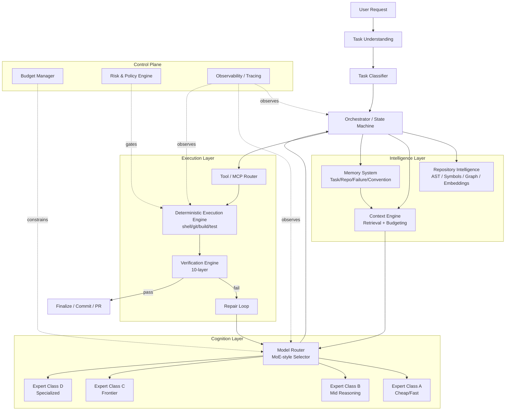

Layer responsibilities at a glance:

| Layer | Owns | Never does |
|---|---|---|
| Orchestrator (state machine) | Task lifecycle, transitions, retries, budgets | Reasoning about code |
| Repository Intelligence | Index, symbols, graph, embeddings | Deciding what to change |
| Context Engine | What the model sees, per call | Model selection |
| Model Router | Which model, per call | Executing tools |
| Tool/MCP Router | Which tool, per action | Judging correctness |
| Execution Engine | Running commands deterministically | Interpreting meaning |
| Verification Engine | Pass/fail ground truth | Fixing anything |
| Repair Loop | Turning failure into a next action | Bypassing verification |
| Memory | Cross-task learning | Being the source of truth for current state |
| Budget/Risk/Observability | Control plane constraints | Task logic |

---

# 5. Core Components

- **Orchestrator** — a durable state machine (per task) that sequences the lifecycle in §13, persists state after every transition, and is the only component allowed to call the Model Router, Tool Router, or Verification Engine directly. Nothing else is allowed to "just call the LLM."
- **Repository Intelligence Service** — maintains an incrementally-updated index (files, symbols, ASTs, call/dependency graph, embeddings) per repository, reusable across tasks and sessions.
- **Context Engine** — turns "what does the model need to know right now" into a token-budgeted, ranked context payload, per model, per call.
- **Model Router** — the MoE dispatcher (§6): classifies task difficulty, filters eligible experts, and selects one (or a small ensemble) under budget and policy constraints.
- **Model Adapter Layer** — a uniform interface (`generate`, `stream`, `tool_call`, `structured_output`) hiding provider-specific quirks (§20).
- **Tool / MCP Router** — resolves capability requests ("run tests", "search symbol") to concrete tool/MCP invocations, dynamically exposing only what's relevant (§9).
- **Deterministic Execution Engine** — sandboxed command execution, structured result normalization (§8).
- **Verification Engine** — the 10-layer ground-truth checker (§12).
- **Repair Loop** — bounded retry/escalation controller that turns verification failures into targeted next actions (§13).
- **Memory System** — five-layer persistent memory (§14).
- **Budget Manager** — tracks and constrains token/cost/latency spend per task and per org (§15).
- **Risk & Policy Engine** — classifies and gates actions by risk tier (§17).
- **Observability** — OpenTelemetry-style tracing across every call and transition (§18).

---

# 6. Model-Level MoE Router

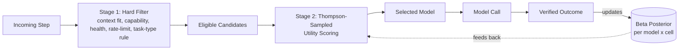

## 6.1 Expert taxonomy (concrete, not abstract)

| Class | Role | Example fit | Typical use |
|---|---|---|---|
| **A — Cheap/Fast** | classification, extraction, summarization, simple planning | small fast models (Haiku-class, GPT-mini-class, Qwen-small) | task classification, log summarization, commit message drafting, trivial one-line fixes |
| **B — Mid Reasoning** | everyday coding, debugging, repo analysis | mid-tier models (Sonnet-class, GPT-mid-class, DeepSeek-coder) | most implementation and repair work |
| **C — Frontier** | architecture, hard debugging, large refactors, ambiguous specs | top-tier reasoning models (Opus-class, GPT-frontier, Gemini-frontier) | escalation only |
| **D — Specialized** | domain-narrow tasks | SQL-tuned, security-tuned, frontend-tuned models | invoked by task-type tag, not by "strength" |

Class D is orthogonal to A–C: a specialization tag (`sql`, `security`, `frontend`, `infra`) narrows the candidate set *before* the A/B/C tier decision is applied.

## 6.2 Routing is two-stage, not one formula

**Stage 1 — Hard filter (rule-based, deterministic).** Eliminates ineligible models before any scoring happens:
- context window must fit estimated prompt + expected output
- required capability (tool-use, structured-output, vision) must be supported
- provider must be currently healthy (no open circuit breaker) and under rate limit
- task-type → allowed class mapping (e.g. "typo fix" never reaches Class C directly)

**Stage 2 — Soft selection (contextual bandit).** Among the surviving candidates, pick using a per-cell (model × task_type × repo_language × complexity_bucket) statistic, updated from **verified** outcomes, not model self-report:

```
utility(model, task) =
      w_q * success_prob(model, cell)        # Beta(α,β) posterior mean, Thompson-sampled
    − w_c * norm_cost(model, est_tokens)
    − w_l * norm_latency(model, est_tokens)
    − w_f * recent_failure_rate(model, window=50)
    + w_s * specialization_bonus(model, task.tags)
    − w_v * volatility_penalty(model)          # variance of recent quality, penalizes flaky providers
```

Selection uses **Thompson sampling** on `success_prob` (draw from each candidate's Beta posterior, pick the argmax of `utility`) rather than plain UCB or a fixed weighted sum, because:

- it naturally balances exploration/exploitation without a separate epsilon schedule,
- it degrades gracefully with sparse data (wide posteriors → more exploration for new/rare cells),
- it's cheap to compute (no gradient updates, no training loop) — appropriate given routing decisions must be sub-100ms and cannot block on a model call.

## 6.3 Why not learned RL / full policy learning

Explicitly rejected for the primary router:
- **Full RL (policy gradient, PPO over routing decisions)** — reward is sparse (verification pass/fail arrives many steps after routing), environment is non-stationary (providers silently change model versions/quality), and the action space changes as new models are added. The engineering cost and instability outweigh the benefit versus a bandit.
- **Static/rule-only routing** — too brittle; can't adapt when a provider degrades or a new model turns out to punch above its price for a given repo's language.
- **Fully learned neural router** — requires a labeled training set of "which model would have succeeded," which doesn't exist cheaply; the bandit *becomes* that training signal online, safely.

**Chosen combination:** rule-based hard filter (safety/eligibility) → contextual bandit soft selection (quality/cost optimization) → deterministic escalation ladder (§7) for retries → optional multi-model consensus only at the top of the ladder (§6.4). This is the simplest design that is both safe and self-improving.

## 6.4 Escalation and consensus as router features, not separate systems

Escalation (§7) is implemented as the bandit's candidate set shifting upward by one class after each verified failure, with the failure fed back as a negative observation for the model/cell that was tried. Multi-model consensus (two Class-B/C models propose independently, a cheap Class-A model or deterministic diff-compare reconciles) is reserved for Level 4 of the ladder — it roughly doubles cost, so it is never the default.

## 6.5 Routing decision record

Every routing decision is persisted:

```json
{
  "task_id": "t_8f21",
  "cell": {"task_type": "bug_fix", "lang": "typescript", "complexity": "medium"},
  "candidates": ["claude-sonnet-x", "gpt-mid", "deepseek-coder"],
  "chosen": "claude-sonnet-x",
  "utility_breakdown": {"success_prob": 0.81, "cost_penalty": 0.04, "latency_penalty": 0.02, "specialization_bonus": 0.0},
  "escalation_level": 2,
  "outcome": null
}
```
`outcome` is filled in by the Verification Engine after the fact and used to update the Beta posterior for `(chosen, cell)`.

---

## 6.6 Hierarchical Model Escalation

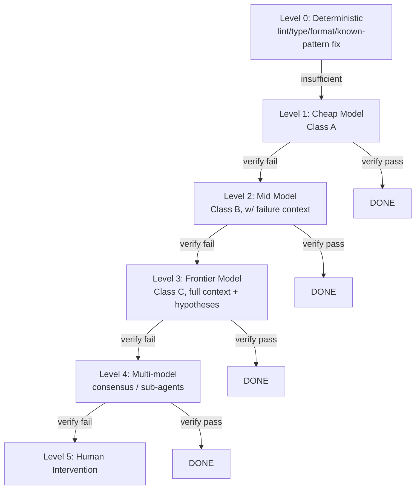

Escalation rules:

- **Never skip a level** except when the Task Classifier assigns a task a minimum starting level (e.g. "large architectural refactor" starts at Level 2, not Level 0/1 — trying a cheap model first would just waste a call the router already knows will fail, based on the `task_type → min_level` rule table).
- **Escalation is per-failure-class-aware.** A syntax error escalates less aggressively (often stays at Level 0/1 — feed the compiler error back deterministically) than a logic/behavioral test failure (escalates model tier because it needs actual reasoning).
- **Retry budget per level is capped** (default: 2 attempts at L0–L2, 1 attempt at L3, 1 attempt at L4) — see Repair Loop (§13) for the full budget/circuit-breaker design.
- **Downward re-calibration**: if Level 1 has a rolling success rate above threshold (e.g. 85%) for a given cell over the last N tasks, the classifier's `min_level` for that cell can be lowered — this is how the system gets cheaper over time on a stable codebase/task type without manual tuning.
- **Level 5 (human)** is a first-class terminal state, not a crash: task is paused, full state/blackboard/diff/verification trace is packaged for a human reviewer, and the task can be resumed after human input re-enters the state machine as a new hypothesis.

---

# 7. Context Engineering

Principle: the model receives **minimum sufficient context**, assembled fresh per call, not an ever-growing transcript.

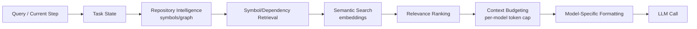

Selection algorithm, in order:

1. **Task state slice** — objective, constraints, current plan step, and *only* the last N structured actions/results (not raw transcript) from the Blackboard (§11).
2. **Symbol/dependency retrieval** — for the file(s)/symbol(s) directly implicated by the current step, pull the AST-level signature, direct callers/callees (1-hop), and the relevant test file(s) — not whole files unless small.
3. **Semantic search** — only if step 2 doesn't fully resolve ("find where X concept is handled" style steps); embedding search over the repo index, capped to top-k, deduplicated against what step 2 already retrieved.
4. **Relevance ranking** — a lightweight scorer (recency, graph-distance, lexical overlap with task description, prior-failure relevance) orders all retrieved candidates; low scorers are cut before formatting, not truncated blindly at the end.
5. **Context budgeting** — a hard token budget per call, tiered by model class (Class A gets a small, tight budget; Class C gets more room since it's invoked for harder tasks) and by remaining task-level budget (§15). Budgeting truncates by *dropping lowest-ranked items*, never by mid-file truncation of something judged relevant.
6. **Model-specific formatting** — the same underlying context object is rendered differently per adapter (e.g. some models want file content fenced with line numbers; some want diffs; system prompt structure differs) — this is the last step, handled by the Model Adapter Layer (§20), not baked earlier.

What is explicitly **excluded by default**: full repository trees, full file contents beyond the relevant slice, past raw tool stdout (only structured diagnostics, §10), prior model chain-of-thought, and unrelated failure history. Each is retrievable on demand if the model's next action explicitly requests it (as a tool call), which is a deliberate, logged, budgeted decision rather than an ambient default.

**Context compaction**: at defined checkpoints (state transition, or blackboard exceeding a size threshold), a Class-A model — not the working model — is used to compress completed-step history into a short structured summary appended to Task Memory, replacing the verbose entries in the live blackboard.

---

# 8. Repository Intelligence

Discipline enforced: **SEARCH → LOCATE → READ**, never "read everything, ask the LLM."

Index components (built incrementally, reused across tasks):

- **File tree index** — path, hash, language, size, last-modified, owning module.
- **Symbol index** — via tree-sitter per language: functions, classes, types, exports, with byte-range spans (so retrieval pulls exact spans, not whole files).
- **Call graph / dependency graph** — caller→callee edges, import/export edges, built from the symbol index; stored as an adjacency table (SQLite/Postgres, recursive CTEs for traversal — no separate graph DB needed at repo scale, see §23).
- **Test graph** — maps source symbols to the tests that exercise them (via import analysis + coverage data when available), so verification and repair can target the *relevant* tests instead of the full suite.
- **Config/framework/language detection** — parses lockfiles, manifest files, CI config to determine package manager, framework, build/test/lint commands — this removes an entire class of "ask the LLM to figure out how to run tests" calls.
- **Git history index** — recent churn, blame, and commit-message association per file, used for ownership hints and for weighting relevance (recently-touched files are more likely relevant to a bug).
- **Embeddings index** — chunked at symbol/function granularity (not fixed-size sliding windows), stored in a local vector store; used only as the fallback for step 3 of context retrieval, not the primary lookup path.

**Incremental indexing strategy**: a file-watcher / git-hook-triggered diff indexer re-parses only changed files (identified by content hash) and patches the symbol/graph/embedding indexes rather than rebuilding — first index of a mid-size repo (~50k LOC) targets under 60s; incremental updates target sub-second for single-file diffs. The index is versioned against a repo commit hash, so a stale index is detectable (§25) and triggers a background re-sync rather than blocking the task.

The Repository Intelligence Service exposes a small capability surface to the rest of the system (not raw file access): `find_symbol`, `get_callers`, `get_callees`, `get_definition_span`, `find_tests_for`, `semantic_search`, `repo_map(scope)`. This is itself consumed through the Tool/MCP Router like any other capability — the model never gets raw filesystem `ls`/`cat` as its primary discovery mechanism.

---

# 9. Tool / MCP Router

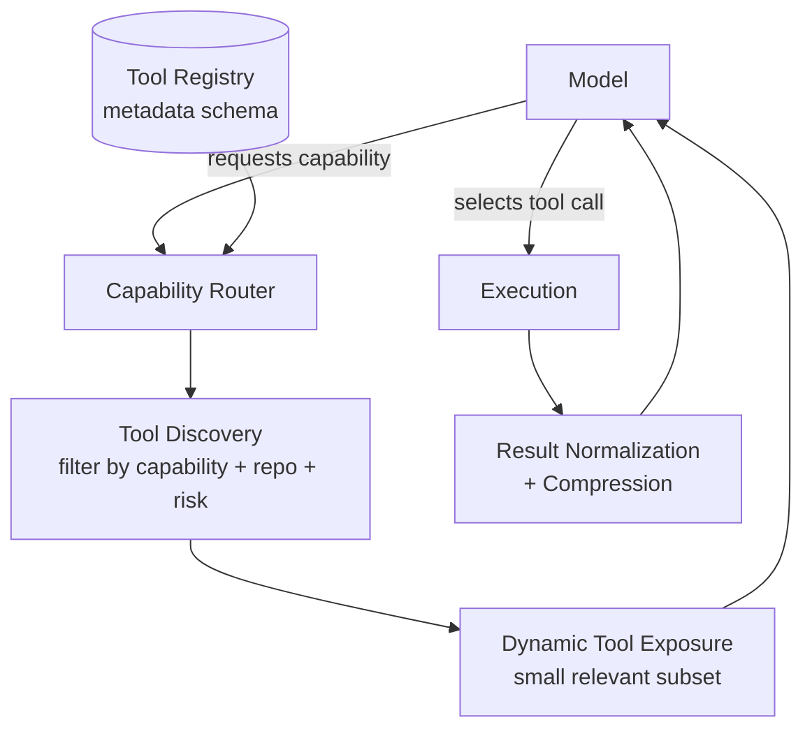

The model is shown **capabilities**, not tools:

```
filesystem · git · testing · build · lint · browser · database · cloud · deployment · observability · repo-intel
```

Only after the model selects a capability (or the Orchestrator pre-selects one deterministically for a known step type) does the Capability Router resolve it to concrete tool(s)/MCP server(s), ranked by: fit to capability, repo compatibility (e.g. which package manager is actually in use), historical reliability, and permission level. Typically 1–5 concrete tools are exposed for a given step, never the full registry.

**Tool metadata schema** (per registered tool):
```json
{
  "id": "git.commit",
  "capability": "git",
  "risk_tier": "medium",
  "idempotent": false,
  "timeout_ms": 15000,
  "retryable": false,
  "input_schema": {...},
  "output_schema": {...},
  "cost_class": "free"
}
```

Cross-cutting handling done centrally, not per-tool: retries with backoff (only for `retryable: true`), timeout enforcement, idempotency-key dedup for anything mutating, structured error normalization (`{error_class, message, recoverable, suggested_capability}`), and result compression (large stdout is summarized/truncated to the structurally relevant portion — e.g. failing test names + assertion diffs, not full console spam) before it ever reaches a model.

**Batching**: independent read-only tool calls in the same step (e.g. "get definition of X" + "find tests for Y") are batched and executed in parallel, with results merged before the next model call — this is a major latency lever (§19) that costs nothing in correctness since the calls are independent by construction.

---

# 10. Agent Orchestrator

The Orchestrator owns the Task State Machine (§13) and is the single authority that may invoke the Model Router, Tool Router, or Verification Engine. It is implemented as a durable, resumable workflow (persist-after-every-transition), so a crash, restart, or long-running human-approval pause never loses task progress.

Responsibilities:
- drive state transitions per §13,
- enforce budgets (reject/downgrade a step if it would exceed remaining task budget),
- enforce risk policy (route medium/high-risk actions through the Risk Engine before execution),
- own retry/escalation counters,
- emit trace spans for every transition (§18),
- decide, per step, whether the step needs a model call at all (many steps — e.g. "run the test suite," "apply a previously-successful patch from Failure Memory" — do not).

---

# 11. Blackboard / State Machine

## 11.1 Task State Machine

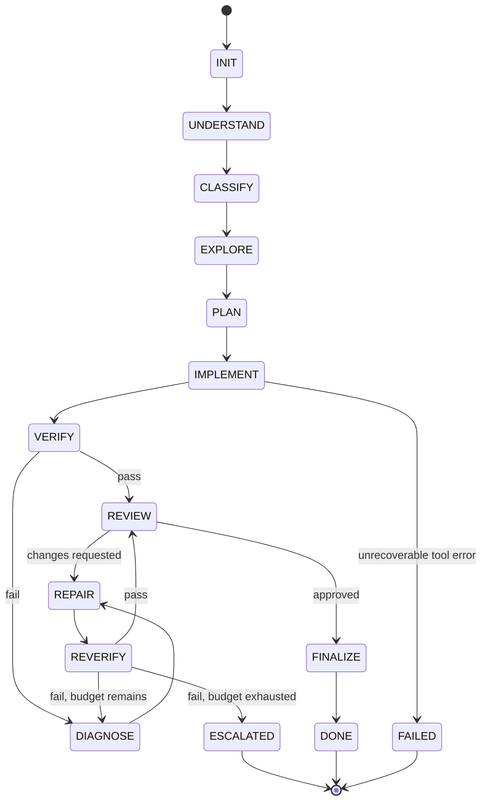

This is a real DAG with backedges (repair loops), not a linear chain — `VERIFY`/`REVERIFY` can cycle back to `DIAGNOSE` up to the repair budget (§13), and `REVIEW` can bounce back into `REPAIR` for review-requested changes without re-running the whole lifecycle.

## 11.2 Task State Schema

```json
{
  "task_id": "t_8f21",
  "objective": "Fix off-by-one in pagination",
  "constraints": ["no API signature changes"],
  "state": "REPAIR",
  "plan": [{"step": 1, "desc": "locate pagination logic", "status": "done"},
           {"step": 2, "desc": "patch boundary condition", "status": "in_progress"}],
  "files_touched": ["src/pagination.ts"],
  "hypotheses": [{"id": "h1", "text": "off-by-one in slice bound", "status": "testing"}],
  "evidence": ["test_pagination_last_page failing: expected 10 items got 9"],
  "tests": {"run": 42, "passed": 41, "failed": 1},
  "errors": [{"class": "assertion", "file": "pagination.test.ts", "line": 34}],
  "retries": {"level1": 1, "level2": 0, "level3": 0},
  "model_usage": [{"model": "claude-haiku-x", "calls": 3, "tokens": 4200}],
  "token_usage": {"input": 18400, "output": 2100, "cached": 6000},
  "budget": {"max_usd": 0.75, "spent_usd": 0.11, "max_calls": 12, "used_calls": 4},
  "permissions": {"can_write": true, "can_exec_shell": true, "can_deploy": false},
  "artifacts": {"diff": "patches/t_8f21.diff"},
  "final_status": null
}
```

## 11.3 Blackboard

Shared, ephemeral working memory scoped to the current task (distinct from persistent Memory, §14):

```json
{
  "goal": "...",
  "constraints": ["..."],
  "current_hypothesis": "...",
  "relevant_files": ["..."],
  "recent_actions": [{"action": "run_tests", "result_ref": "r_1"}],
  "test_results": {"...": "..."},
  "known_failures": ["previously tried: rewrite slice() call — reverted, broke pagination cursor"],
  "open_questions": ["is pagination cursor 0- or 1-indexed elsewhere in the codebase?"],
  "next_action": "search for cursor usage in related modules",
  "completion_criteria": "all pagination tests pass, no unrelated diffs"
}
```

Update rules: only the Orchestrator writes to the Blackboard (models propose deltas, the Orchestrator validates/applies them — this prevents a model from silently corrupting shared state). Conflict resolution: last-validated-write-wins per field, with a `contradicts_evidence` check against `evidence`/`test_results` before acceptance (a hypothesis contradicted by prior evidence is rejected, not merged). Expiration: `recent_actions` is capped (last 8) and older entries are compacted into Task Memory (§8's context compaction) rather than deleted outright.

---

# 12. Verification Engine

Ten layers, run in cheapest-first order, each capable of independently determining failure (short-circuiting later, more expensive layers):

| Layer | Check | Cost | LLM involved? |
|---|---|---|---|
| 1 | Syntax (parse) | ~ms | No |
| 2 | Type checking | ~ms–s | No |
| 3 | Lint | ~ms–s | No |
| 4 | Unit tests (targeted, via Test Graph) | ~s | No |
| 5 | Unit tests (full suite, if targeted subset passes) | ~s–min | No |
| 6 | Integration tests | ~min | No |
| 7 | Behavioral/golden tests (if suite exists) | ~min | No |
| 8 | Security checks (SAST, dependency audit) | ~s–min | No |
| 9 | Regression detection (diff against baseline behavior/perf) | ~s | No |
| 10 | Repo-specific invariants (custom rules, e.g. "no direct DB calls outside repository layer") | ~ms–s | No |

**LLM is invoked from Verification only when all 10 layers pass deterministically but a task explicitly required semantic judgment the layers can't express** (e.g. "does this refactor preserve intended behavior for an under-tested legacy function" with no golden test) — and even then, it's a narrow, structured judgment call (given the diff + spec, classify: `matches_intent | uncertain | violates_intent`), not open-ended grading.

Verification output is always the structured diagnostic object from §10 (status, exit_code, test_summary, diagnostics[], affected_files[], error_class, confidence) — this is what feeds Diagnosis, never raw tool stdout.

---

# 13. Repair Engine

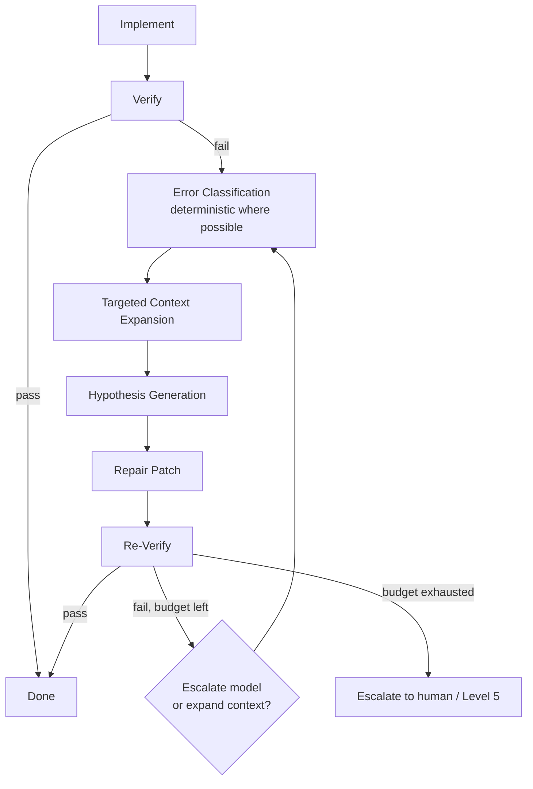

Controls to prevent infinite loops:

- **Retry budget**: hard cap per level (default 2 at L0–L2, 1 at L3, 1 at L4 — configurable per task risk/cost profile).
- **Repair budget**: separate token/cost ceiling for the repair phase (default: repair phase may not exceed 2× the original implementation phase's spend).
- **Repeated-failure detection**: if the same `error_class` + `affected_files` signature recurs after a repair attempt, the next attempt is forced to escalate model tier (repeating the same tier is disallowed — prevents "try again, hope for a different answer" loops) and context is expanded (pull in one more hop of the call graph, or bring in the relevant Failure Memory entries).
- **Patch isolation**: each repair attempt is applied as an isolated, revertible patch (not stacked on the previous failed attempt) so a bad hypothesis doesn't compound.
- **Rollback**: a failed repair always reverts to the last known-good state before the next hypothesis is tried — the Blackboard's `known_failures` is updated so it isn't retried.
- **Circuit breaker**: if a task has escalated through all levels and still fails, or if 3+ repair cycles produce contradictory hypotheses, the task moves to `ESCALATED` (Level 5) rather than continuing — this is a hard stop, not a soft suggestion.

---

# 14. Memory System

```mermaid
flowchart LR
    EXP[New Experience] --> MATCH[Similarity / Structured Match]
    MATCH --> LAYERS

    subgraph LAYERS[Memory Layers]
        TM[Task Memory\nper-task compacted history]
        RM[Repository Memory\nconventions, architecture facts]
        AM[Architecture Memory\nADRs, structural decisions]
        CM[Coding Convention Memory\nstyle, patterns]
        FM[Failure Memory\nsymptom→root cause→fix]
        SM[Successful Solution Memory\nreusable patterns]
        UM[User Preference Memory]
    end

    LAYERS --> RETRIEVE[Relevant Prior Experience]
    RETRIEVE --> CTX[Context Engine]
```

Deliberately **not** "dump everything into one vector database." Each layer has a different schema, update cadence, and retrieval method:

| Layer | Schema | Retrieval | Update |
|---|---|---|---|
| Task Memory | compacted step summaries | by task_id | on compaction (§8) |
| Repository Memory | structured facts (framework, conventions, build cmds) | by repo_id, direct lookup | on index/detect, rarely changes |
| Architecture Memory | ADR-style records (decision, rationale, alternatives) | by repo_id + tags | on architecture-affecting task completion |
| Coding Convention Memory | inferred style rules (naming, error handling patterns) | by repo_id + language | periodic re-inference from diffs |
| Failure Memory | `{symptom, error, root_cause, affected_files, fix, failed_fixes[]}` | structured match first (error_class + file/module), embedding fallback | on every terminal task outcome |
| Successful Solution Memory | patch pattern + applicability conditions | structured match on task_type + symptom | on verified success, generalized after N repeats |
| User Preference Memory | explicit + inferred preferences (review style, risk tolerance) | by user_id, direct lookup | on explicit feedback |

Retrieval for a new failure always tries **structured match first** (same error class, same or graph-adjacent file, same repo) before falling back to embedding similarity — structured match is cheaper, more precise, and avoids false-positive "similar-sounding but unrelated" retrievals that pure vector search is prone to.

---

# 15. Multi-Agent System

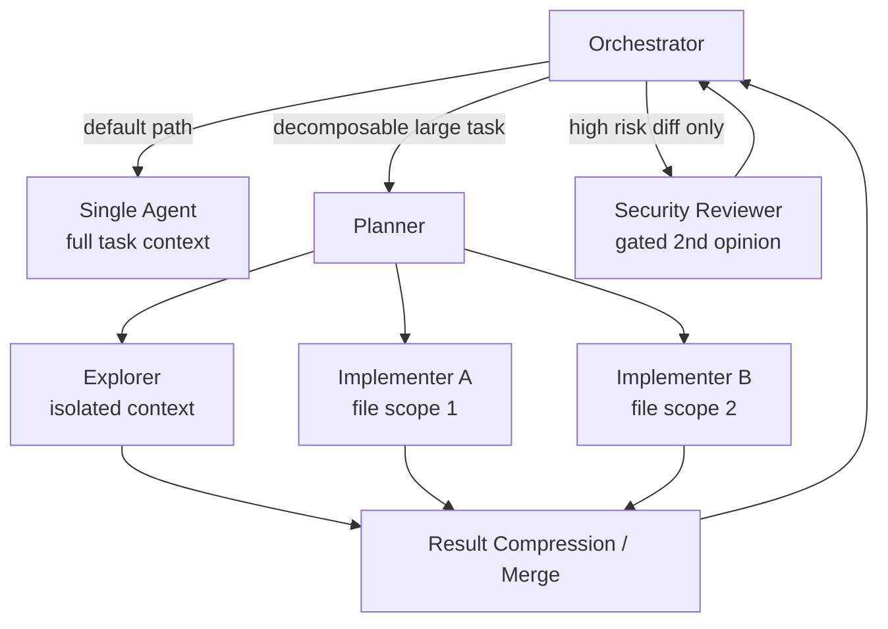

**Default: single agent, single active context, per task.** Sub-agents are the exception, spun up only when they pay for themselves in reduced total cost/latency/error rate, because each sub-agent adds: context duplication, a model call to spawn, a model call to merge/reconcile, and a new failure surface (coordination bugs).

When sub-agents *are* worth it:

- **Explorer** (parallel, isolated context) — when the task genuinely needs broad, independent search across unrelated parts of a large repo (e.g. "find all places this deprecated API is used") — cheap-model, parallelizable, result-compressed before merge.
- **Implementer + Tester running in parallel on independent files** — only when the plan has proven-independent subtasks (no shared file, no shared symbol per the dependency graph) — verified by the Planner via the call graph before parallelizing, not assumed.
- **Security Reviewer / Architect as a gated second opinion** — only on high-risk-tier changes (§17), as a single extra Class-B/C call reviewing the diff, not a persistent agent.

Explicitly **not** used by default: a standing "team" of Planner/Debugger/Tester/Reviewer agents chatting with each other per task — this is the most common source of runaway token cost in multi-agent designs (each agent re-derives context, and inter-agent chat itself consumes tokens without proportionally improving correctness for typical bug-fix/feature tasks).

Comparison:

| Architecture | Token cost | Latency | Correctness gain | Use when |
|---|---|---|---|---|
| Single-agent | Low | Low | Baseline | Default — >90% of tasks |
| Hierarchical multi-agent (planner delegates to workers) | Medium–High | Medium | Gains only on genuinely decomposable large tasks | Large refactors, multi-module features |
| Parallel specialist (independent experts, merge/vote) | High | Low (parallel) but high total cost | Gains mainly on ambiguous/high-stakes decisions | Consensus at escalation Level 4 only |

**Chosen production default**: single-agent execution through the state machine, with hierarchical delegation available as a Planner-invoked capability (not a standing architecture) for tasks the Planner explicitly classifies as decomposable, and parallel specialist consensus reserved strictly for Level 4 escalation. Sub-agent budgets are carved out of the parent task's budget (not additive), sub-agents terminate on their own verification pass/fail or budget exhaustion, and conflicting sub-agent outputs are reconciled by a deterministic diff-merge first, falling to a cheap-model tiebreak only on genuine semantic conflict.

---

# 16. Cost / Token Optimization

Budget Manager tracks, per task and per org: input/output/cached tokens, tool tokens, API cost, latency, and rolling model success rates. The Router does not just estimate `cost(model, task)` — it optimizes under a constraint:

```
choose model m maximizing utility(m, task)
subject to:  spent_usd + est_cost(m, task) ≤ task.budget.max_usd
             spent_calls + 1 ≤ task.budget.max_calls
```

If no eligible model fits the remaining budget, the task doesn't silently degrade to a bad answer — it transitions to `ESCALATED` with a budget-exceeded reason, surfaced to the user/operator for an explicit budget increase decision. This is a deliberate design choice: **silent quality degradation under budget pressure is worse than an explicit stop.**

Prompt caching (provider-level, e.g. cached system/context prefixes) is treated as a first-class cost lever in the Context Engine: stable context (repo conventions, tool schemas, system policy) is ordered first and kept byte-identical across calls within a task specifically to maximize cache hits; volatile context (current diagnostics) is appended after the cache-stable prefix, never interleaved into it.

---

# 17. Security / Risk Engine

| Tier | Examples | Policy |
|---|---|---|
| **Low** | read file, search, run tests, lint | Auto-approved, no gate |
| **Medium** | modify source, install a declared dependency, `git commit` (not push) | Auto-approved within task scope + repo allowlist; logged |
| **High** | delete files outside task scope, modify secrets/env, `git push`/deploy, DB migration, destructive shell commands | Requires explicit policy match (pre-approved pattern) or human approval gate; sandboxed dry-run required first where possible |

Risk scoring combines: static action classification (from the tool metadata's `risk_tier`), blast radius (files/services affected vs. task scope), and reversibility (is there a rollback path). The policy engine defaults to **deny/ask** for anything that doesn't match an explicit low/medium allow-rule — risk classification errs toward asking, never toward silently permitting.

All execution happens inside a sandbox (container/microVM, §24) with no network access by default, no credentials beyond what the task explicitly needs, and filesystem access scoped to the working checkout. Rollback is structural, not best-effort: every mutating action is committed as an isolated, revertible unit (patch/commit), so any high-risk action can be undone by reverting to the last checkpoint rather than relying on the model to "undo" its own change.

---

# 18. Observability

Every task emits an OpenTelemetry-compatible trace tree:

```
Task
 └─ Subtask
     └─ Model call (span: model, tokens, latency, cost, cell)
     └─ Context assembly (span: sources retrieved, tokens budgeted/dropped)
     └─ Tool call (span: tool, duration, result size, risk_tier)
     └─ Verification (span: layer-by-layer pass/fail)
     └─ Repair iteration (span: level, hypothesis, outcome)
```

Core metrics dashboarded: task success rate, first-pass success rate (no repair needed), avg model calls/task, tokens/task, cost/task, **cost per successful task** (the real efficiency metric — a cheap failed task is not cheap), tool calls/task, repair iterations/task, escalation rate by level, human-intervention rate, failure category breakdown, p50/p95 latency, and per-model quality (win rate in the bandit, calibration of the router's predicted `success_prob` vs. actual).

---

# 19. Evaluation Framework

Fixed task suites (bug fixing, feature implementation, refactoring, review, test generation, dependency upgrade, documentation, repo migration) run against pinned repository fixtures with known-good solutions/tests, executed the same way production tasks are (through the real Orchestrator, not a mocked harness), so eval results are trustworthy predictors of production behavior.

Every suite run reports: correctness (does the verified diff match/pass the golden criteria), regression rate (does anything previously passing now fail), autonomy (did it finish without human intervention), token/cost efficiency, and latency. The framework supports A/B comparison of routing policies, prompt versions, context strategies, and memory-on/off — by running the identical task suite through two configurations and diffing the metrics, not by subjective review. This is what allows router weights (`w_q, w_c, w_l, ...` in §6.2) and escalation thresholds to be tuned empirically rather than guessed.

---

# 20. Storage Architecture

**Low-complexity deployment (single dev / small team):**
- SQLite for task state, blackboard, memory layers, tool/routing decision logs.
- `sqlite-vec` (or embedded LanceDB) for the embedding index.
- Local filesystem for repo checkouts, patches, artifacts.
- No Redis, no queue service — a SQLite-backed job table with polling is sufficient at this scale.

**Large-scale deployment (multi-tenant / team server):**
- PostgreSQL (with `pgvector`) as the system of record: task state, memory, routing logs, embeddings.
- Redis for the task queue (BullMQ), rate-limit counters, and short-TTL caches (tool result cache, semantic retrieval cache).
- Object storage (S3-compatible) for large artifacts (patches, logs, sandbox snapshots).
- Graph relationships (call graph, dependency graph) remain modeled as adjacency tables with recursive CTEs in Postgres — a dedicated graph database (Neo4j etc.) is deliberately not introduced; repo-scale graphs (10^4–10^6 edges) do not need it, and it would add an operational dependency without a proportional benefit.

---

# 21. Deployment Architecture

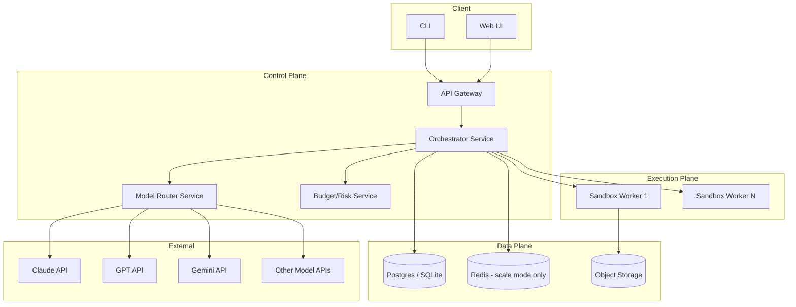

---

# 22. Low-Resource Deployment

Split cleanly along the "deterministic vs. cognitive" line already established:

- **Local (client machine)**: Orchestrator, state store (SQLite), lightweight incremental indexer, local caches, local tool execution (filesystem/git/test runner), sandboxing via lightweight containers.
- **Remote (API)**: all model inference — no local model is required for the system to function; local embedding generation is optional (fall back to a remote embedding API if the client is too weak to run one locally).
- **Optional remote worker**: for heavier repos or CI-triggered tasks, the same Orchestrator binary runs as a remote worker instead of on the laptop, with state synced through the same Postgres/SQLite schema — this is a deployment-mode switch, not a different architecture.

This hybrid means the architecture scales from "solo developer's laptop" to "team server" by moving the *same* components across a network boundary, not by redesigning them.

---

# 23. Failure Analysis

| Failure mode | Detection | Mitigation | Recovery |
|---|---|---|---|
| Model hallucination (invents API/file) | Deterministic verification (compile/type-check) catches it immediately | Ground truth verification is mandatory before any change is accepted | Repair loop with the concrete error fed back |
| Wrong tool selection | Tool schema validation, output-shape mismatch | Capability Router narrows options; risk tier limits blast radius | Structured error returned to model, retry with corrected tool |
| Context overflow | Token budgeting pre-check before call | Hard budget enforced by Context Engine, never exceeded silently | Drop lowest-ranked context, retry |
| Context contamination (irrelevant/stale info biases output) | Relevance ranking score threshold | Low-relevance items excluded before formatting | N/A — prevented by design |
| Tool failure / API timeout | Timeout enforcement, structured error class | Retry with backoff (idempotent only), circuit breaker per provider | Fallback to alternate provider/model via Router |
| Rate limit | Provider response code | Router's hard filter excludes rate-limited providers | Reroute to next-best eligible model |
| Model degradation (silent quality drop) | Rolling success-rate monitoring per model/cell | Bandit posterior shifts away automatically | Alert if a previously-strong model's success rate drops sharply |
| Routing error (bad selection) | Verification failure attributed back to routing decision log | Feeds negative observation into bandit | Escalation ladder catches it next attempt |
| Infinite repair loops | Repeated-failure signature detection, repair budget | Forced escalation or circuit breaker | Task moves to ESCALATED, human review |
| Incorrect repository assumptions | Repo Intelligence facts checked against actual detected config | Config/framework detection is deterministic, not assumed by the model | Re-run detection, correct Repository Memory |
| Stale repository index | Index versioned against commit hash | Hash mismatch triggers background re-sync | Task blocks on critical-path re-index only, proceeds elsewhere |
| Stale memory | Memory entries carry repo-version tags | Low-confidence/old entries deprioritized in retrieval | Periodic memory garbage collection |
| Malicious code / prompt injection (e.g. in a fetched file, issue, or dependency) | Content from untrusted sources treated as data, never as instructions; explicit injection-pattern scanning on ingested external content | Tool outputs and fetched content are never auto-executed as instructions | Flag and require human review before proceeding |
| Dependency poisoning | Dependency install is a medium/high-risk action | Policy gate on install source + version pinning | Rollback via revertible commit |
| Destructive commands | Risk classification (high tier) | Deny/ask default, sandboxed dry-run | Rollback from checkpoint |
| Silent verification failures (e.g. flaky test masking a real regression) | Regression-detection layer (§12) compares against baseline, flakiness tracked per test over time | Flaky tests quarantined from pass/fail gating, flagged separately | Does not block, but is surfaced, not silently ignored |

---

# 24. Technology Stack

| Concern | Choice | Why |
|---|---|---|
| Orchestrator / Backend | **TypeScript / Node.js** | strong async I/O for many concurrent model/tool calls, single language across orchestrator + CLI + web UI, good MCP SDK support |
| LLM Gateway / Model Adapter | TypeScript module, thin per-provider adapters | keeps routing logic and provider quirks in one owned codebase, not an opaque third-party gateway |
| Task Queue | SQLite-backed table (MVP) → **BullMQ on Redis** (scale) | avoid Redis dependency until concurrency actually demands it |
| State Store | **SQLite** (MVP) → **PostgreSQL** (scale) | same schema, straightforward migration path |
| Cache | in-process LRU (MVP) → **Redis** (scale) | tool-result / semantic-retrieval caching |
| Vector Search | `sqlite-vec` / embedded LanceDB (MVP) → **pgvector** (scale) | avoid standing up a separate vector DB service early |
| Code Index (AST/symbols) | **tree-sitter** (multi-language grammars) + ripgrep for lexical fallback | fast, incremental, battle-tested, language-agnostic |
| Graph / Dependency Analysis | adjacency tables in SQLite/Postgres, recursive CTEs | avoids a dedicated graph DB at repo scale |
| Sandbox | Docker + seccomp (MVP) → **Firecracker microVMs** (scale) | stronger isolation and fast cold-start at scale |
| Observability | **OpenTelemetry** SDK, Prometheus + Grafana, Jaeger/Tempo for traces; local files (MVP) → ClickHouse/Loki (scale) | open standard, avoids vendor lock-in |
| Web UI | **Next.js / React** | consistent with TS-first stack |
| CLI | **TypeScript (oclif)** | shares code with orchestrator |
| MCP | official **MCP TypeScript SDK**, servers as separate processes over stdio/SSE | standard, composable |
| Testing (of the system itself) | task-suite runner executing through the real Orchestrator against pinned repo fixtures, CI via GitHub Actions | trustworthy because it's not a mocked harness |
| Model APIs | Claude, GPT, Gemini, DeepSeek, Qwen — all behind the Model Adapter Layer | no orchestration logic depends on a specific vendor |

---

# 25. Recommended MVP

Build, in this order, the smallest slice that proves the core loop end-to-end on a single repo, single user, single model provider first:

1. Task State Machine + Blackboard (persisted in SQLite) — no model calls yet, just the skeleton.
2. Deterministic Execution Engine + structured diagnostics (§10) — shell/git/test/lint wrapped with normalized output.
3. Repository Intelligence: file tree + tree-sitter symbol index (skip embeddings/call-graph initially).
4. Model Adapter Layer for **one** provider, plus a trivial one-tier router (no bandit yet — static rule: cheap model first, escalate to one strong model on failure).
5. Verification Engine layers 1–4 (syntax/type/lint/unit-test) — this alone gives ground-truth pass/fail.
6. Repair loop with a hard retry cap (2 attempts, 1 escalation) — no memory yet.
7. Minimal CLI to submit a task and see the diff + verification result.

This MVP already delivers the core value proposition (autonomous fix-verify-repair on real ground truth) without the router's bandit, multi-provider support, embeddings, or memory — all of which are additive, not required for correctness.

---

# 26. Phase 2

- Multi-provider Model Adapter + full hard-filter/soft-select router (bandit) replacing the static rule.
- Context Engine with retrieval ranking + token budgeting (replacing "send relevant files ad hoc").
- Call/dependency graph + test graph in Repository Intelligence.
- Failure Memory + Successful Solution Memory (structured match).
- Risk & Policy Engine with explicit medium/high-risk gating.
- Observability: full OpenTelemetry tracing + dashboards.
- Verification layers 5–10 (integration/behavioral/security/regression/invariants).

# 27. Phase 3

- Embeddings-based semantic search fallback in Repository Intelligence and Context Engine.
- Multi-agent support (Explorer, gated Security Reviewer) for large/decomposable tasks and high-risk diffs.
- Multi-model consensus at escalation Level 4.
- Evaluation framework with fixed task suites + A/B testing infrastructure for router/prompt/context tuning.
- Scale-mode storage (Postgres/pgvector/Redis) and Firecracker sandboxing.
- Architecture Memory (ADRs), Coding Convention Memory, User Preference Memory.
- Low-resource / remote-worker deployment split.

---

# 28. Final Recommended Architecture

## 28.1 Final Architecture Diagram

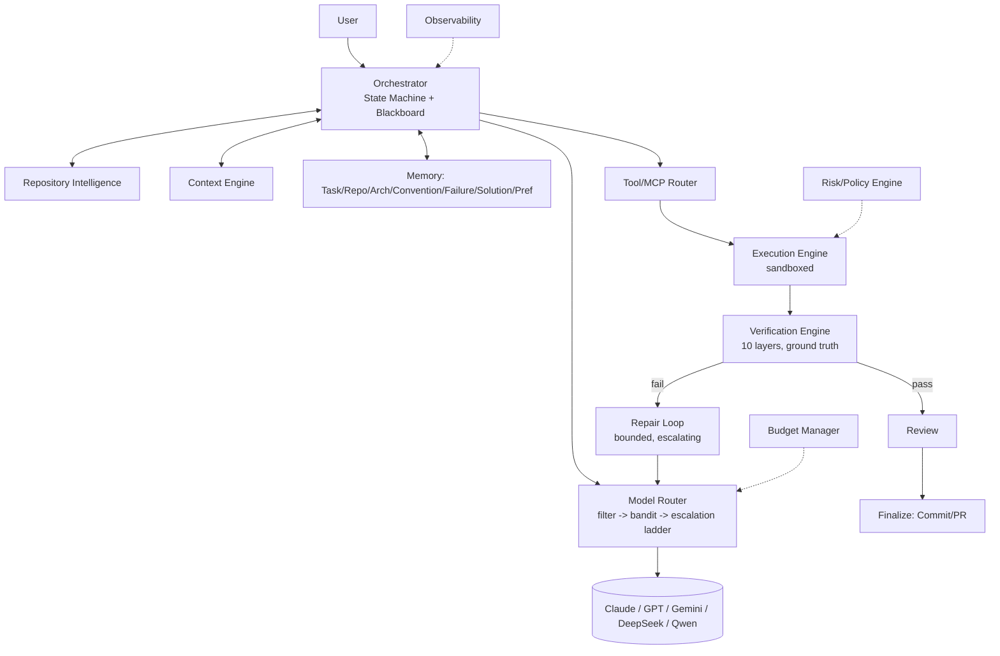

## 28.2 Component Responsibility Matrix

| Component | Decides | Never decides |
|---|---|---|
| Orchestrator | state transitions, budgets, delegation | code correctness |
| Repository Intelligence | what exists in the repo | what to change |
| Context Engine | what the model sees | which model |
| Model Router | which model/tier | how to fix code |
| Model (LLM) | code content, hypotheses, plans | ground-truth pass/fail |
| Tool/MCP Router | which tool | correctness of tool's result |
| Execution Engine | how a command runs, sandboxed | whether the result is "good" |
| Verification Engine | pass/fail, ground truth | how to fix a failure |
| Repair Loop | next hypothesis / escalation | when to stop trying (budget does) |
| Memory | what's reusable | current task's live state |
| Budget Manager | affordability | task correctness |
| Risk Engine | permission to act | whether the action is a good idea technically |

## 28.3 Core Data Structures

The three canonical objects are the **Task State** (§11.2), the **Blackboard** (§11.3), and the **Structured Diagnostic** (§10/§12):

```json
// Structured Diagnostic — the universal execution result format
{
  "status": "failed",
  "exit_code": 1,
  "test_summary": {"run": 42, "passed": 41, "failed": 1},
  "diagnostics": [{"file": "pagination.test.ts", "line": 34, "message": "expected 10 got 9"}],
  "affected_files": ["src/pagination.ts"],
  "error_class": "assertion",
  "confidence": 0.95
}
```
Every deterministic engine (execution, verification, repair diagnosis) speaks this format; it's the only thing that ever reaches the model as "what happened."

## 28.4 Main Execution State Machine

See §11.1 for the full diagram. Algorithmically:

```
state = INIT
while state not in {DONE, FAILED, ESCALATED}:
    action = policy_for(state)              # deterministic table, not model-decided
    if action.needs_model:
        candidates = hard_filter(task, action)
        model = bandit_select(candidates, cell(task, action))
        result = model_call(model, context_engine.build(task, action))
    else:
        result = deterministic_engine.run(action)
    state = transition(state, result)        # explicit table: (state, result) -> next_state
    persist(task_state, blackboard)
    emit_trace(state, action, result)
```

The transition table is data, not code scattered through prompts — this is what makes the system auditable and resumable.

## 28.5 Model Routing Algorithm (summary)

`hard_filter → Thompson-sample utility() over surviving candidates → execute → verify → feed outcome back into Beta posterior for (model, cell)`. Full detail in §6.

## 28.6 Token Optimization Strategy (summary)

Minimum-sufficient context (§7) + prompt-cache-aware ordering + cheapest-tier-first escalation (§6.6) + structured diagnostics instead of raw logs (§10/§12) + memory reuse to skip re-discovery (§14). Together these are the primary lever — see §29 for the first-principles breakdown.

## 28.7 Tool Routing Strategy (summary)

Capabilities shown, not tools; Capability Router resolves to 1–5 concrete tools per step; independent read-only calls batched in parallel; results compressed before reaching the model. Full detail in §9.

## 28.8 Failure Recovery Strategy (summary)

Ground-truth verification triggers classification → bounded repair with patch isolation and rollback → forced escalation on repeated-signature failure → circuit breaker to human review. Full detail in §13, §23.

## 28.9 Recommended Technology Stack

See §24.

## 28.10 MVP Implementation Order

See §25–27.

## 28.11 Most Important Engineering Risks

1. **Router miscalibration early on** (cold-start bandit has no data) — mitigate with conservative rule-based priors seeded from public benchmarks until enough production outcomes accumulate.
2. **Verification gaps** (a repo with weak/no test coverage gives false confidence) — mitigate by surfacing coverage confidence explicitly and lowering autonomy (more human review gates) for low-coverage repos.
3. **Sandbox escape / destructive command risk** — mitigate with strict sandboxing, no ambient credentials, and a hard-deny default on high-risk actions.
4. **Context/memory staleness silently degrading quality** — mitigate with commit-hash-versioned indexes and memory entries, detected and re-synced automatically.
5. **Provider drift** (a model silently gets worse/changes behavior) — mitigate with continuous rolling success-rate monitoring feeding the bandit, plus alerting on sharp drops.
6. **Runaway multi-agent/repair cost** if guardrails are loosely implemented — mitigate with hard budgets enforced at the Orchestrator level, not left to model discipline.

## 28.12 The 20% of Components That Generate 80% of the Value

In priority order: **(1)** the Task State Machine + Blackboard (everything else is only valuable because state is externalized and auditable), **(2)** the Verification Engine (ground truth is what makes autonomy trustworthy at all), **(3)** the Repair Loop with bounded escalation (this is what turns "sometimes works" into "reliably converges or fails safely"), **(4)** Context Engineering / minimum-sufficient-context (this is the single biggest cost and reliability lever), and **(5)** the two-stage Model Router. Repository Intelligence, Memory, multi-agent support, and advanced observability are high-value but are amplifiers on top of these five — build them second.

---

# 29. First-Principles: Maximizing Autonomous Coding Throughput per Token/Dollar

- **(A) Reduce unnecessary model calls** — deterministic policy table for state transitions (§28.4) means most transitions need zero model calls (running tests, applying a known-good memory fix, formatting).
- **(B) Reduce context size** — minimum-sufficient context retrieval (§7) instead of transcript accumulation.
- **(C) Reduce reasoning depth on easy tasks** — escalation ladder starts at Level 0/1, never defaults to frontier (§6.6).
- **(D) Select cheaper specialized models** — Class D specialization tags narrow candidates before tier scoring (§6.1).
- **(E) Deterministic automation** — 10-layer verification and structured diagnostics remove entire categories of "ask the model to interpret output" calls (§12, §10).
- **(F) Better repository retrieval** — SEARCH → LOCATE → READ via symbol/call-graph index instead of dumping files (§8).
- **(G) Better verification** — ground truth, not self-report, so repair only triggers on real failure, and success is trusted the first time it happens (§12).
- **(H) Automatic repair** — bounded, targeted, escalating — avoids both under-fixing (give up too soon) and over-spending (retry forever) (§13).
- **(I) Caching** — prompt-cache-aware context ordering, tool-result and repo-index caching (§16 storage discussion, §7).
- **(J) Parallelism** — independent tool calls and independent sub-tasks run concurrently, reducing latency without adding tokens (§9 batching, §15 multi-agent).
- **(K) Memory reuse** — Failure/Solution Memory means the second time a codebase hits a similar bug, the system applies a known fix instead of re-deriving it (§14).
- **(L) Escalation only when necessary** — the ladder (§6.6) plus the bandit's success-probability estimate (§6.2) jointly ensure the cheapest model expected to succeed is always tried first.

These are not eleven separate tricks bolted onto a chatbot — they are the direct consequence of the core design principle in §3: **push everything deterministic out of the model, verify with ground truth, and only pay for reasoning when reasoning is actually the bottleneck.** That single discipline, applied consistently across routing, context, tools, and repair, is what produces high throughput per token and per dollar.
