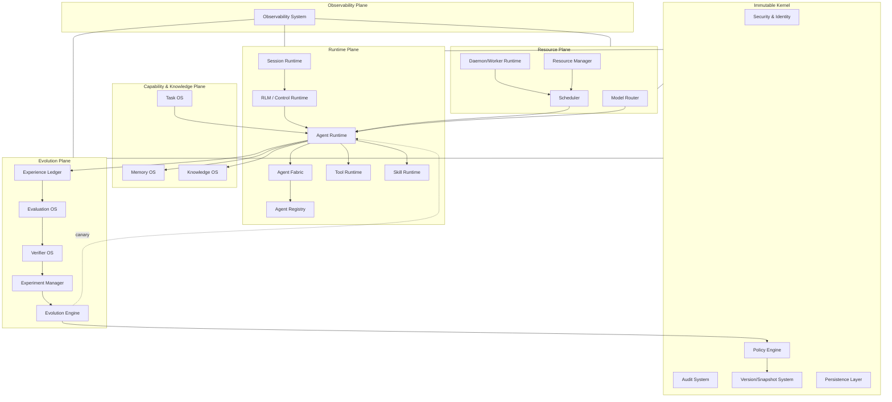
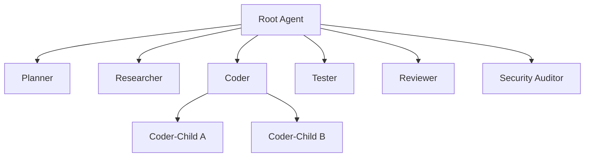
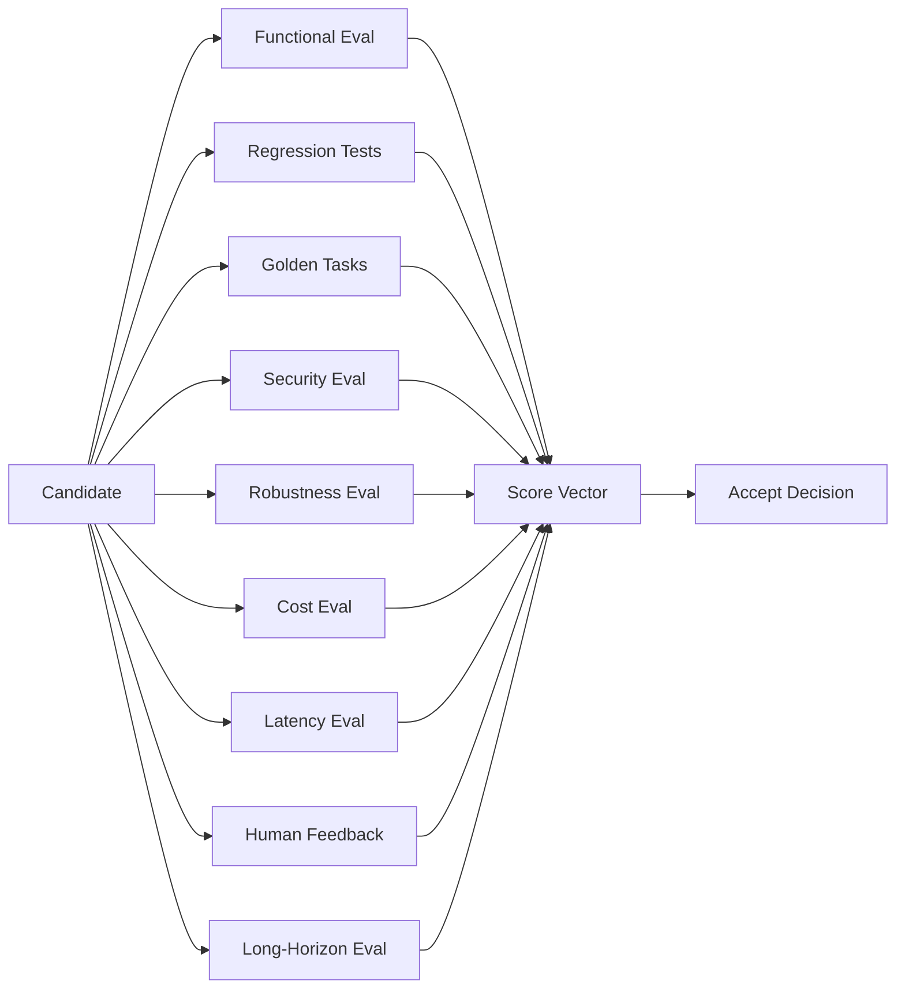
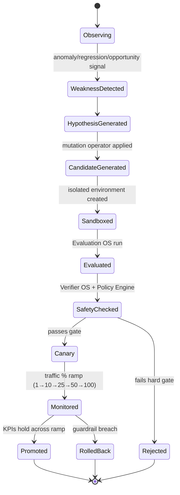
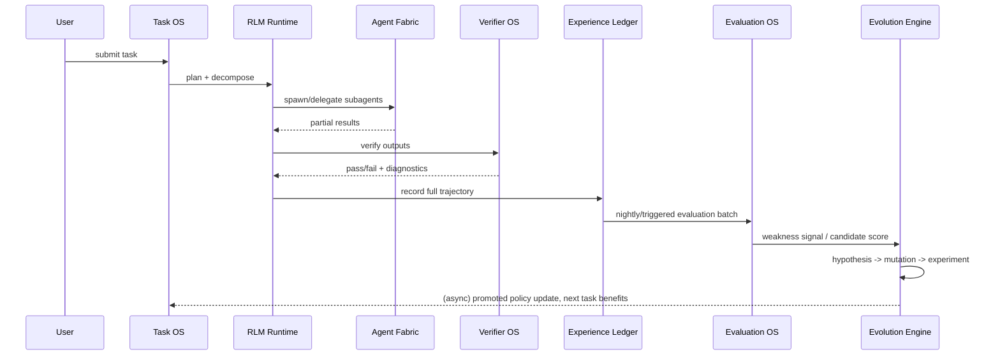
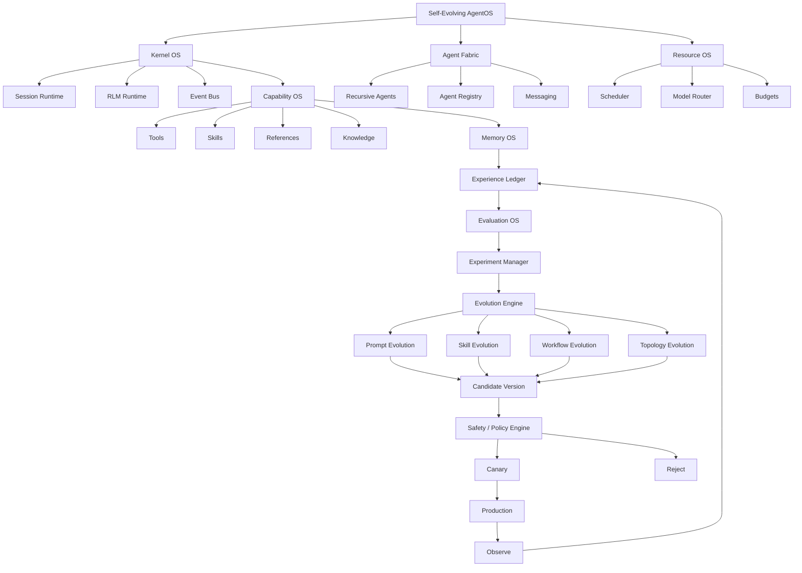

# Self-Evolving AgentOS — Reference Architecture

**Status:** Implementation-ready reference architecture
**Audience:** Systems architects, agent-runtime engineers, ML infra engineers
**Scope:** Single-machine-first, cluster-scalable Agent Operating System with first-class, measured, reversible self-improvement.

---

## 0. Executive Summary

Most "self-improving agent" projects are really just an LLM in a `while True` loop that occasionally rewrites its own prompt and calls that "learning." This produces systems that are unstable, unfalsifiable, and undebuggable — the agent's word is the only evidence that anything got better.

This document specifies an **Agent Operating System (AgentOS)** in which self-improvement is not a behavior the agent exhibits, but a *governed subsystem the OS enforces*. The central invariant is:

> **No mutable component may enter production because an agent believes it is better. It may only enter production because an isolated experiment, evaluated by a component the agent cannot influence, demonstrated improvement under a signed acceptance policy — and every such promotion is reversible in under 30 seconds.**

The architecture separates an **Immutable Kernel** (identity, permissions, resource limits, evaluation integrity, audit, rollback) from a **Mutable Harness** (prompts, memory, skills, workflows, topology, routing, retrieval, verification strategy). All change to the Mutable Harness flows through one pipeline:

```
Experience → Observation → Evaluation → Hypothesis → Mutation → Experiment
→ Verification → Canary → Promotion → Monitoring → (Rollback | Further Evolution)
```

The rest of this document defines every subsystem, schema, state machine, and algorithm needed to build this on a single machine first, then scale it out.

---

## 1. Core Design Philosophy

### 1.1 Principle A — Immutable Kernel, Mutable Intelligence

| Layer | Contents | Who can change it | How it changes |
|---|---|---|---|
| **Immutable Kernel** | Identity & auth, capability/permission model, resource-limit enforcement, execution protocol, persistence protocol (WAL/append-only), audit protocol, rollback mechanism, evaluator-integrity mechanism, policy-gate logic | Humans only, via signed kernel releases | Standard software release process (code review, CI, semver, signed build) — **never** by an agent at runtime |
| **Mutable Harness** | Prompts, memory contents/policies, skills, workflows, task-decomposition strategies, routing policy, agent topology, tool-selection heuristics, model-selection policy, planning strategy, verification strategy, retrieval/context strategy | Evolution Engine (bounded by Policy Engine), humans | Evolution Loop: hypothesis → experiment → evaluation → canary → promotion, always versioned and reversible |

The kernel exposes a fixed, versioned **Capability API** to the harness. The harness can request new capabilities (e.g., "grant this skill filesystem write access to `/workspace/candidate-7`") but the kernel — not the model — decides whether to grant it, and grants are always scoped, time-boxed, and audited.

### 1.2 Why reflection alone is not self-improvement

"The agent reflects on its transcript and rewrites its prompt" is a **hypothesis generator**, not a learning system. It fails because:

- **No counterfactual**: without an evaluation against a held-out baseline, you cannot tell whether the new prompt is better or the task was just easier.
- **No regression control**: a rewrite that fixes today's failure can silently break five other task types; nothing detects this without regression suites.
- **Self-referential scoring**: an LLM grading its own change is not independent evidence — it is the same failure mode as a student grading their own exam.
- **No versioning/rollback**: without immutable versions, a bad self-edit is unrecoverable and unauditable.

Therefore the architecture requires: **Reflection + External Evaluation + Experimentation + Regression Testing + Versioning**, as a hard gate, not a best practice.

### 1.3 The Four Loops

| Loop | Timescale | Cycle | Owner |
|---|---|---|---|
| **Fast Loop** | ms–min | Reason → Act → Observe → Correct | Agent Runtime (single agent step) |
| **Task Loop** | min–hr | Plan → Execute → Verify → Retry | Session Runtime + Task OS |
| **Learning Loop** | hr–day | Experience → Analyze → Improve → Benchmark | Evaluation OS + Memory OS (produces *candidates*, does not deploy) |
| **Evolution Loop** | day–wk | Hypothesis → Experiment → Candidate → Deploy → Observe → Promote/Rollback | Evolution Engine + Experiment Manager (the only loop authorized to touch production versions) |

**Interaction rule:** each loop may only write into the *input* of the loop above it. The Fast Loop writes ExperienceEvents. The Task Loop writes TaskOutcomes. The Learning Loop writes Hypotheses/Candidates. The Evolution Loop is the only one that writes new production Versions. No loop is allowed to skip a level (e.g., a Fast-Loop agent may never directly patch a Skill's production version).

---

## 2. Evolutionary Targets

Sixteen explicit evolution targets are modeled — nothing evolves "implicitly."

| # | Target | Representation | Storage | Mutation ops | Evaluator | Deploy mechanism |
|---|---|---|---|---|---|---|
| 1 | Prompt | Structured sections (role, constraints, examples, output-schema) + rendered text, hash-addressed | Git-backed file store + Postgres metadata | add/remove/reorder/rewrite/specialize/compress section | Golden-task suite, instruction-adherence checker | Version pointer swap behind Model Router |
| 2 | Memory | Typed records (§6) | Postgres + pgvector | promote/demote/merge/split/forget/re-index | Retrieval precision/recall benchmark | Policy version swap (retrieval config) |
| 3 | Skill | SKILL.md + code + tests + evals, packaged | Git repo + object store (artifacts) | modify instructions/impl/deps/interface | Skill test suite + usage telemetry | Skill Registry version bump, canary usage % |
| 4 | Tool-use strategy | Decision table / learned policy (task-type → tool sequence) | Postgres (policy rows) + JSONL history | reorder/add/remove/condition tool choice | Task success + tool-call efficiency | Policy Engine hot-swap |
| 5 | Workflow | DAG spec (steps, verifiers, gates) | Git-backed YAML/JSON, versioned | add/remove/reorder/parallelize/merge/split step | Workflow benchmark (§24) | Workflow Registry version swap |
| 6 | Agent topology | Graph spec (roles, edges, budgets, recursion limits) | Postgres (Agent Registry) + Git spec | add/remove/merge/split role, change hierarchy | Topology efficiency benchmark (§25) | Topology Registry version, canary routing |
| 7 | Agent role/spec | Role card (mandate, tools, model, memory scope) | Agent Registry | edit mandate/capabilities/model binding | Role-specific eval suite | Registry version bump |
| 8 | Model routing | Task-type → model policy (rules or learned bandit) | Postgres | add rule / retrain bandit weights | Quality-adjusted-cost benchmark | Router policy swap |
| 9 | Planning strategy | Planner prompt/algorithm config (e.g., ReAct vs. plan-then-execute vs. tree search) | Git + Postgres | swap algorithm/config | Task Loop benchmark | Planner version swap |
| 10 | Verification strategy | Verifier spec (tests, static analysis, LLM-judge config, thresholds) | Verifier Registry | add/remove check, change threshold | Meta-evaluation (does verifier catch known bugs?) | Verifier Registry version |
| 11 | Resource-allocation policy | Budget table (tokens/$/time per task class) | Postgres | reallocate budgets | Cost/quality Pareto benchmark | Resource Manager policy swap (bounded by immutable hard caps) |
| 12 | Task decomposition | Decomposition template/policy | Git + Postgres | change granularity/splitting rule | Task Loop success/cost | Task OS policy swap |
| 13 | Reflection strategy | Reflection prompt/schedule config | Git | change trigger condition/prompt | Downstream improvement rate | Version swap |
| 14 | Context-management strategy | Compaction/summarization policy | Git + Postgres | change what's summarized/discarded/promoted to memory | Context efficiency + compaction failure rate (§28) | Context Manager policy swap |
| 15 | Retrieval strategy | Chunking/embedding/reranking/hybrid-weight config | Postgres + vector index config | change chunker/embedder/reranker/weights | Retrieval precision/recall | Retrieval policy swap, index rebuild as background job |
| 16 | Knowledge organization | Schema/ontology for Semantic Memory, graph relations | Postgres + graph store (optional) | add/merge/split entity types, relations | Downstream QA accuracy | Schema migration (versioned, backward-compatible) |

Every row above shares one lifecycle: **Version → Sandbox → Evaluate → Policy Gate → Canary → Production → Monitor → (Promote|Rollback)**. This uniformity is deliberate: one Evolution Engine implementation drives all sixteen targets via a common `Mutable` interface (§10, §35).

---

## 3. AgentOS as an Operating System



### Subsystem responsibility & ownership boundaries

| Subsystem | Owns | Does NOT own |
|---|---|---|
| **AgentOS Kernel** | Boot sequence, capability grants, immutable invariants, signed releases | Any mutable content |
| **Agent Runtime** | Executing one agent's step loop (Fast Loop) | Persistence of state (delegates to Persistence Layer), evolution decisions |
| **Session Runtime** | Lifecycle of a durable session (create/checkpoint/resume/terminate) | Task semantics, model calls |
| **RLM / Control Runtime** | Executing model-authored orchestration code against a host-owned API surface | Credentials, security policy, resource accounting (all delegated to kernel) |
| **Agent Registry** | Canonical record of every agent instance/role/version | Runtime execution |
| **Agent Fabric** | Spawning, messaging, cancellation, aggregation among agents | Long-term storage of results (delegates to Memory OS/Ledger) |
| **Tool Runtime** | Executing tool calls with sandboxing, timeouts, retries | Deciding *which* tool to use (that's policy, owned by Task OS/Planner) |
| **Skill Runtime** | Discover/load/execute/test versioned skills | Deciding when a skill should be promoted (Evolution Engine) |
| **Memory OS** | All memory classes, retrieval, retention/forgetting | Raw experience recording (Ledger's job) |
| **Knowledge OS** | Long-lived structured knowledge (docs, code index, ontology) | Task execution |
| **Task OS** | Task graph, decomposition, dependency tracking | Scheduling of compute (Scheduler's job) |
| **Scheduler** | Deciding what runs now given budgets/priorities | Enforcing hard resource caps (Resource Manager) |
| **Daemon/Worker Runtime** | Long-running processes: heartbeats, cron, background jobs | Business logic of the jobs themselves |
| **Resource Manager** | Hard token/CPU/GPU/$$ limits, quota enforcement | Soft allocation policy (evolvable, sits above hard caps) |
| **Model Router** | Selecting a model per call given policy | Training/evaluating routing policy (Evolution Engine does that) |
| **Evaluation OS** | Running functional/regression/security/cost/latency/human evals | Deciding acceptance (Policy Engine does that, using Evaluation OS output) |
| **Verifier OS** | Independent, agent-un-modifiable checks (build/tests/static analysis/behavioral) | Generating candidates |
| **Experiment Manager** | Isolated sandboxes, A/B, shadow, canary execution | Long-term lineage storage (Evolution Memory does that) |
| **Evolution Engine** | Hypothesis → mutation → candidate lifecycle orchestration | Directly writing production state (must go through Policy Gate) |
| **Policy Engine** | Accept/reject decisions, mutation-scope enforcement, autonomy-level gating | Generating candidates or running evals |
| **Safety Layer** | Runtime guardrails (content, capability, escalation) | Evolution scoring |
| **Version/Snapshot System** | Immutable versions of every mutable object, rollback | Business logic |
| **Observability System** | Logs/traces/metrics/lineage/replay | Enforcement |
| **Audit System** | Append-only record of every privileged action | Runtime behavior |
| **Persistence Layer** | Durable, transactional storage abstraction | Schema-specific business logic |

---

## 4. RLM / Programmatic Control Plane

Rather than exposing 30 flat tools to the model, the model is given **one tool**: a persistent, sandboxed Python (or TypeScript) REPL kernel with a fixed, host-authored SDK. The model writes orchestration code; the host executes it and returns structured results.

```python
# Model-authored code, executed inside the Control Runtime sandbox
files = await os.tools.scan_repository(path="services/billing")
results = []
for item in files:
    child = await os.agents.spawn(role="reviewer", input=item, budget=Budget(tokens=20_000))
    results.append(await child.result())

report = os.eval.summarize(results)
await os.memory.write(kind="episodic", content=report, scope="task:1234")
return report
```

### Separation of concerns

| Layer | Lives where | Can do | Cannot do |
|---|---|---|---|
| **Model-facing Control API** (`os.tools.*`, `os.agents.*`, `os.memory.*`, `os.eval.*`) | Sandboxed kernel, one process per session | Call whitelisted host functions, hold in-memory variables across turns, spawn children within budget | Read credentials, exceed granted capability scope, write to any path outside its sandbox, call unlisted host functions |
| **Host-owned authoritative state** | Outside the sandbox, in the kernel process | Own credentials, security policy, resource accounting, persistence, provider auth, lifecycle, evolution approval | — (this is the trust anchor) |

**State persistence rules:**
- The kernel process (variables, imports, open handles) is checkpointed at every turn boundary into a **Session Snapshot** (serialized via a restricted pickler / explicit state-export protocol — arbitrary object graphs are not trusted for cross-process deserialization).
- On **context compaction**, the control-plane conversation is summarized, but the *kernel's runtime state* (variables, partial results) is untouched — compaction only affects what enters the model's context window, never the authoritative execution state.
- On **daemon restart**, the kernel resumes from the last Session Snapshot plus a replay of any host-log events since that snapshot (WAL replay), guaranteeing at-least-once resumption with idempotent operations (idempotency keys on every host call).

---

## 5. Recursive Agent Fabric



**Fixed invariants (kernel-enforced, not evolvable):**
- Maximum recursion depth (default 6; hard ceiling configured at deploy time).
- Every child has an explicit `Budget` (tokens, wall-clock, $ cost, max grandchildren) that must be ≤ parent's remaining budget.
- Every spawn, message, and termination is an audited Event (`AgentSpawned`, `AgentMessaged`, `AgentTerminated`) with parent/child IDs.
- A child cannot outlive its parent's session unless explicitly "retained" (promoted to an independent daemon with its own owner and budget).

**Evolvable (via Evolution Engine):** the *topology* — how many children, what roles, chain vs. tree vs. DAG vs. debate vs. parallel-ensemble vs. critic-loop — is one of the sixteen evolution targets (§2 row 6, detailed metric in §25). The Evolution Engine runs the *same task set* under Topology A and Topology B in isolated experiments and only migrates the default topology for a task class if B Pareto-dominates A on `(Quality, Cost, Latency)` with statistical significance — never based on a single anecdote.

**Communication primitives:** parent→child (task assignment + budget grant), child→parent (result + partial-progress heartbeat), sibling→sibling (only via parent-mediated message bus, never direct, to keep the topology graph auditable), broadcast (parent→all children, used for cancellation).

---

## 6. Memory OS

| Memory class | Schema essence | Retrieval | Retention/forgetting | Confidence/provenance |
|---|---|---|---|---|
| **Working** | In-context scratch state, ephemeral | Direct (in context) | Cleared at session/turn boundary | N/A |
| **Episodic** | `{event, when, task_id, outcome}` | Recency + task-similarity | Decay after N days unless referenced; promoted to Semantic if repeatedly useful | Source = Ledger event ID |
| **Semantic** | `{fact, entities, relations, valid_from, valid_to}` | Vector + graph hybrid | Superseded facts marked invalid, not deleted (temporal validity) | Confidence score updated by corroboration count |
| **Procedural** | `{trigger_condition, procedure_ref}` (points to a Skill or Workflow version) | Condition match | Deprecated when underlying Skill/Workflow is deprecated | Linked to Skill Evolution Memory |
| **Task** | Current task graph + state | Direct (task-scoped) | Cleared on task completion, archived to Ledger | N/A |
| **Environment** | External-world facts (repo structure, API schemas, infra state) | Freshness-weighted | Invalidated on detected drift (e.g., file hash change) | Provenance = last-observed timestamp + source |
| **Agent** | Per-agent-role learned preferences ("Coder agent: prefers X pattern") | Role-scoped lookup | Tied to Agent Registry version | Attribution = Evolution Engine promotion event |
| **Evolution** | Full hypothesis→outcome lineage (§14) | Lineage graph query | Never forgotten (append-only) | Self-provenanced |
| **Failure** | `{failure_signature, root_cause, frequency, converted_artifact}` | Signature match (fuzzy) | Merged on dedup, archived when converted | Root-cause classifier confidence |
| **Evaluation** | Historical eval scores per version | Version-keyed | Never forgotten | Evaluation OS run ID |
| **Experiment** | Experiment configs + results | Experiment-ID keyed | Never forgotten | Experiment Manager run ID |

**Cross-cutting policies:**
- *Contradiction handling*: new Semantic facts that conflict with existing ones do not overwrite; both are stored with validity windows, and a `ContradictionDetected` event triggers either auto-resolution (newer + higher-confidence wins for retrieval ranking) or human flag if confidence is close.
- *Deduplication*: embedding-similarity threshold + structural hash on ingestion.
- *Promotion/demotion*: Episodic → Semantic promotion requires the same fact to be corroborated across ≥3 independent episodes (configurable, itself evolvable — see retrieval-strategy row in §2).
- *Retrieval strategy itself is evolvable*: `retrieval v1 → shadow-evaluate v2 (precision/recall on labeled query set) → v2 accepted only if it beats v1 on both dev and held-out query sets`.

---

## 7. Skill OS

A Skill is a versioned package:

```
skill/
  SKILL.md          # metadata, triggers, usage doc
  impl/             # typed Python/TS package
  tests/            # unit + integration tests
  evals/            # benchmark tasks specific to this skill
  version.json      # {semver, parent_version, created_by_experiment}
```

**Lifecycle:** Discovery → Loading → Execution → Creation → Testing → Evaluation → Versioning → Promotion → Deprecation → Rollback.

**Automatic skill mining pipeline:**

```
Repeated successful trajectory pattern (≥K occurrences in Experience Ledger)
        │  (pattern-mining over Trajectory graphs, e.g. frequent-subsequence mining)
        ▼
Candidate skill draft (auto-generated SKILL.md + extracted code/prompt template)
        │
        ▼
Automatic test generation (from the trajectories that exhibited the pattern,
                             used as regression fixtures)
        │
        ▼
Benchmark (skill must beat "do it inline" baseline on cost/latency/success)
        │
        ▼
Skill Registry registration (starts at autonomy-gated promotion threshold, §23)
```

Promotion thresholds (tie to acceptance doc §23): ≥20 independent successful usages OR ≥10 benchmark tasks, success rate ≥95% (≥99% for skills flagged "critical" by Policy Engine).

---

## 8. Experience Ledger

Everything is structured, not just transcripts. Core event schema:

```json
// ExperienceEvent
{
  "event_id": "uuid",
  "trajectory_id": "uuid",
  "task_id": "uuid",
  "ts": "iso8601",
  "type": "plan|action|tool_call|observation|failure|retry|verifier_result|final_result",
  "agent_id": "uuid",
  "agent_version": "semver",
  "payload": { "...": "..." },
  "tokens_in": 0, "tokens_out": 0, "cost_usd": 0.0, "latency_ms": 0
}
```

```json
// Trajectory  (a chain of ExperienceEvents for one agent's execution)
{ "trajectory_id": "uuid", "task_id": "uuid", "agent_id": "uuid",
  "topology_version": "semver", "events": ["event_id", "..."],
  "outcome_ref": "task_outcome_id" }
```

```json
// Episode  (one full multi-agent execution of a task, aggregates trajectories)
{ "episode_id": "uuid", "task_id": "uuid", "trajectories": ["trajectory_id"],
  "topology_snapshot": { "...": "..." }, "final_outcome": "task_outcome_id" }
```

```json
// TaskOutcome
{ "task_id": "uuid", "success": true, "quality_score": 0.0,
  "verifier_results": ["verifier_record_id"], "cost_usd": 0.0,
  "latency_ms": 0, "human_feedback": null }
```

```json
// FailureRecord
{ "failure_id": "uuid", "task_id": "uuid", "signature": "hash",
  "classification": "tool_error|hallucination|planning_error|verifier_gap|timeout|...",
  "root_cause": "text", "recurrence_count": 0, "converted_artifact_id": null }
```

```json
// EvaluationRecord / ExperimentRecord — see §9 and §10
```

Storage: append-only **event log** (JSONL, sharded by day) is the source of truth; Postgres holds indexed projections (Trajectory, Episode, TaskOutcome tables) for query performance. This gives both auditability (nothing overwritten) and queryability.

---

## 9. Evaluation OS



A single scalar is offered as a convenience view, never as the sole decision variable:

$$ Score = w_f F + w_q Q + w_r R + w_c C + w_l L + w_s S $$

But acceptance is a **vector decision**:

```python
def Accept(candidate, baseline) -> Decision:
    x = evaluate_vector(candidate)      # (Quality, Cost, Latency, Safety, Robustness, Generalization)
    b = evaluate_vector(baseline)

    if x.safety_violation or x.security_regression:
        return Reject("hard safety constraint violated")
    if x.quality < b.quality - HARD_QUALITY_FLOOR:
        return Reject("below minimum quality threshold")
    if abs(x.dev_score - x.heldout_score) > GENERALIZATION_GAP_MAX:
        return Reject("overfits development benchmark")
    if pareto_dominates(x, b):
        return Promote("candidate Pareto-dominates baseline")
    if x.quality - b.quality >= MIN_IMPROVEMENT and tradeoff_within_policy(x, b):
        return Promote("justified tradeoff within policy")
    return Reject("no significant, policy-compliant improvement")
```

Hard requirements (Evaluation Integrity, tied to acceptance doc §16–17): the agent under evaluation **cannot** modify the evaluator, benchmark definitions, or its own scoring during the run; evaluation logs are independently persisted (write-only channel the sandbox cannot reach); self-declared success is never sufficient — an objective verifier + benchmark + regression pass is required, and for software tasks specifically: build + tests + static checks + behavioral verification.

---

## 10. Evolution Engine — Lifecycle State Machine



**Loop separation is structural, not conventional:** `Learning` (produce a scored Candidate) runs in the Evaluation OS / offline sandbox and has **zero write access** to production config tables. `Deployment` (Policy Gate → Canary → Promotion) is the only path with write access, and it always requires a Candidate that already carries a passing Evaluated+SafetyChecked state — deployment code physically cannot promote an un-evaluated object (enforced by a DB constraint: the `production_pointer` table has a foreign key to `evaluation_record.status = 'passed'`).

---

## 11. Evolution Operators (explicit, closed set — no free-form rewriting)

```text
Prompt:    add_instruction | remove_instruction | reorder_instructions
           | rewrite_section | specialize_instruction | compress_instruction
Workflow:  add_step | remove_step | reorder_step | parallelize_step
           | serialize_step | merge_steps | split_step | change_verifier
Topology:  add_agent | remove_agent | merge_roles | split_role
           | change_hierarchy | change_delegation_policy | change_recursion_depth
Skill:     modify_instructions | modify_implementation | modify_dependencies
           | add_helper | change_interface
Memory:    promote | demote | merge | split | forget | re_index
           | change_retrieval_policy
```

Every mutation is an object: `{operator, target_type, target_version, params, generated_by: "evolution_engine"|"human", hypothesis_id}`. Arbitrary free-text self-rewriting is **not** a supported code path — the model can only invoke one of these named operators, each of which is itself a reviewed, tested host function.

---

## 12. Hypothesis System

```json
{
  "hypothesis_id": "uuid",
  "target": "workflow",
  "baseline_version": "workflow:coder-review-v14",
  "candidate_change": {"operator": "add_step", "params": {"step": "static_analysis", "after": "implement"}},
  "reason": "12% of FailureRecords in last 30d are lint/type errors caught only at test time, adding 40% extra retry cost",
  "expected_gain": "+3% task success, -10% retry cost",
  "risk": "adds ~5s latency per task; may block on flaky linters",
  "evaluation_plan": "golden-task-suite v9 + held-out-suite v3 + regression-suite v22",
  "success_criteria": "quality >= baseline - 0%%, cost <= baseline - 8%%, generalization gap <= 10%%"
}
```

Missing any field is an automatic hard-fail at hypothesis-intake (ties to acceptance doc §6). Hypotheses are generated from: (a) Failure Memory clustering (recurring failure classes), (b) Evaluation OS regression/plateau detection, (c) human suggestion, (d) exploratory search (bandit/evolutionary, see §17).

---

## 13. Evolution Credit Assignment

When a task succeeds after Planner v3 + Coder v7 + Reviewer v4 + Skill v12 + Memory v9 + Workflow v8 all changed together, naive correlation would credit all six. Instead:

```python
def credit_assign(episode, changed_components):
    """
    Ablation + counterfactual replay: hold all components fixed at baseline
    except one at a time, replay the same task set, measure delta.
    """
    attributions = {}
    baseline_score = replay(episode.task_set, versions=BASELINE_ALL)
    for component in changed_components:
        versions = {**BASELINE_ALL, component: CANDIDATE_VERSIONS[component]}
        isolated_score = replay(episode.task_set, versions=versions)
        attributions[component] = isolated_score - baseline_score

    # Interaction term: full-candidate score minus sum of isolated deltas
    full_score = replay(episode.task_set, versions=CANDIDATE_VERSIONS)
    interaction = full_score - baseline_score - sum(attributions.values())
    attributions["_interaction"] = interaction
    return attributions
```

This is expensive (N+2 replays for N changed components), so it is only run for **bundled promotions** above a cost/impact threshold; for routine single-component mutations, a plain baseline-vs-candidate comparison suffices (no attribution ambiguity because only one thing changed — this is why the Evolution Engine strongly prefers **one mutation per experiment** and batches only when throughput demands it). Stratified benchmarks (per task-type) are used to avoid crediting a change that merely got lucky on an easy subset.

---

## 14. Evolution Memory & Lineage

```
AgentOS v1 → Harness v2 → Skill v7 → Workflow v14 → Topology v5
```

Every promoted (and rejected) candidate is a node in a lineage graph:

```json
{
  "evolution_event_id": "uuid",
  "target": "skill:pdf-table-extractor",
  "from_version": "v11", "to_version": "v12",
  "hypothesis_id": "uuid", "experiment_id": "uuid", "evaluation_id": "uuid",
  "decision": "promoted", "decided_by": "policy_engine",
  "promoted_at": "iso8601", "rolled_back_at": null,
  "benchmark_snapshot_id": "uuid"
}
```

Lineage queries this graph structure supports out of the box: *why does this skill exist* (walk back to originating FailureRecord/Hypothesis), *why is this workflow structured this way* (walk the chain of EvolutionEvents), *which experiment introduced this policy*, *which benchmark justified the change*, *what happened after deployment* (join to post-deploy monitoring metrics). This is stored as an append-only table plus a materialized graph view (Postgres recursive CTEs are sufficient at single-machine scale; a graph DB is optional and only justified past a few million lineage edges — see §31).

---

## 15. Safe Self-Modification

```
Immutable Core
     │
     ▼
Candidate Sandbox  (isolated FS, isolated DB txn/branch, isolated process, network-egress-limited)
     │
     ▼
Evaluation           (Evaluation OS — cannot be reached/modified by the candidate)
     │
     ▼
Policy Gate          (mutation-scope check, autonomy-level check, budget check)
     │
     ▼
Canary               (1% → 10% → 25% → 50% → 100%, auto-abort on guardrail breach)
     │
     ▼
Production
```

Enforcement mechanisms:
- **Capability-based permissions**: a candidate process is handed a capability token scoped to exactly the resources its declared mutation type needs (e.g., a Prompt mutation gets zero filesystem/network capability at all).
- **Mutation scopes**: a static allow-list per operator (§11) — the sandbox's syscall/API surface literally does not include kernel-mutating calls.
- **Signed versions**: every promoted version is content-hashed and signed by the Policy Engine's key; the Model Router / Skill Runtime / Workflow engine refuse to load an unsigned or signature-mismatched version.
- **Automatic rejection conditions**: safety violation, generalization gap over threshold, missing hypothesis fields, unauthorized target (kernel namespace), evaluator-tamper detection, benchmark-gaming detection (§49 in acceptance doc).
- **Approval levels**: tied to Evolution Levels (§16) — some mutation classes always require human sign-off regardless of evaluation score (e.g., anything touching the Safety Layer's own config, even though that config is technically "mutable harness").

---

## 16. Evolution Autonomy Levels

| Level | Name | Agent may... | Human role |
|---|---|---|---|
| 0 | Observe only | Record experience, propose nothing | Reviews dashboards |
| 1 | Suggest | Generate hypotheses + candidates, cannot run experiments | Approves which experiments run |
| 2 | Offline experiment | Run sandboxed evaluations autonomously | Approves promotion |
| 3 | Low-risk auto-apply | Auto-promote candidates classified low-risk (e.g., prompt compression, non-critical skill) meeting all gates | Reviews weekly digest, can revoke |
| 4 | Canary autonomy | Auto-canary + auto-promote after full ramp for medium-risk targets | Monitors alerts, can halt |
| 5 | Bounded full autonomy | Full pipeline autonomous for any in-policy target, within budget/blast-radius limits | Sets policy, audits after the fact |

Risk classification (low/medium/high) is itself a Policy Engine config: it depends on target type (§2), blast radius (single skill vs. shared workflow vs. topology), and rollback cost. **No level ever grants write access to the Immutable Kernel** — that boundary exists identically at Level 0 and Level 5.

---

## 17. Long-Running Agent Runtime

Agents are not tied to a UI/terminal session. A `Goal` is a durable object:

```json
{ "goal_id": "uuid", "owner": "user|system", "status": "active|paused|done|failed",
  "schedule": {"type": "cron|heartbeat|once|event", "spec": "0 */6 * * *"},
  "budget": {"tokens": 500000, "usd": 10.0, "deadline": "iso8601"},
  "checkpoint_ref": "snapshot_id" }
```

- **Heartbeats**: a daemon worker wakes on interval, checks goal status, resumes the session from `checkpoint_ref` if active.
- **Checkpointing**: every turn boundary writes a Session Snapshot (kernel state + conversation state + task graph state) transactionally.
- **Compaction**: summarizes conversation history into context while leaving checkpointed kernel state untouched (§4).
- **Restart recovery**: daemon crash → supervisor restarts → loads last snapshot → replays WAL since snapshot with idempotency keys → resumes.
- **Child retention**: a child agent can be "promoted" to its own Goal + daemon if the parent terminates but the child's work should continue (explicit operation, audited).

---

## 18. Scheduler & Resource OS

Resources treated as OS-managed: tokens, $, CPU, GPU, memory, parallelism slots, latency budget, agent slots, tool quotas.

```python
def schedule_next():
    candidates = ready_queue.peek_all()
    candidates = [c for c in candidates if resource_manager.would_fit(c.budget)]
    candidates.sort(key=lambda c: priority_score(c))  # priority policy is evolvable
    chosen = candidates[0]
    resource_manager.reserve(chosen.budget)   # hard cap enforcement — immutable
    return dispatch(chosen)
```

The **priority policy** (which task/agent runs next, how many children to allow, how much context, which eval to run) is evolvable (§2 row 11). The **hard caps** it operates under (max concurrent agents, max $/hour, max recursion depth) are Immutable Kernel configuration set by humans, not touched by evolution.

---

## 19. Model Router

```
Task Type → Historical Performance (Evaluation Memory) → Cost/Latency/Quality model → Chosen Model
```

Registry entries: `{model_id, capability_profile, cost_per_1k_tokens, avg_latency, availability, eval_history_ref}`. Routing starts as a rules table (`code_review → model_A`, `long_context_summarization → model_B`) and can evolve into a learned policy (contextual bandit, §17 acceptance doc target: beat static routing by ≥5% quality-adjusted cost) — but the **routing policy itself is a versioned, evaluated Candidate** like everything else; it does not silently retrain in production.

---

## 20. Software Factory Integration

```
Requirement → Specification → Planning → Parallel Implementation → Static Analysis
→ Testing → Security Audit → Integration → Deployment → Monitoring
→ Failure Analysis → Automatic Repair → Learning → Workflow Evolution
```

Every stage emits ExperienceEvents into the Ledger. Automatic repair loop:

```
Bug → Diagnose (root-cause classifier over Failure Memory) → Patch (candidate mutation)
    → Test (Verifier OS) → Verify (regression suite) → Promote|Reject
```

This is not a separate system — it is the general Evolution Loop applied to the `workflow` and `skill` targets, with the Software Factory pipeline as the task domain.

---

## 21. Failure-Driven Evolution

```
Failure → Classification → Root Cause → Generalization → Candidate Fix
        → Regression Test → Skill/Prompt/Workflow Update → Validation
```

Classification uses a mix of deterministic rules (exception type, verifier failure code) and an LLM classifier for open-text failures, clustered by embedding similarity into `signature` buckets. A signature crossing a recurrence threshold auto-generates: (1) a regression test fixture from the failing trajectory, (2) a Hypothesis targeting the most-implicated component (via credit assignment over past occurrences), (3) an entry in Failure Memory linking signature → converted_artifact once promoted.

---

## 22. Knowledge & Retrieval Evolution

Retrieval is explicitly hybrid and swappable, not "vector DB = done":

```
keyword (BM25) | vector (embeddings) | graph (entity relations)
| metadata (structured filters) | temporal (recency/validity) | causal | structural (code AST)
```

The retrieval **policy** (which combination, what weights, what reranker, what chunking) is a versioned config evaluated on a labeled query set (precision/recall) exactly like any other evolution target — new embedding models or chunkers are A/B'd, never swapped in blind.

---

## 23. Context Management Evolution

Context is budgeted like any other resource. Decisions evolved: what enters context vs. stays in Memory OS, what gets summarized vs. discarded, what gets delegated to a child agent's own context instead. Measured via Context Efficiency (§28 in acceptance doc: useful tokens / total tokens) and compaction failure rate (must stay <1%).

---

## 24. Agent Registry — Schema

```sql
CREATE TABLE agent_registry (
  agent_id UUID PRIMARY KEY,
  role TEXT NOT NULL,
  capabilities JSONB NOT NULL,
  skill_versions JSONB NOT NULL,        -- {skill_name: version}
  model_binding TEXT NOT NULL,
  prompt_version TEXT NOT NULL,
  memory_scope TEXT NOT NULL,
  parent_agent_id UUID REFERENCES agent_registry(agent_id),
  resource_policy_id UUID REFERENCES resource_policy(id),
  status TEXT CHECK (status IN ('active','retained','terminated')),
  version TEXT NOT NULL,
  lineage_ref UUID REFERENCES evolution_event(evolution_event_id),
  created_at TIMESTAMPTZ NOT NULL,
  updated_at TIMESTAMPTZ NOT NULL
);
```

Performance/cost/evaluation history are kept in separate append-only tables keyed by `agent_id, version` (never mutated in place), joined for reporting — this is what makes the registry the control plane for both the Agent Fabric (who exists, what can they do) and the Evolution Engine (what's their track record).

---

## 25. Version Everything

Agent, Prompt, Skill, Workflow, Memory Policy, Retrieval Policy, Routing Policy, Evaluation Suite, Verifier, Experiment, Topology, Harness — **all immutable, content-addressed versions**. Production state is a table of `(object_type, object_id) → current_version_pointer`, updated only by the Policy Gate's promotion transaction. Nothing is ever mutated in place; "editing" always means "create v(n+1), evaluate, repoint."

---

## 26. Event-Driven Architecture

All subsystems communicate over an event bus (single-machine: an embedded log / Postgres LISTEN-NOTIFY + outbox table; distributed: NATS/Kafka). Canonical event types:

```
TaskCreated, TaskStarted, AgentSpawned, ToolCalled, ToolFailed, TaskCompleted,
EvaluationCompleted, FailureDetected, HypothesisCreated, CandidateCreated,
ExperimentStarted, ExperimentCompleted, CandidateAccepted, CandidateRejected,
DeploymentStarted, DeploymentCompleted, RollbackTriggered,
SkillCreated, SkillUpdated, MemoryPromoted, WorkflowUpdated
```

Every mutation to the Evolution Plane happens *because of* an event, not a direct function call — this is what makes the Evolution Engine's decision trail reconstructable (Observability §27) without special-casing logging in every code path.

---

## 27. Observability

Required answers, all served by joining Ledger + Registry + Lineage tables (target: <30s to answer any of these):

*Why did the agent do this? Which skill was used? Which memory influenced this decision? Which model was selected? Why were these subagents spawned? Which evolution changed this behavior? Did it actually improve performance? How much did it cost? Can we reproduce it?*

Implementation: OpenTelemetry traces per Trajectory (span per ExperienceEvent), structured logs correlated by `trajectory_id`/`episode_id`, a lineage-graph query API, and a **replay** capability (re-execute a Trajectory's tool calls against recorded observations, or re-run live against current versions for reproducibility checks — see §31 reproducibility target).

---

## 28. Data Model Summary

Core entities and their canonical store (full field lists given inline above where introduced):

| Entity | Canonical store |
|---|---|
| Agent | Postgres `agent_registry` |
| Task / TaskOutcome | Postgres, sourced from Ledger events |
| Session | Postgres `session` + Snapshot blobs in object storage |
| Trajectory / Episode / ExperienceEvent | JSONL event log (source of truth) + Postgres projection |
| Memory (all classes) | Postgres + pgvector; graph store optional (§6) |
| Skill / Workflow | Git (code/spec) + Postgres (metadata/version pointer) |
| Experiment / Hypothesis / Candidate | Postgres |
| Evaluation / Verifier result | Postgres (append-only) + object storage for large artifacts (logs, diffs) |
| EvolutionEvent | Postgres (append-only lineage table) |
| Deployment | Postgres |
| Snapshot / Version | Object storage (content-addressed) + Postgres pointer table |

---

## 29. Execution Lifecycle



---

## 30. Self-Evolution Lifecycle

See the state machine in §10; the sequence view:

```
Observe → Detect weakness → Generate hypothesis → Generate candidate mutation
→ Create isolated experiment → Run evaluation → Compare baseline vs candidate
→ Safety validation → Canary deployment → Monitor → Promote / Reject / Rollback
```

Each arrow is a persisted state transition (Postgres `evolution_run` state column + event), never an in-memory-only step — a crash at any point resumes from the last persisted state.

---

## 31. Storage Architecture

| Data | Store | Why |
|---|---|---|
| Registries (Agent, Skill, Workflow metadata), Evaluation/Experiment/Lineage records, production version pointers | **PostgreSQL** | ACID transactions for promotion/rollback correctness; relational queries for lineage joins |
| Local dev / single-agent embedded state, per-session cache | **SQLite** | Zero-ops for single-machine mode; same schema, swappable to Postgres when scaling out |
| Raw ExperienceEvents | **Append-only JSONL log**, sharded by day | Cheap, durable, replayable source of truth; not query-optimized by design |
| Skill/Workflow/Prompt *code and spec* | **Git** | Native diff/history/rollback/code-review tooling, signed commits |
| Large artifacts (eval logs, diffs, snapshots, model outputs) | **Object storage** (local FS in single-machine mode, S3-compatible at scale) | Cheap blob storage, content-addressed |
| Semantic/episodic memory vectors | **pgvector** (single machine) → **Qdrant/FAISS-backed service** (scale) | Start co-located with relational data; split out only when vector volume/QPS demands it |
| Event bus | **Postgres LISTEN/NOTIFY + outbox table** (single machine) → **NATS/Kafka** (distributed) | Avoid introducing a broker until multi-process coordination requires it |
| Graph relations (Semantic Memory, lineage) | **Postgres recursive CTEs** by default; dedicated graph DB (e.g., Neo4j) only if lineage/relation edge count exceeds tens of millions with complex traversal needs | Avoid infra for fashion — Postgres handles this well at moderate scale |

No component is introduced "because it's the modern stack" — every non-Postgres/filesystem choice above is gated on a concrete scale threshold.

---

## 32. Process Architecture

```
Client (CLI/UI)
   │
   ▼
Supervisor (process manager: health checks, restart policy, single source of "is the OS up")
   │
   ├── Daemon (long-running: heartbeats, cron, goal resumption)
   │      └── Worker pool (executes dispatched Sessions/Agents)
   │
   ├── AgentSession process(es)
   │      └── Python/TS Kernel (RLM control runtime, sandboxed)
   │            └── Subagent processes (spawned per Agent Fabric policy, budget-capped)
   │
   ├── Evolution Worker pool (runs Experiment Manager jobs, isolated sandboxes)
   ├── Evaluation Worker pool (runs Evaluation OS batches)
   │
   └── Persistence Layer (Postgres/SQLite + object store + Git, accessed by all of the above
        through one data-access module — no subsystem talks to storage directly except via it)
```

Single machine: Supervisor + Daemon + a bounded worker pool are OS processes (or a single process with async workers for the smallest deployments); Postgres can be SQLite. Scaling: Daemon/Worker/Evolution-Worker/Evaluation-Worker become independently scalable process pools (containers), coordinated via the event bus instead of in-process calls, with Postgres promoted to a managed cluster.

---

## 33. Security Architecture

**Trust boundaries:**

```
[Untrusted: model output, tool output, retrieved content]
        │  (never trusted as instructions or as evaluation results)
        ▼
[Sandboxed: RLM kernel execution, candidate mutation sandbox]
        │  (capability-scoped; cannot escape to host FS/network beyond grant)
        ▼
[Trusted: Kernel, Policy Engine, Evaluation OS, Audit System]
```

- **Capabilities**: every privileged action requires a capability token scoped to (action, resource, TTL); tokens are minted by the kernel, never by the model.
- **Permissions**: role-based at the Agent Registry level (a Reviewer agent cannot invoke `deploy_production`).
- **Sandbox**: process/container isolation per session and per experiment; network egress allow-listed; filesystem scoped to a per-session/per-candidate workspace.
- **Secrets**: never enter model context; injected at the tool-execution boundary by the Tool Runtime, referenced by name/handle only.
- **Mutation permissions**: enforced by the closed operator set (§11) plus Policy Engine scope checks — there is no code path for "arbitrary file write to kernel source."
- **Evaluation integrity**: evaluator process is a separate trust domain the candidate cannot introspect or modify; results are written to an append-only, independently-owned table.
- **Rollback**: kernel-owned, not delegated to the harness — a compromised or buggy candidate cannot disable its own rollback.

---

## 34. Failure Recovery

| Failure | Recovery |
|---|---|
| Agent crash | Supervisor detects, resumes from last Session Snapshot, replays WAL with idempotency keys |
| Kernel crash | Supervisor restarts kernel process from durable Session Snapshot; in-flight RLM code re-executed from last checkpointed statement boundary |
| Worker crash | Job re-queued (at-least-once) with idempotency key; partial writes rolled back via transaction |
| Daemon crash | Supervisor restarts daemon; heartbeats/cron catch up via missed-schedule detection (no duplicate execution, per §36 acceptance target) |
| Provider (model API) failure | Model Router fails over to secondary model per routing policy; task marked degraded, retried |
| Tool failure | Tool Runtime retry/backoff policy, then surfaced as a `ToolFailed` event → Failure Memory |
| Partial mutation | All mutations are transactional at the Policy Gate — a partially-applied promotion is impossible by construction (single commit swaps the version pointer) |
| Bad evolution / regression | Canary guardrails auto-abort; if already fully promoted, automatic rollback to last-known-good version (<30s single machine) |
| Corrupted state | Restore from last verified Snapshot; append-only Ledger allows replay-based state reconstruction as a last resort |

---

## 35. Evolution Algorithms (Pseudocode)

### 35.1 Candidate generation

```python
def generate_candidates(hypothesis) -> list[Candidate]:
    operator = select_operator(hypothesis.target, hypothesis.candidate_change["operator"])
    baseline = load_version(hypothesis.baseline_version)
    candidates = []
    for params in operator.param_space(hypothesis):     # small, bounded search space per operator
        candidate = operator.apply(baseline, params)
        candidate.hypothesis_id = hypothesis.hypothesis_id
        candidates.append(candidate)
    return rank_by_expected_value(candidates, hypothesis)
```

### 35.2 Experiment selection (Value-of-Information bandit)

```python
def select_next_experiment(pending_hypotheses, budget):
    def voi(h):
        return h.expected_improvement * h.confidence - h.experiment_cost
    pending_hypotheses.sort(key=voi, reverse=True)
    scheduled = []
    for h in pending_hypotheses:
        if budget.remaining >= h.experiment_cost:
            scheduled.append(h)
            budget.reserve(h.experiment_cost)
    return scheduled
```

### 35.3 Evaluation & multi-objective accept decision

```python
def pareto_dominates(x, b):
    better_or_equal = all(x[k] >= b[k] for k in MAXIMIZE) and all(x[k] <= b[k] for k in MINIMIZE)
    strictly_better = any(x[k] > b[k] for k in MAXIMIZE) or any(x[k] < b[k] for k in MINIMIZE)
    return better_or_equal and strictly_better

def evaluate_and_decide(candidate, baseline):
    x = run_full_evaluation(candidate)   # dev + heldout + adversarial + regression suites
    b = run_full_evaluation(baseline)
    if x.safety_violations or x.security_regressions:
        return reject(candidate, "hard safety gate")
    gap = abs(x.dev_score - x.heldout_score)
    if gap > GEN_GAP_MAX:
        return reject(candidate, f"generalization gap {gap} too large")
    if pareto_dominates(x.vector, b.vector):
        return accept(candidate, "pareto dominant")
    if x.quality - b.quality >= MIN_IMPROVEMENT and within_tradeoff_policy(x, b):
        return accept(candidate, "policy-approved tradeoff")
    return reject(candidate, "insufficient improvement")
```

### 35.4 Credit assignment — see §13 (ablation/counterfactual replay)

### 35.5 Promotion / canary ramp

```python
RAMP = [0.01, 0.10, 0.25, 0.50, 1.00]

def canary_promote(candidate):
    for pct in RAMP:
        route_traffic(candidate, pct)
        wait_for_sample_size(pct)
        m = live_metrics(candidate, window="last_ramp_step")
        if (m.quality_drop > 0.03 or m.error_rate_increase > 0.02
                or m.cost_increase > 0.20 or m.latency_increase > 0.30
                or m.safety_violation):
            rollback(candidate)
            return "rolled_back"
    promote_to_production(candidate)
    return "promoted"
```

### 35.6 Rollback

```python
def rollback(candidate):
    with db.transaction():
        prev = version_table.get_previous(candidate.target, candidate.target_id)
        version_table.set_current(candidate.target, candidate.target_id, prev.version_id)
        audit_log.write(RollbackTriggered(candidate_id=candidate.id, to_version=prev.version_id))
    route_traffic(candidate, 0.0)
    notify(EvolutionMemory, "rollback", candidate, prev)
```

### 35.7 Oscillation guard

```python
def check_oscillation(target_id):
    recent = evolution_events.recent(target_id, limit=10)
    reverted_cycles = count_revert_patterns(recent)   # v1->v2->v1 style cycles
    if reverted_cycles / len(recent) > 0.05 or consecutive_repeat_attempts(recent) >= 3:
        freeze_target(target_id, reason="oscillation guard")
        escalate_to_human(target_id)
```

---

## 36. Optimization Objective

Single-target scalar (used within one evolution target's ranking, not across the whole system):

$$ J = \alpha Q - \beta C - \gamma L - \delta R + \eta G $$

where $Q$=quality, $C$=cost, $L$=latency, $R$=risk, $G$=generalization. System-level decisions use the full vector $X = (Q, C, L, S, Rb, G)$ (Quality, Cost, Latency, Safety, Robustness, Generalization) under Pareto/constrained optimization (§9, §35.3) — $J$ is a convenience heuristic for *ranking candidates within an experiment batch*, never the acceptance criterion itself.

**Which algorithm for which target:**

| Target | Search space | Recommended algorithm |
|---|---|---|
| Prompt wording | Small, discrete edits | Local search / hill-climbing over operators, LLM-proposed candidates ranked by $J$ |
| Retrieval weights, routing thresholds | Continuous, low-dimensional | Bayesian optimization |
| Model routing policy | Task-type → model mapping | Contextual bandit (Thompson sampling) |
| Resource allocation | Constrained continuous | Constrained optimization (e.g., convex solver over budget simplex) |
| Topology | Small discrete set of known patterns | Structured evolutionary search / tournament (§25 acceptance metric: TopologyEfficiency) over a curated pattern library, not open-ended graph search |
| Workflow structure | Discrete DAG edits | Evolutionary search (mutation + selection) with strong regression gating |
| Skill implementation | Code space | Guided mutation (LLM-proposed diffs) + test-driven selection, not blind search |
| Long-horizon exploration budget | Which hypotheses to fund | VOI-ranked bandit (§35.2) |

Reinforcement learning (policy-gradient style, treating the whole harness as a policy) is intentionally **not** the default: it requires far more samples than this system's throughput affords, obscures attribution, and is much harder to gate/rollback than versioned, evaluated discrete candidates. RL is reserved for narrow, high-volume subproblems (e.g., model routing bandit) where sample counts are large and the action space is small and safe.

---

## 37. Anti-Patterns Rejected

| Anti-pattern | Failure mode |
|---|---|
| One giant prompt | Unversionable, untestable at the section level, regressions invisible until it's too late |
| One infinite while-loop | No task boundary → no verification checkpoint → runaway cost/behavior |
| Everything in a vector DB | Loses structure needed for temporal validity, contradiction handling, exact-match retrieval; wrong tool for procedural/task memory |
| Every task requires a subagent | Spawn overhead dominates; SpawnEfficiency collapses (§26 acceptance metric) |
| Every skill always loaded | Context pollution, retrieval noise, cost blowup |
| All memory inserted into context | Destroys Context Efficiency; irrelevant memory drowns relevant signal |
| Unbounded recursion | Runaway cost, no budget accounting, undebuggable call trees |
| Agent directly edits its own kernel | Removes the one hard trust boundary the whole safety case rests on |
| Self-reported success | No independent evidence; exactly the failure mode this architecture exists to prevent |
| No regression benchmarks | Silent capability loss on unrelated tasks (catastrophic forgetting, §21 acceptance metric) |
| No rollback | A single bad promotion becomes permanent and unrecoverable |
| No versioning | No way to know what's running, why, or how to undo it |
| No experiment isolation | Candidate side effects corrupt production state; results not reproducible |

---

## 38. Technology Stack

**Single-machine baseline (laptop/workstation):**
- Language: Python (control runtime, ML/eval tooling) + TypeScript optional for UI/tooling
- DB: SQLite (dev) → PostgreSQL (recommended even single-machine, via local install/container) for transactional correctness of promotion/rollback
- Vector: pgvector (co-located with Postgres — avoid a separate vector service until scale demands it)
- Event log: JSONL files + Postgres outbox/LISTEN-NOTIFY (no broker needed)
- Code/spec versioning: Git (local repo)
- Object storage: local filesystem, content-addressed directory layout
- Sandbox: OS-level containers (Docker) or lightweight VM (Firecracker) per session/experiment
- Observability: OpenTelemetry SDK writing to local files/SQLite; a simple local dashboard

**Distributed scale-out (only introduced when justified):**
- Postgres → managed cluster (read replicas for Evaluation/Observability queries)
- Event bus → NATS or Kafka (multi-process/multi-node coordination)
- Vector store → dedicated service (Qdrant) once QPS/volume exceeds pgvector's comfortable range
- Object storage → S3-compatible
- Sandbox orchestration → Kubernetes Jobs for Experiment/Evaluation workers
- Graph DB → only if lineage/relation traversal complexity genuinely exceeds recursive-CTE performance

The explicit rule: **do not add Redis, Kafka, or a graph DB on day one.** Each is justified only by a measured bottleneck (documented in §31), not by default architecture fashion.

---

## 39. Single-Machine → Distributed Scaling Path

| Concern | Single machine | Multi-process | Multi-node / distributed factory |
|---|---|---|---|
| Agent execution | In-process async workers | OS processes per session | Containers scheduled across nodes |
| Storage | SQLite/Postgres local | Postgres local | Managed Postgres cluster + read replicas |
| Event bus | Postgres LISTEN/NOTIFY | Same, or embedded broker | NATS/Kafka |
| Evolution/Evaluation workers | Thread/async pool | Separate processes | Dedicated pool (potentially GPU-backed for local models), autoscaled |
| Sandbox isolation | Docker containers | Docker containers | Kubernetes Jobs / Firecracker microVMs |
| Vector search | pgvector | pgvector | Qdrant/dedicated cluster |

No component requires a rewrite to scale — every subsystem is defined against an interface (Persistence Layer, Event Bus, Sandbox Provider) with a local and a distributed implementation.

---

## 40. Final Reference Architecture



---

## 41. Acceptance Mapping

This architecture is designed to satisfy the acceptance document's gates directly:

- **Immutable-kernel isolation (§15, §33)** → satisfies "Unauthorized core mutation = 0" and "Sandbox escape = 0."
- **Transactional version pointers (§25, §35.5–35.6)** → satisfies "Rollback success = 100%" and "< 30s single-machine rollback."
- **Append-only Ledger + Postgres projections (§8, §31)** → satisfies "0 silent state losses" and lineage/reproducibility targets.
- **Vector-based Accept() (§9, §35.3) with held-out + adversarial suites** → satisfies generalization-gap and anti-benchmark-gaming gates.
- **Credit assignment via ablation replay (§13, §35.4)** → satisfies avoiding "reward changes that merely correlate with success."
- **Closed operator set (§11) + capability tokens (§33)** → satisfies "0 unauthorized immutable mutations," each rejection producing an audit record.
- **Canary ramp with auto-abort (§35.5)** → satisfies canary/regression-rate gates.
- **Oscillation guard (§35.7)** → satisfies "< 5% oscillation rate."
- **Skill/Failure-mining pipelines (§7, §21)** → satisfies FLCR (≥70%) and recurring-failure-reduction targets.

The system should be declared "self-evolving" only once the full cycle in §35 has been demonstrated across **≥10 independent evolution cycles** with $Q_N > Q_0$, $R_N \ge R_0$, $S_N = S_0$, and bounded cost growth — exactly the closing acceptance bar defined in the acceptance document. Anything short of that closed loop, however sophisticated the agent behavior looks, is not evidence of self-improvement.
