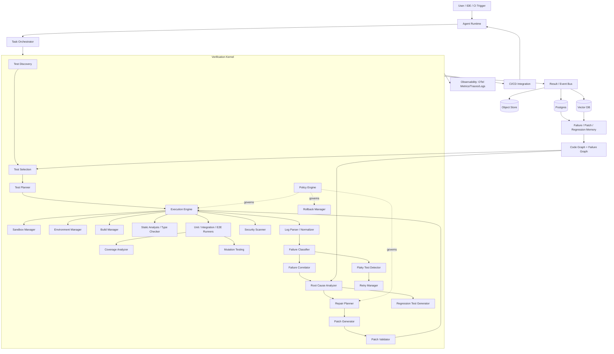
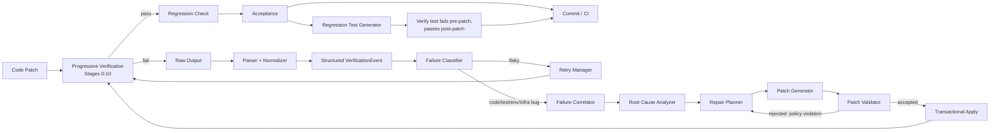
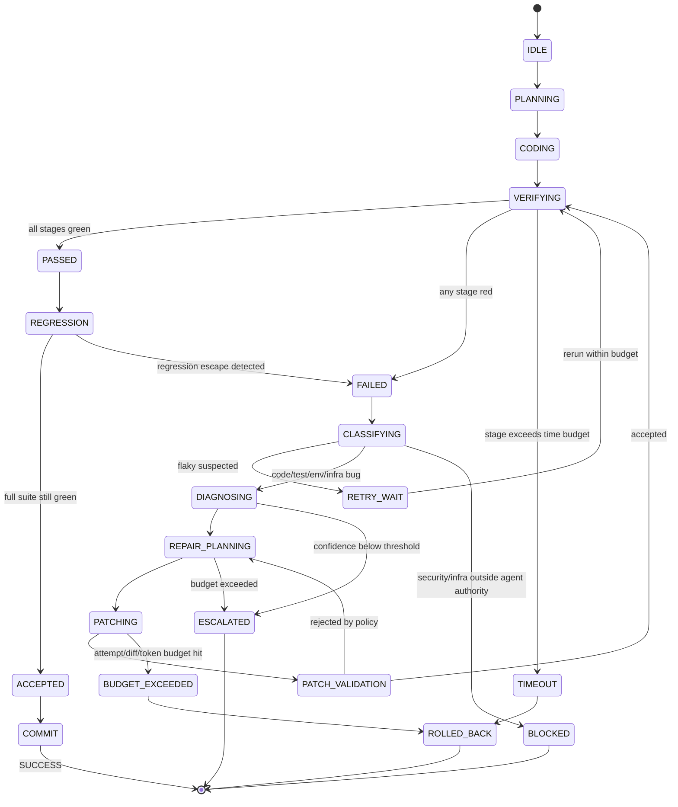
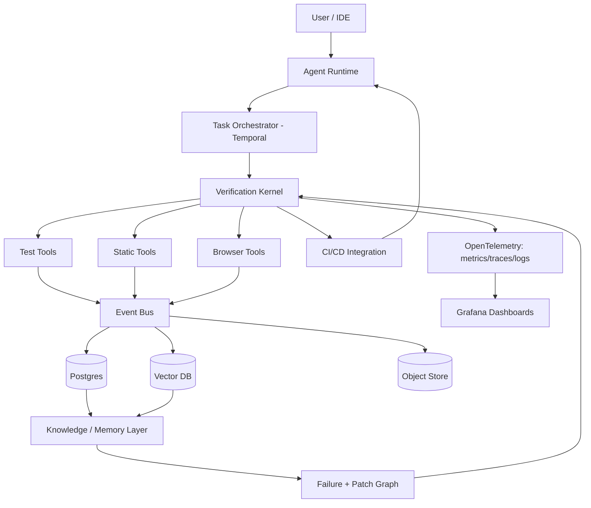

# Verification & Self-Healing Kernel
### A Reusable Architecture for Autonomous Coding Agent Testing, Diagnosis, Repair, and Regression Prevention

---

## A. Executive Architecture

The system in this document is **not** a coding assistant. It is a **Verification Kernel**: an
independent, deterministic-first control plane that sits between a Coding Agent and a codebase,
and whose sole job is to answer one question with authority — *"Is this change actually correct,
safe, and non-regressive?"*

The kernel treats software modification as a **closed-loop control system**, not a conversation:

```
Requirement → Plan → Patch → Verify → Diagnose → Repair → Verify → Accept/Reject
```

Three design decisions make this production-grade rather than a demo:

1. **Hard separation of Agent and Verifier.** The Agent proposes; it never certifies its own work.
   Only the Verification Kernel can emit `PASS / FAIL / INCONCLUSIVE / BLOCKED`. This exists
   because generator models are systematically overconfident about their own output — they
   optimize for "looks plausible," not "is provably correct," and under instruction pressure
   ("the tests must pass") they will rationalize success. An independent, non-LLM-controlled
   judge removes that incentive gradient entirely.
2. **Deterministic-first, LLM-second.** Every stage that *can* be computed exactly (parsing,
   diffing, type checking, dependency graphs, test execution) *is* computed exactly. The LLM is
   reserved for the narrow band of work that is genuinely ambiguous: root-cause hypothesis
   generation under uncertainty, patch synthesis, and regression-test intent. This maximizes
   reliability and minimizes both cost and hallucination surface.
3. **Everything is transactional and bounded.** Every patch attempt is a reversible transaction
   with a checkpoint, a diff, and a verdict. Every repair loop has an explicit budget (attempts,
   tokens, time, diff size). There is no `while not success: agent.fix()`. The system either
   converges inside its budget or escalates — it never loops indefinitely or silently degrades
   guarantees.

The kernel is designed to be **embedded**, not standalone: it exposes a small set of APIs
(`submit_patch`, `verify`, `get_verdict`, `diagnose`, `propose_repair`) that any agent runtime
(Claude Code-style, SWE-agent-style, OpenHands-style, or a custom CI bot) can call. It is
repository-agnostic via a plugin/adapter layer, and language-agnostic via normalized test/build
discovery.

---

## B. Detailed Architecture

### B.1 Why the Agent/Verifier separation is load-bearing

If the same model that wrote a patch also decides whether the patch is correct, three failure
modes appear reliably in practice: (a) the model re-reads its own broken code and pattern-matches
it as "looks right"; (b) under retry pressure the model's definition of "done" quietly degrades
(skips a test, narrows an assertion, adds an `xfail`); (c) there is no external audit trail to
prove correctness to a human or to CI. Making the Verifier a separate, largely non-LLM subsystem
with its own persistence and its own verdict authority closes all three gaps. The Agent's claim
`"implementation complete"` is treated as a *hypothesis to be tested*, never as a fact.

### B.2 Verification Kernel — subsystem responsibilities

| Subsystem | Responsibility | Primary Interface |
|---|---|---|
| **Verification Orchestrator** | Owns the state machine (§E); sequences stages 0–11; enforces budgets; emits the final verdict | `run(patch, plan) -> Verdict` |
| **Test Discovery** | Inspects the repo, infers build/test/lint/typecheck/e2e commands per language | `discover(repo) -> ProjectManifest` |
| **Test Selection** | Maps a diff to the minimal sufficient test set via dependency/call graph | `select(diff, manifest) -> TestPlan` |
| **Test Planner** | Orders selected tests into the progressive escalation ladder (targeted → module → integration → e2e → full) | `plan(TestPlan) -> StagedPlan` |
| **Execution Engine** | Runs commands inside the Sandbox, streams raw output | `execute(command, env) -> RawResult` |
| **Sandbox Manager** | Provisions isolated compute (container/microVM), enforces resource limits | `spawn(spec) -> SandboxHandle` |
| **Environment Manager** | Materializes reproducible envs (deps, services, fixtures, env vars) | `provision(manifest) -> Env` |
| **Build Manager** | Runs language-specific build/compile steps, caches artifacts | `build(manifest) -> BuildResult` |
| **Static Analysis** | Lint + style + basic correctness rules (Ruff, ESLint, Clippy…) | `analyze(files) -> [Finding]` |
| **Type Checker** | mypy/Pyright/tsc/rustc-borrowck-style checks | `typecheck(files) -> [Finding]` |
| **Unit Test Runner** | Executes unit tests, captures per-test result | `run(tests) -> [TestResult]` |
| **Integration Test Runner** | Executes tests that cross module/service boundaries | same interface, heavier env |
| **E2E Test Runner** | Drives full application via Playwright/Cypress | `run(flows) -> [E2EResult]` |
| **Security Scanner** | SAST (Semgrep/CodeQL), dependency CVE scan, secret scan | `scan(diff/repo) -> [Finding]` |
| **Property-Based Test Runner** | Runs Hypothesis/fast-check style generators against invariants | `run(properties) -> [PBTResult]` |
| **Mutation Testing** | Injects mutants, measures kill rate to score test suite strength | `mutate(module) -> MutationReport` |
| **Coverage Analyzer** | Line/branch coverage, delta coverage on changed lines | `coverage(run) -> CoverageReport` |
| **Log Parser** | Tool-specific stdout/stderr/JUnit-XML parsers | `parse(raw, tool) -> [Event]` |
| **Failure Classifier** | Maps a parsed event to the Failure Taxonomy (§H) and Bug/Env/Infra/Flaky split | `classify(event) -> Classification` |
| **Failure Correlator** | Groups related events (one root cause → many symptoms) | `correlate([event]) -> [Cluster]` |
| **Root Cause Analyzer** | Deterministic + LLM-assisted localization (§B.7) | `analyze(cluster) -> RootCause` |
| **Patch Validator** | Static checks on a *proposed* patch before execution: diff size, forbidden paths, API compat | `validate(patch, policy) -> ValidationResult` |
| **Regression Test Generator** | Synthesizes a test proven to fail pre-patch and pass post-patch | `generate(bug, patch) -> RegressionTest` |
| **Flaky Test Detector** | Statistical/behavioral flake classification (§B.10) | `assess(test_history) -> FlakeReport` |
| **Retry Manager** | Executes bounded reruns for suspected flakes, never for suspected code bugs | `retry(test, budget) -> RetryResult` |
| **Rollback Manager** | Reverts a workspace to the last good checkpoint | `rollback(checkpoint_id)` |
| **Policy Engine** | Central decision authority: PASS/FAIL/RETRY/ROLLBACK/ESCALATE/BLOCK (§I) | `decide(state) -> PolicyDecision` |
| **Artifact Manager** | Persists logs, screenshots, diffs, reports immutably | `store(artifact) -> ArtifactRef` |
| **Observability System** | Metrics/traces/events for every stage (§B.17) | emits OTel spans + events |

### B.3 Progressive Verification — Stages 0–11

Running the full suite on every patch is the single largest source of wasted tokens, wasted
compute, and slow feedback loops in agentic coding. The kernel instead runs a strictly ordered,
**fail-fast** pipeline:

| Stage | Name | Deterministic | Cost | Needs LLM | Stops pipeline on failure? |
|---|---|---|---|---|---|
| 0 | Syntax | Yes | Trivial | No | Always |
| 1 | Formatting | Yes | Trivial | No | Always (or auto-fix + continue) |
| 2 | Lint | Yes | Low | No | On error-level findings |
| 3 | Type Check | Yes | Low–Med | No | Always |
| 4 | Build | Yes | Med | No | Always |
| 5 | Targeted Tests (changed functions) | Yes | Low | No | Always |
| 6 | Affected Module Tests | Yes | Med | No | Always |
| 7 | Integration Tests | Yes | Med–High | No | Always |
| 8 | E2E Tests | Yes | High | No | Always |
| 9 | Security Tests | Yes | Med | No | Always (hard block) |
| 10 | Full Regression | Yes | Very High | No | Always |
| 11 | Final Acceptance | Hybrid | Low | Sometimes | Always |

**Why this ordering is efficient:** cost and signal strength are inversely correlated with how
early a defect surfaces — a syntax error caught at Stage 0 costs milliseconds; the same defect
caught at Stage 10 would have wasted an entire regression run. Ordering cheap/deterministic/
high-frequency-failure checks first means the *overwhelming majority* of bad patches are rejected
before any expensive stage runs.

**What stops the pipeline early:** any Stage 0–9 failure halts progression by default (configurable
"continue-on-warn" for lint). Security findings at Stage 9 are a **hard block** regardless of
downstream stage status — a patch that passes every test but introduces a vulnerability is still
rejected.

**Deterministic vs LLM:** Stages 0–10 are 100% deterministic — pass/fail is computed by tools, not
judged by a model. Stage 11 (Final Acceptance) is the only place an LLM may participate, and only
to check *semantic* acceptance-criteria satisfaction that tests can't directly encode (e.g., "does
this actually implement password reset the way the requirement described"), never to override a
tool-produced failure.

### B.4 Test Discovery

Discovery walks the repository root, matches known manifest files, and produces a **normalized
Project Manifest** — the single artifact every other subsystem consumes so that nothing downstream
needs to know it's looking at a Python repo vs. a Rust repo.

```json
{
  "language": "python",
  "framework": "fastapi",
  "package_manager": "poetry",
  "build_command": "poetry build",
  "test_commands": ["poetry run pytest -q"],
  "lint_commands": ["poetry run ruff check ."],
  "typecheck_commands": ["poetry run mypy src"],
  "e2e_commands": ["poetry run playwright test"],
  "security_commands": ["poetry run bandit -r src", "semgrep --config=auto"],
  "test_directories": ["tests/"],
  "ci_config": [".github/workflows/ci.yml"],
  "container_config": ["Dockerfile", "compose.yaml"]
}
```

**Adapter model:** each language/tool pair is a small plugin implementing
`discover() / validate() / execute() / parse() / normalize()` (full interface in §G). Discovery
runs these adapters speculatively (glob for `pyproject.toml`, `package.json`, `Cargo.toml`,
`go.mod`, `pom.xml`, `build.gradle`, `Makefile`…), and any adapter that finds its manifest file
registers itself — this is how monorepos with multiple languages/services are supported: one
manifest per detected sub-project, keyed by path.

### B.5 Test Selection — avoid running (and paying for) everything

```
Changed Files → Dependency Graph → Affected Modules → Affected Tests → Targeted Verification
```

The selector builds a static import/call graph once per commit baseline (cached, incrementally
updated), then computes the reverse-reachability set from every changed symbol. Signals combined:

- `git diff` changed lines → changed symbols (AST-level, not file-level)
- import graph + call graph → transitively affected modules
- test-to-code mapping (built from historical coverage data: "test X exercises lines in file Y")
- previous-failure history (tests that failed near this code before are weighted up)
- changed public API surface, changed config, changed DB schema → forces broader selection
  regardless of graph distance, since these have effects the static graph under-approximates

**Progressive escalation:** the kernel never jumps straight to full regression. It runs
Targeted → Module → Integration → E2E → Full Regression, and only escalates to the next tier if
the current tier passes (build confidence) — full regression is reserved for Stage 10 and for
pre-merge/CI, not for every agent iteration. This is the single biggest lever for token/compute
efficiency: an inner repair loop typically only ever touches Stages 0–6.

### B.6 Structured Verification Events — never hand the LLM raw logs

```
Raw stdout/stderr/JUnit-XML/JSON → Tool-specific Parser → Normalizer → VerificationEvent
```

```json
{
  "run_id": "vr_8f1c2a",
  "tool": "pytest",
  "status": "failed",
  "category": "assertion_failure",
  "test_name": "test_reset_token_expires",
  "file": "tests/auth/test_password_reset.py",
  "line": 42,
  "error_type": "AssertionError",
  "message": "expected token to be expired after 900s, was still valid",
  "stack_trace": "compressed_ref://artifacts/vr_8f1c2a/stack_0012.txt",
  "expected": "token.is_valid() == False",
  "actual": "token.is_valid() == True",
  "changed_files": ["src/auth/reset_token.py"],
  "related_files": ["src/auth/reset_token.py", "src/auth/config.py"],
  "environment": {"python": "3.12.4", "os": "linux"},
  "duration_ms": 214,
  "confidence": 0.0
}
```

Normalizers exist per tool (pytest, Jest, Vitest, JUnit, `go test`, `cargo test`, ESLint, Ruff,
Pyright, mypy, `tsc`, Semgrep, CodeQL, Playwright, Cypress, generic build tools, and a
regex/JSON fallback for arbitrary scripts). Every normalizer's job is narrow and mechanical:
turn tool-specific text/XML/JSON into the schema above. Long stack traces and logs are stored as
artifact references, not inlined — the LLM only sees the compressed/relevant slice unless it
explicitly requests more (see §J).

### B.7 Failure Classification & Root Cause Analysis

**Taxonomy first, cause second.** Every event is classified into the Failure Taxonomy (§H) *and*
into one of: `Code Bug | Test Bug | Environment Bug | Infrastructure Bug | Dependency Bug |
Flaky Failure | Unknown`. This split is what prevents nonsensical repairs — an `npm install`
network timeout must never trigger a source-code patch attempt. Classification is **rule-based
first** (exit codes, known error signatures, dependency-resolution error patterns, DNS/connection
errors, OOM signals) and only falls back to an LLM classifier when rules are inconclusive.

**Progressive localization** (bounds what the LLM ever sees):

```
Error → Stack Trace top frame → Failing file → Is it a changed file? →
  yes: direct candidate         no: walk dependency graph one hop →
Related functions (call graph neighbors) → Related tests (test-to-code map) →
Historical similar failures (vector search over Failure Memory) → Candidate Root Cause
```

Each hop is bounded (max hop count, max files, max tokens per file — signature + surrounding
±20 lines, not the whole file). This is what keeps root-cause analysis from becoming
"grep the whole repository and hope": the LLM is only ever shown a small, ranked candidate set
with evidence attached, and is asked to *choose/refine among candidates*, not to search freely.

**Deterministic vs LLM diagnosis:** exact stack-trace-to-line mapping, type errors, lint
violations, and build errors are 100% deterministic — the "root cause" *is* the compiler/tool
output, verbatim. LLM diagnosis is reserved for assertion failures, integration failures, and
E2E failures, where the *symptom* (wrong output) doesn't literally state the *cause*.

### B.8–B.9 Repair Architecture and Transactional Modification

```
Failure Analyzer → Repair Planner → Patch Generator → Patch Validator → Verification
```

The Repair Planner (LLM, constrained) must output, before any code is touched: what to change,
why, which files may be modified, which are explicitly forbidden, the expected post-repair test
outcome, and the specific tests expected to flip to green. The Patch Generator then operates
under hard constraints enforced by the Policy Engine, not by prompting alone: max files changed,
max diff size, allowed/forbidden directories, API/schema-compatibility checks, and a dependency-
modification policy (e.g., "may not add a new dependency without explicit escalation").

Every modification is a transaction:

```
BEGIN (checkpoint/snapshot) → CREATE PATCH → VERIFY → PASS → COMMIT
                                                    → FAIL → ROLLBACK
```

```json
{
  "attempt_id": "att_0007",
  "parent_attempt": "att_0006",
  "changed_files": ["src/auth/reset_token.py"],
  "diff": "artifact_ref://diffs/att_0007.patch",
  "reason": "expiry check used '>' instead of '>=' against TTL boundary",
  "tests_before": {"passed": 41, "failed": 1},
  "tests_after": {"passed": 42, "failed": 0},
  "result": "success"
}
```

This is essential for autonomous coding for three reasons: (1) it makes every change reversible
in O(1), which is what allows the system to attempt repairs at all without risking the repo; (2)
it produces a full attempt lineage, which is both an audit trail and training signal (Failure
Memory, §B.18); (3) it lets the Policy Engine reason about *trajectories* ("3 consecutive
failures touching the same file" → escalate) rather than single events.

### B.10 Flaky Test Detection

A single failure is never sufficient evidence to modify application code. On any Stage 5–8
failure, before repair planning begins, the kernel checks: does this test have failure-rate
history inconsistent with a deterministic bug (e.g., intermittent across identical inputs)? If
flake signals are present, the system reruns under a bounded retry budget and classifies:

```json
{
  "test": "tests/e2e/test_checkout_flow.py::test_payment_confirmation",
  "flaky_probability": 0.87,
  "suspected_causes": ["network_timing", "shared_test_db_state"],
  "recommended_action": "quarantine"
}
```

Signals: retry-consistency (fail→pass→pass→fail pattern), timing correlation (fails more under
load), environment correlation (fails only in CI, never locally), and historical statistics
(rolling flake rate per test, stored in Failure Memory). Suspected-flaky tests are quarantined
(marked, tracked, excluded from blocking merges) and routed to a human/backlog item — **never**
silently deleted and never used to trigger an application-code repair.

### B.11 Regression Test Generation

```
Bug → Root Cause → Patch → Regression Test Generation → Run against pre-patch code (must FAIL)
    → Run against post-patch code (must PASS) → Run full existing suite (must still PASS) → Commit
```

Deterministic safeguard against weak/meaningless tests: the generated test is **mechanically
verified twice** — checked out against the pre-patch commit it must fail (proves it reproduces
the bug, not a tautology), and against the post-patch commit it must pass. A regression test that
passes on *both* revisions is rejected and regenerated (it proves nothing). This closes the
common failure mode of agents writing regression tests that merely assert the new code does what
the new code does.

### B.12 Property-Based Testing (selective)

Hypothesis/fast-check/QuickCheck-style generators are excellent at surfacing boundary conditions,
invariant violations, and unexpected input combinations that example-based tests miss — but they
are expensive and not appropriate everywhere. Selection policy: apply property testing to pure
functions with clear invariants (parsers, serializers, math/validation logic, state machines),
and skip it for I/O-bound or side-effecting code where a meaningful property is hard to state.
The kernel scores candidate functions by (a) purity, (b) presence of an inferable invariant
(round-trip, idempotence, monotonicity), and (c) historical bug density, and only proposes
property tests above a threshold score.

### B.13 Mutation Testing

Code coverage measures *execution*, not *verification* — a line can be executed by a test that
asserts nothing meaningful about it. Mutation testing (Stryker/mutmut/PITest) injects small
semantic changes (`>` → `>=`, `and` → `or`, boundary off-by-ones) and measures what fraction of
mutants the suite kills. A low mutation score on changed code is treated as a Stage-11 acceptance
signal: the patch may pass all tests yet still be rejected for producing a suite with insufficient
kill rate on the changed lines, prompting the Regression Test Generator to strengthen assertions
rather than just add another shallow test.

### B.14 Browser / E2E Automation

```
Agent modifies UI → Build → Start app → Launch browser → Execute workflow →
Capture evidence → Analyze failure → Repair → Repeat
```

The Browser Adapter (Playwright) captures DOM snapshots, console logs, network traces, and
screenshots — but these are **evidence artifacts**, stored by the Artifact Manager and referenced
by ID, not dumped into the LLM context. Only a targeted excerpt reaches the model: the specific
console error, the failing assertion's expected/actual DOM state, and (only if visual diffing is
inconclusive) a single before/after screenshot pair. This keeps E2E failures — historically the
most context-expensive failure class — bounded in token cost.

### B.15 Database & External Service Testing

All stateful dependencies are isolated per test run: ephemeral Postgres/Redis containers seeded
from deterministic fixtures, mocked third-party APIs, a fake S3/object store, and a mock payment
gateway. For systems where mocking loses fidelity, the kernel supports record/replay: real
traffic is recorded once against a sandboxed upstream, then replayed deterministically thereafter.
No repair-loop execution is ever permitted to reach a production endpoint or a production
database — this is enforced at the network-policy layer (§K), not by convention.

### B.16 CI/CD Integration

```
Coding Agent → Local Verification (kernel, fast) → Pull Request → Independent CI (kernel, full)
→ Security → Full Regression → Approval → Merge
```

CI is an **independent second judge**, running the same kernel in a clean environment the agent
does not control — this catches "works on my sandbox" drift. CI output is parsed by the same
Log Parser / Normalizer stack into `VerificationEvent`s and fed back to the agent identically to a
local failure, closing the loop: `CI fail → structured event → Agent → repair → push → CI` again.

### B.17 Observability

Every stage emits OpenTelemetry spans and events: agent runs, repair attempts, test runs (with
duration and outcome), classified failure types, token/latency/cost per call, patch success rate,
rollback rate, flaky-test rate, and verification coverage (what fraction of the diff was actually
exercised by the selected tests). Dashboards track Agent Efficiency, Verification Efficiency,
Repair Effectiveness, Failure Patterns, Cost, and Reliability — all derived from the same event
stream rather than bespoke logging per subsystem.

### B.18 Failure Memory & Learning — Vector + Graph + Causal

Three retrieval mechanisms are combined rather than one being chosen exclusively:

| Mechanism | Best for | Store |
|---|---|---|
| **Vector** | Semantic similarity — "have we seen an error message like this before" | pgvector / Qdrant |
| **Graph** | Structural relationships — dependency impact, code ownership, coverage | Graph DB (or Postgres w/ recursive CTEs at small scale) |
| **Causal** | "This commit caused this failure" chains, repair-effectiveness tracking | Postgres (structured facts) |

```
Requirement → Function → Module → Test → Failure → Root Cause → Patch → Regression Test
```

is stored as a graph so that, e.g., root-cause localization can ask "what tests cover this
function" (graph query) *and* "what similar failures have we fixed before" (vector query) in the
same lookup, then combine both into a ranked candidate list before any causal/LLM reasoning
happens. Vector search proposes candidates; the graph narrows them to what's structurally
possible; causal analysis (mostly rule-based: "failure appeared after commit X touched file Y")
produces the final ranked hypothesis.

### B.19 Multi-Agent Architecture — used sparingly

Specialized agents (Planner, Coder, Test, Debugger, Security, Reviewer, Release) are justified
only when a role requires genuinely different context, tools, or a different model tier than the
default coder — e.g., a Security Agent reviewing Semgrep/CodeQL findings benefits from a distinct,
narrower prompt and stricter tool permissions. Multi-agent decomposition purely for "separation of
concerns" without a corresponding difference in context or tooling **increases cost and latency
for no reliability gain**, and the default should be a single Coder Agent operating under the
kernel's deterministic checks. Order of preference: deterministic tool → specialized narrow agent
→ general LLM agent, in that order.

### B.20 Model Routing

| Role | Model tier | Examples |
|---|---|---|
| Classification, log compression, summarization | Small/fast | "is this a flaky failure", trace summarization |
| Simple, mechanical, single-line repairs | Small/fast | off-by-one, wrong constant, import fix |
| Root-cause analysis under ambiguity | Strong | multi-file interaction failures |
| Complex debugging, architecture-level changes | Strong | cross-service, race conditions |
| Security-sensitive or high-criticality repo changes | Strong (+ mandatory human review) | auth, payments, migrations |

Routing policy inputs: failure complexity (evidence cluster size), diagnosis confidence, diff
size, dependency depth of affected code, security sensitivity flag, repository criticality tier,
and current retry count (escalate model tier as retries increase, before escalating to a human).

### B.21 Repair Confidence

```json
{"diagnosis_confidence": 0.93, "repair_confidence": 0.82, "regression_confidence": 0.96}
```

Computed from a weighted combination of: stack-trace-to-diff agreement (does the proposed change
touch the exact failing lines/frames), historical similarity to prior successful fixes, static
analysis cleanliness of the patch, dependency-consistency (no forbidden-path or API-break
signals), and — most heavily weighted — actual post-patch verification results, which is why
`repair_confidence` is provisional until Stage 5+ has run and can be finalized only after
Stage 10.

---

## C. Component Diagram



---

## D. Data Flow: Code → Test → Failure → Diagnosis → Patch → Regression



---

## E. State Machine



**State transition table (abridged):**

| From | Event | To | Notes |
|---|---|---|---|
| VERIFYING | Stage 0–9 fails | FAILED | any deterministic stage failure |
| VERIFYING | Stage 9 (security) finding | BLOCKED | hard block regardless of other stages |
| CLASSIFYING | flake signals present | RETRY_WAIT | bounded reruns, no code change |
| RETRY_WAIT | retries exhausted, still failing | DIAGNOSING | treat as real failure |
| REPAIR_PLANNING | diagnosis confidence < threshold | ESCALATED | human/backlog |
| PATCHING | attempt count > max_attempts | BUDGET_EXCEEDED → ROLLED_BACK | |
| PATCH_VALIDATION | forbidden path touched | REPAIR_PLANNING | patch rejected before execution |
| REGRESSION | full suite fails post-accept | FAILED | regression escape caught before commit |
| ACCEPTED | — | COMMIT → SUCCESS | terminal |

Terminal states: `SUCCESS`, `ROLLED_BACK`, `ESCALATED`, `BLOCKED`, `TIMEOUT`, `BUDGET_EXCEEDED`.

---

## F. Data Schemas (TypeScript)

```typescript
interface Task {
  id: string;
  requirement: string;
  acceptanceCriteria: AcceptanceCriterion[];
  repositoryId: string;
  createdAt: string;
  status: "idle" | "planning" | "coding" | "verifying" | "accepted" | "escalated" | "blocked";
}

interface AcceptanceCriterion {
  id: string;
  description: string;
  verifiedBy: string[]; // test IDs or verification stage names
  satisfied: boolean | null;
}

interface Repository {
  id: string;
  url: string;
  defaultBranch: string;
  manifests: ProjectManifest[]; // one per detected sub-project (monorepo support)
}

interface ProjectManifest {
  language: string;
  framework?: string;
  packageManager: string;
  buildCommand: string;
  testCommands: string[];
  lintCommands: string[];
  typecheckCommands: string[];
  e2eCommands: string[];
  securityCommands: string[];
  path: string; // sub-project root within monorepo
}

interface Workspace {
  id: string;
  repositoryId: string;
  baseCommit: string;
  sandboxHandle: string;
  checkpoints: string[]; // ordered snapshot IDs
}

interface Patch {
  id: string;
  workspaceId: string;
  diff: string; // artifact ref
  changedFiles: string[];
  author: "agent" | "human";
  parentAttemptId?: string;
}

interface VerificationRun {
  id: string;
  patchId: string;
  stagesPlanned: string[];
  stagesCompleted: string[];
  status: "pass" | "fail" | "inconclusive" | "blocked";
  events: string[]; // VerificationEvent IDs
  durationMs: number;
}

interface VerificationEvent {
  runId: string;
  tool: string;
  status: "passed" | "failed" | "error" | "skipped";
  category: string; // failure taxonomy leaf
  testName?: string;
  file?: string;
  line?: number;
  errorType?: string;
  message: string;
  stackTraceRef?: string; // artifact ref, not inlined
  expected?: string;
  actual?: string;
  changedFiles: string[];
  relatedFiles: string[];
  environment: Record<string, string>;
  durationMs: number;
  confidence: number;
}

interface Failure {
  id: string;
  eventIds: string[]; // correlated cluster
  taxonomyPath: string; // e.g. "FAILURE/Unit Test Failure/Assertion Failure"
  originClass: "code_bug" | "test_bug" | "environment_bug" | "infrastructure_bug"
             | "dependency_bug" | "flaky" | "unknown";
}

interface RootCause {
  failureId: string;
  rootCause: string;
  confidence: number;
  affectedFiles: string[];
  evidence: string[]; // artifact refs
  repairScope: string[];
  recommendedAction: string;
}

interface RepairAttempt {
  attemptId: string;
  parentAttempt?: string;
  failureId: string;
  changedFiles: string[];
  diffRef: string;
  reason: string;
  testsBefore: { passed: number; failed: number };
  testsAfter: { passed: number; failed: number };
  result: "success" | "failure" | "rollback";
}

interface RegressionTest {
  id: string;
  failureId: string;
  testFileRef: string;
  provenFailsPrePatch: boolean;
  provenPassesPostPatch: boolean;
  admitted: boolean; // false if it didn't prove both above
}

interface Artifact {
  id: string;
  type: "log" | "screenshot" | "video" | "coverage" | "diff" | "report" | "trace";
  storageUri: string;
  runId: string;
  createdAt: string;
}

interface CIResult {
  provider: "github_actions" | "gitlab_ci" | "jenkins" | "other";
  runUrl: string;
  status: "success" | "failure" | "cancelled";
  events: VerificationEvent[];
}

interface PolicyDecision {
  attemptId: string;
  decision: "pass" | "fail" | "retry" | "rollback" | "escalate" | "block";
  reason: string;
  budgetsRemaining: { attempts: number; tokens: number; diffLines: number; timeMs: number };
}
```

---

## G. Tool Adapter Interface

```typescript
interface ToolAdapter {
  name: string;
  discover(repoRoot: string): Promise<ProjectManifest | null>;
  validate(manifest: ProjectManifest): Promise<{ ok: boolean; reason?: string }>;
  execute(command: string, env: SandboxEnv): Promise<RawResult>;
  parse(raw: RawResult): Promise<VerificationEvent[]>;
  normalize(events: VerificationEvent[]): Promise<VerificationEvent[]>; // schema/unit alignment
}
```

```python
from abc import ABC, abstractmethod
from typing import Optional

class ToolAdapter(ABC):
    name: str

    @abstractmethod
    def discover(self, repo_root: str) -> Optional[ProjectManifest]: ...

    @abstractmethod
    def validate(self, manifest: ProjectManifest) -> ValidationResult: ...

    @abstractmethod
    def execute(self, command: str, env: SandboxEnv) -> RawResult: ...

    @abstractmethod
    def parse(self, raw: RawResult) -> list[VerificationEvent]: ...

    @abstractmethod
    def normalize(self, events: list[VerificationEvent]) -> list[VerificationEvent]: ...


class PytestAdapter(ToolAdapter):
    name = "pytest"

    def discover(self, repo_root: str) -> Optional[ProjectManifest]:
        # look for pyproject.toml / pytest.ini / tox.ini / setup.cfg [tool:pytest]
        ...

    def execute(self, command: str, env: SandboxEnv) -> RawResult:
        # always run with --junitxml for structured output, never rely on stdout scraping alone
        return env.run(f"{command} --junitxml=report.xml -q")

    def parse(self, raw: RawResult) -> list[VerificationEvent]:
        # parse JUnit XML, one VerificationEvent per <testcase>
        ...
```

Every concrete adapter (`JestAdapter`, `RuffAdapter`, `PyrightAdapter`, `CargoTestAdapter`,
`SemgrepAdapter`, `PlaywrightAdapter`, `GithubActionsAdapter`, …) implements the same five
methods, which is what lets the Orchestrator treat "run the tests" as a single polymorphic call
regardless of language.

---

## H. Failure Taxonomy

```
FAILURE
├── Syntax Error
├── Type Error
├── Lint Error
├── Build Error
│   ├── Compilation Failure
│   └── Bundling/Packaging Failure
├── Unit Test Failure
│   └── Assertion Failure
├── Integration Failure
├── E2E Failure
│   ├── Element Not Found
│   ├── Timing/Wait Failure
│   └── Visual Regression
├── Dependency Failure
│   ├── Resolution Failure
│   └── Version Conflict
├── Environment Failure
│   ├── Missing Env Var
│   └── Service Not Running
├── Network Failure
├── Database Failure
│   ├── Migration Failure
│   └── Constraint Violation
├── Timeout
├── Resource Exhaustion (OOM, disk full, process limit)
├── Permission Error
├── Configuration Error
├── Security Finding
│   ├── SAST Finding
│   ├── Dependency CVE
│   └── Secret Exposure
├── Performance Regression
├── Flaky Test
└── Unknown
```

Every leaf additionally carries an **origin class**: `Code Bug | Test Bug | Environment Bug |
Infrastructure Bug | Dependency Bug | Flaky Failure | Unknown`. The origin class — not the leaf
category alone — determines what the Policy Engine is allowed to do next. A `Dependency Failure`
classified as `Infrastructure Bug` (e.g., registry outage) routes to `RETRY`, never to
`REPAIR_PLANNING`; the same leaf classified as `Dependency Bug` (genuinely incompatible version
pin introduced by the patch) routes to repair.

---

## I. Repair Policy

**Budgets** (defaults, configurable per repo criticality tier):

| Budget | Default | Enforced by |
|---|---|---|
| Max repair attempts per failure | 3 | Policy Engine |
| Max total runtime per task | 30 min | Orchestrator |
| Max tokens per repair loop | 150k | Model Router |
| Max files changed per patch | 5 | Patch Validator |
| Max diff size per patch | 300 lines | Patch Validator |
| Max command executions per attempt | 20 | Sandbox Manager |
| Max recursion depth (repair-of-repair) | 2 | Policy Engine |
| Max dependency changes per task | 1 (requires escalation beyond) | Patch Validator |

**Policy Engine decision table:**

| Decision | Trigger |
|---|---|
| `PASS` | All planned stages green; regression clean |
| `FAIL` | Deterministic stage failure, budget not yet exhausted |
| `RETRY` | Flake signals present, or transient infra error (network/registry), within retry budget |
| `ROLLBACK` | Attempt budget or diff/token budget exceeded; or verification timeout |
| `ESCALATE` | Diagnosis confidence below threshold after max attempts; ambiguous root cause; or security-sensitive path touched |
| `BLOCK` | Security finding (hard); forbidden-path modification attempted; production-credential access attempted |

Escalation always produces a full attempt-lineage report (every `RepairAttempt`, every
`VerificationEvent`) so a human reviewer starts with complete context rather than re-deriving it.

---

## J. Token Optimization

The **Context Builder** constructs the smallest context that still carries full diagnostic signal,
using a strict retrieval order:

1. **Failure fingerprint** (taxonomy leaf + origin class + one-line message) — always included, ~20 tokens.
2. **The exact failing assertion/stack frame**, not the whole trace — a few lines.
3. **The changed diff** for files implicated by the stack trace — diff only, not full files.
4. **Related source**: for files referenced but not shown, only the specific function/class
   signature ± ~20 lines, sourced from the dependency graph hop (§B.7), capped at 3 files.
5. **Related tests**: the specific failing test body, not the whole test file.
6. **Historical similar failures**: top-2 nearest neighbors from vector search, summarized to one
   line each ("similar issue in `X`, fixed by changing boundary comparison"), not full patch text.

Context is **expanded** only when the model's own repair proposal fails validation or
re-verification (evidence that the initial context was insufficient), one hop at a time, and is
**discarded** at the end of every attempt — nothing persists into the next attempt's prompt except
the structured `RepairAttempt` summary (a few lines), not the raw evidence again. A hard token
ceiling per repair-loop iteration is enforced by the Model Router, which will downgrade to
"fewer candidates, more precision" rather than silently exceeding budget.

---

## K. Security Model

**Threat model:** the Coding Agent's output (code, shell commands, generated tests) is treated as
**untrusted input to the execution layer**, exactly like user-submitted code in a multi-tenant
sandbox — regardless of how much the agent is "trusted" at the planning level.

| Threat | Mitigation |
|---|---|
| Command injection via generated shell commands | Commands run through an allowlisted adapter API, never raw shell interpolation of model output |
| Prompt injection from repo content (malicious comments/READMEs instructing the agent) | Untrusted repo content is never treated as instructions; system/tool boundaries are enforced outside the prompt |
| Secret exfiltration | Sandbox has no access to real secrets; test credentials only; egress network policy blocks unexpected destinations |
| Malicious/compromised dependencies | Dependency installs run network-isolated except to an allowlisted, cached package mirror; new dependencies require Patch Validator approval |
| Filesystem escape | Sandbox uses container/microVM isolation (gVisor/Firecracker) with read-only mounts outside the workspace |
| Network abuse | Default-deny egress; explicit allowlist per adapter (package registries, nothing else) |
| Destructive commands (`rm -rf`, force-push, DB drop) | Command allowlist + Policy Engine forbidden-operation list, enforced independent of the LLM |
| Production access | Sandbox has zero network route to production; DB/service dependencies are always ephemeral test instances |
| Credential leakage in logs/artifacts | Secret-scanning pass on all artifacts before persistence; redaction on ingest |
| Supply-chain attacks (malicious test/patch content) | Patch Validator diff review + Security Scanner run before any patch is eligible for commit, independent of agent claims |

**Isolation layers:** Docker for cheap, high-throughput unit/lint stages; Firecracker/gVisor
microVMs for anything running less-trusted or heavier workloads (build, E2E, DB-backed
integration tests) where kernel-level isolation matters more. Resource limits (CPU, memory, disk,
process count, execution timeout) are enforced per sandbox, not per-command, so a single wedged
process cannot starve the rest of the run.

The core principle: **the sandbox and Policy Engine enforce security independently of the LLM.**
A jailbroken or misled agent cannot escalate privileges, reach production, or bypass the security
scan stage — those are structural properties of the execution layer, not prompted behaviors.

---

## L. Technology Stack

| Category | Recommended | Alternative | Notes |
|---|---|---|---|
| Agent Runtime | Python or TypeScript | either is fine | match the majority language of target repos |
| Orchestrator / Workflow Engine | Temporal | Custom async state machine (small scale) | Temporal gives durable execution + retries for free at production scale |
| Sandbox (light) | Docker | — | unit tests, lint, typecheck |
| Sandbox (heavy/untrusted) | Firecracker or gVisor | Docker + seccomp (budget option) | build/E2E/integration |
| Primary DB | PostgreSQL | — | Task/Patch/VerificationRun/Failure/PolicyDecision store |
| Vector store | pgvector | Qdrant (dedicated, higher scale) | start in Postgres, split out only when needed |
| Graph store | Postgres recursive CTEs | Neo4j / dedicated graph DB | split out only at real multi-hop-query scale |
| Queue | Redis | — | job dispatch, rate limiting |
| Object storage | S3-compatible (MinIO locally) | — | logs, screenshots, diffs, videos |
| Observability | OpenTelemetry + Prometheus/Grafana | vendor APM | one instrumentation standard, swappable backend |
| Static analysis (Python) | Ruff, mypy/Pyright | — | |
| Static analysis (JS/TS) | ESLint, tsc | — | |
| Security | Semgrep | CodeQL (deeper, slower) | Semgrep for fast-path, CodeQL for full regression/CI |
| Browser automation | Playwright | Cypress | Playwright has stronger multi-browser + tracing support |
| CI/CD | GitHub Actions | GitLab CI / Jenkins | adapter pattern makes this swappable |

Prefer the minimum viable stack (Docker + Postgres/pgvector + Redis, no Temporal, no dedicated
graph DB) until scale actually demands the heavier alternative — do not adopt Kubernetes,
Firecracker, or a dedicated graph DB by default.

---

## M. MVP Architecture

**Contains:**

```
Git · Shell Executor · Docker Sandbox · Test Discovery (2–3 languages) · Test Runner
Log Parser (pytest/Jest first) · Rule-based Failure Classifier · Single Repair Agent
Patch Transaction (checkpoint/diff/rollback) · Targeted Verification (Stages 0–6 only)
Final Verification (full suite) · SQLite/Postgres for run history
```

**Explicitly excluded from MVP:** mutation testing, property-based testing, multi-agent
architecture, graph DB, vector-based failure memory, browser/E2E automation, CI integration
beyond a single GitHub Actions adapter, model routing (single model tier only).

This is deliberately small: it proves the core loop (`patch → verify → classify → repair →
re-verify → rollback-on-budget-exceeded`) end-to-end before investing in scale features.

**Roadmap beyond MVP:**

- **V2:** Test selection via dependency graph; structured event schema for all major tools;
  flaky detection; regression test generation with the fail-then-pass proof requirement; CI
  integration as a second independent judge.
- **V3:** Vector-based Failure Memory; model routing (small/fast + strong tiers); security
  scanning as a hard-block stage; mutation testing on changed files; multi-language monorepo
  support via adapter registry.
- **Enterprise:** Graph-based Code/Failure/Patch graph; Firecracker/gVisor sandboxing; full
  observability stack with dashboards; policy tiers by repo criticality; multi-agent
  specialization for security review.
- **Research:** Property-based test generation from inferred invariants; causal-graph root-cause
  reasoning across long commit histories; self-improving test-selection precision/recall using
  historical outcome data.

---

## N. Production Architecture



Horizontal scaling: sandbox execution is stateless and pool-based (N worker pools by
language/sandbox-tier), the Orchestrator is a Temporal cluster (durable, retryable, no in-memory
loop state), and the Event Bus decouples producers (tool runs) from consumers (memory ingestion,
dashboards) so verification throughput scales independently of analytics load.

**Low-resource deployment:** drop Temporal for a single-process async state machine; drop
Firecracker/gVisor for plain Docker + seccomp profiles; drop the dedicated vector DB for pgvector
inside the same Postgres instance; drop the graph DB for recursive CTEs. Stack becomes:
Python/TypeScript + Docker + Postgres/pgvector + Redis + pytest/Ruff/Pyright + Playwright +
GitHub Actions — fully functional without Kubernetes, suitable for a single reasonably-provisioned
machine.

---

## O. Example Execution — Five Scenarios

**Scenario A — TypeScript type failure**
Input: agent adds a field to a shared interface but misses one consumer.
Verification: Stage 3 (Type Check) fails deterministically.
Event: `tsc` error, exact file/line, expected/actual types.
Classification: `Type Error` → `Code Bug`, confidence 1.0 (deterministic).
Root cause: compiler output *is* the root cause — no LLM needed.
Repair: small model patches the one missing consumer.
Verification: Stage 3 re-run, green; cascades to Stage 4–6.
Regression: N/A (type system itself prevents recurrence).
Verdict: `PASS`, single attempt.

**Scenario B — Python unit test failure**
Input: off-by-one in a token-expiry boundary check.
Verification: Stage 5 targeted test fails (`AssertionError`).
Event: expected `False`, actual `True`, file/line pinpointed via traceback.
Classification: `Assertion Failure` → `Code Bug`, high confidence.
Root cause: LLM given failing assertion + 20-line window around the comparison; identifies `>`
should be `>=`.
Repair: one-line patch.
Verification: Stage 5 green, Stage 6 (module) green.
Regression: new boundary-condition test generated, proven to fail pre-patch/pass post-patch.
Verdict: `PASS`, one attempt, `regression_confidence: 0.97`.

**Scenario C — React UI bug via Playwright**
Input: submit button stays disabled after valid form input.
Verification: Stage 8 E2E fails — element remains `disabled`.
Event: `E2E Failure / Element State`, DOM snapshot + one console warning captured as artifacts
(not inlined).
Classification: `Code Bug` (validation logic regression).
Root cause: LLM given the specific console warning and the validation function diff — identifies
a missed re-render trigger on state update.
Repair: patch adds the missing state dependency.
Verification: Stage 8 rerun, workflow completes; screenshot diff confirms visual match.
Regression: Playwright test added asserting button enables on valid input.
Verdict: `PASS`, two attempts (first repair addressed a related but insufficient cause).

**Scenario D — Database migration failure**
Input: new migration adds a `NOT NULL` column without a default on a populated table.
Verification: Stage 4/6 fails — migration errors against seeded test DB.
Event: `Database Failure / Migration Failure`, exact constraint violation from Postgres.
Classification: `Code Bug` (migration bug, not infra — deterministic: error message names the
exact constraint).
Root cause: deterministic — Postgres error is unambiguous.
Repair: migration rewritten with a default value + backfill step.
Verification: migration reruns clean against seeded fixture data.
Regression: migration test added asserting apply-then-rollback-then-reapply all succeed against
non-empty tables.
Verdict: `PASS`, one attempt.

**Scenario E — Security vulnerability via Semgrep/CodeQL**
Input: agent adds a new endpoint that interpolates user input directly into a SQL string.
Verification: Stage 9 (Security) — Semgrep flags SQL injection pattern; hard block regardless of
Stage 5–8 status.
Event: `Security Finding / SAST Finding`, rule ID, exact line, severity `high`.
Classification: `Security Finding` → `Code Bug`, confidence 1.0 (rule-based, deterministic).
Root cause: deterministic — the finding *is* the cause.
Repair: query rewritten to use parameterized statements.
Verification: Stage 9 rerun, clean; full Stage 0–10 rerun since a security-relevant file changed.
Regression: unit test added asserting injection payloads are safely parameterized, not executed.
Verdict: `PASS`, one attempt — but this task is additionally flagged for mandatory human review
before merge, per the security-sensitivity routing policy in §B.20/§I.

---

## End-to-End Trace — "Add password reset functionality"

```
1. Requirement extraction
   Task.requirement = "Add password reset functionality"
   AcceptanceCriteria:
     - user can request a reset link via email
     - reset link expires after 15 minutes
     - reset token is single-use

2. Test generation (agent, pre-implementation)
   - test_request_reset_sends_email
   - test_reset_token_expires_after_900s
   - test_reset_token_single_use

3. Coding
   Patch p1: adds src/auth/reset_token.py, src/auth/routes.py, migration 0032_reset_tokens.py

4. Targeted verification (Stages 0-6)
   Stage 0-3: pass
   Stage 4 (build): pass
   Stage 5 (targeted tests): test_reset_token_expires_after_900s -> FAILED

5. Structured event
   { "tool": "pytest", "status": "failed", "category": "assertion_failure",
     "test_name": "test_reset_token_expires_after_900s",
     "message": "expected token invalid after 900s, was still valid",
     "changed_files": ["src/auth/reset_token.py"] }

6. Classification: Assertion Failure -> Code Bug, confidence 0.95

7. Root cause (LLM, bounded context: failing assertion + reset_token.py expiry check ± 20 lines)
   Hypothesis: expiry comparison uses '>' instead of '>=' at exact TTL boundary. confidence 0.91

8. Repair
   RepairAttempt att_0001: 1 file changed, 1 line diff, reason = boundary comparison fix

9. Re-verification (Stage 5-6): all targeted + module tests green

10. Regression test generation
    New test proven to FAIL against pre-patch commit, PASS against post-patch commit -> admitted

11. Full verification (Stages 7-10): integration, E2E (reset flow via Playwright), security scan
    (no SQLi/secret findings), full regression suite -> all green

12. CI (independent judge): GitHub Actions reruns full pipeline in clean env -> green

13. Commit
    PolicyDecision: PASS. Attempt lineage (1 repair attempt) attached to PR description.
```

---

## P. Implementation Roadmap

| Phase | Scope | Exit criteria |
|---|---|---|
| **Phase 0 — MVP** | §M contents; single language pair (e.g. Python+pytest); local Docker sandbox | End-to-end loop demonstrably fixes a seeded bug with rollback-on-budget working |
| **Phase 1 — Multi-language + selection** | Add JS/TS + Go adapters; dependency-graph test selection; structured event schema for 6+ tools | Test-selection precision/recall measured and beats "always run full suite" on token cost |
| **Phase 2 — Flake + regression + CI** | Flaky detector; regression-test proof requirement; GitHub Actions as independent judge | Rollback rate and regression-escape-rate tracked as first-class metrics |
| **Phase 3 — Memory + routing** | Vector Failure Memory; model routing by complexity; security scan as hard-block stage | Mean-time-to-repair and token-per-successful-fix trend down release over release |
| **Phase 4 — Enterprise** | Graph DB; Firecracker/gVisor; full OTel dashboards; criticality-tiered policy; mutation testing | SLA-grade reliability metrics (first-attempt-success-rate, human-escalation-rate) reported per repo tier |
| **Phase 5 — Research** | Property-test synthesis from inferred invariants; causal root-cause reasoning over full commit history; multi-agent specialization where justified | Controlled experiments show measurable lift over Phase 4 baseline before adoption |

**Metrics tracked from Phase 0 onward:** `repair_success_rate`, `first_attempt_success_rate`,
`mean_repair_attempts`, `mean_time_to_repair`, `test_selection_precision/recall`,
`false_failure_rate`, `flaky_test_rate`, `rollback_rate`, `regression_escape_rate`,
`token_per_successful_fix`, `compute_cost_per_fix`, `human_escalation_rate`. These feed back into
the Policy Engine's thresholds (§I) and the Model Router's tier-selection policy (§B.20), so the
system's own operating parameters improve as a function of observed outcomes rather than manual
retuning.
